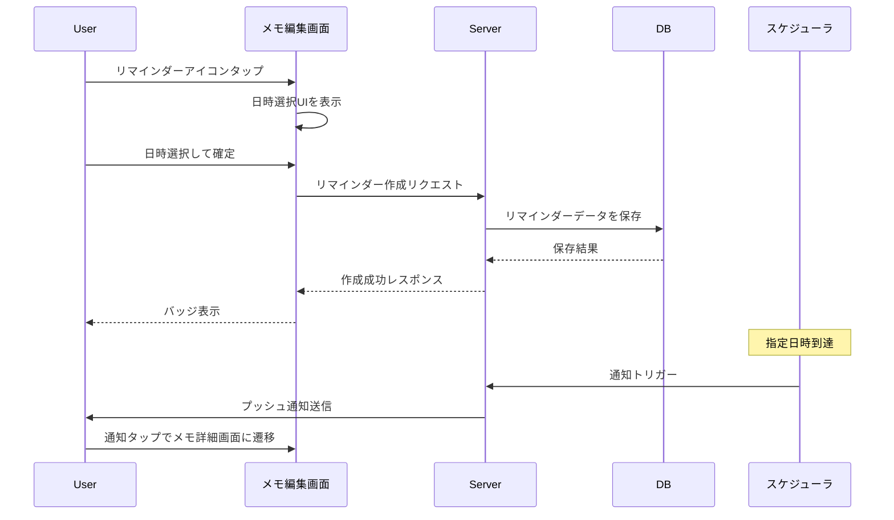
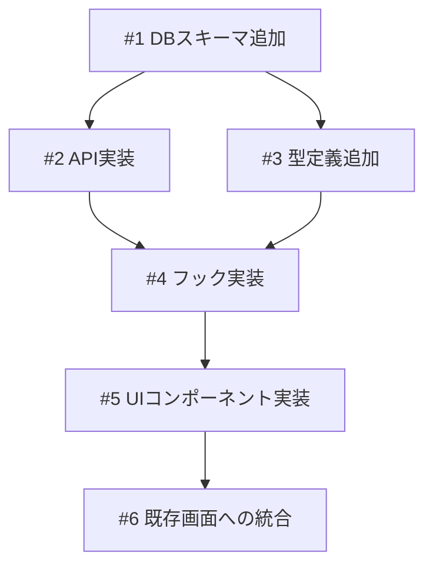

# 出力例: plan.md（リマインダー機能）

「メモアプリにリマインダー機能を追加する」という要求に対する plan.md の出力例。

```markdown
---
title: "feat: リマインダー機能"
feature-name: "reminder"
status: done
created: 2025-01-15
updated: 2025-01-15
---

# リマインダー機能

## 概要

メモ利用者が、メモにリマインダーを設定し、指定した日時にプッシュ通知を受け取ってメモを見返せるようにする。メモを書いても見返すタイミングを逃してしまう課題を解決する。

## 受入条件

- [ ] AC-1: メモ編集画面からリマインダー日時を設定できる
- [ ] AC-2: 設定した日時にプッシュ通知が届く
- [ ] AC-3: 通知をタップするとメモの詳細画面に遷移する
- [ ] AC-4: リマインダー設定済みのメモにバッジが表示される
- [ ] AC-5: リマインダーの変更・削除ができる

## スコープ

### やること

- 単発リマインダー（1回限り）
- プッシュ通知（ブラウザ Notification API）
- メモ詳細画面からのリマインダー設定

### やらないこと

- 繰り返しリマインダー（毎日、毎週等）
- メール通知
- リマインダー一覧専用画面

## 非機能要件

- 認可: メモの所有者のみリマインダーを操作可能
- リマインダー日時は未来の日時のみ許可

## データフロー

### リマインダー設定フロー



## バックエンド変更

### API設計

- リマインダーのCRUD操作を提供（作成・取得・更新・削除）
- 作成時の入力: 対象メモの識別子、リマインダー日時
- 取得時の出力: リマインダーの識別子、対象メモ、日時、状態（待機中/送信済み/キャンセル）
- 主要なエラーケース:
  - 過去の日時を指定した場合 → バリデーションエラー
  - 存在しないメモを指定した場合 → 対象なしエラー
  - 同一メモに重複してリマインダーを設定した場合 → 競合エラー

### 対象ファイル

- 新規: `src/api/reminders.ts` — リマインダーAPI実装
- 変更: `src/api/index.ts` — ルーティングにリマインダーAPIを追加

## DB変更

### データモデル

#### リマインダーテーブル

- 目的: メモに紐づくリマインダー情報を管理する
- 関係: メモテーブルと1対1の関係。メモ削除時にリマインダーも連動して削除

| カラム | 説明 | 制約 |
|--------|------|------|
| 識別子 | リマインダーを一意に識別する値 | 必須、主キー |
| 対象メモ | リマインダーが紐づくメモ | 必須、メモテーブルへの外部キー |
| リマインダー日時 | 通知を送信する日時 | 必須 |
| 状態 | 待機中・送信済み・キャンセルの3状態 | 必須、初期値は「待機中」 |
| 作成日時 | レコードが作成された日時 | 必須 |

- 待機中のリマインダーのみを効率的に検索できるようにする（スケジューラの検索高速化）
- メモからリマインダーを参照する検索を高速化する

### 対象ファイル

- 変更: `src/db/schema.ts` — リマインダーテーブル定義を追加
- 新規: マイグレーションファイル — テーブル作成とインデックス追加

## フロントエンド変更

### 画面・UI設計

- メモ詳細画面のアクションバーに「リマインダー設定」ボタンを追加
- ボタンタップで日時選択ポップオーバーを表示
- 日時選択後、確定でリマインダーを設定
- リマインダー設定済みのメモにはバッジ（日時表示付き）を表示
- 既存の「ブックマーク」ボタンと同じパターンで実装

### ワイヤーフレーム

#### リマインダー設定ポップオーバー

```
+------------------------------+
| リマインダーを設定     [x]    |
+------------------------------+
|                              |
|  日付: 2025/01/15            |
|  時刻: 14:00                 |
|                              |
|  [キャンセル]     [設定]      |
+------------------------------+
```

#### リマインダーバッジ

```
[bell 1/15 14:00]    // 通常サイズ
[bell]               // 小サイズ
```

### 対象ファイル

- 新規: `src/features/reminder/components/ReminderPicker.tsx` — 日時選択ポップオーバー
- 新規: `src/features/reminder/components/ReminderBadge.tsx` — バッジ表示
- 新規: `src/features/reminder/hooks/useReminder.ts` — リマインダーのデータ取得・操作フック
- 変更: `src/features/memo/components/MemoActions.tsx` — アクションバーにリマインダーボタン追加
- 変更: `src/features/memo/components/MemoCard.tsx` — バッジ表示追加

## 設計判断

| 判断事項 | 選択 | 理由 | 検討した代替案 |
|---------|------|------|--------------|
| メモとリマインダーの関係 | 1対1 | スコープが単発リマインダーのみ | 1対多（将来の複数リマインダー対応時に変更可） |
| 状態管理方式 | 3状態（待機中/送信済み/キャンセル） | 通知の送信状態を追跡する必要がある | 2状態（有効/無効）— キャンセルと送信済みの区別が必要 |
| 検索最適化 | 待機中のみの部分インデックス | スケジューラは待機中のみ検索する | 全件インデックス — 不要なデータを含み非効率 |

## システム影響

### 影響範囲

- メモ編集画面: アクションバーにボタン追加
- メモカード: バッジ表示追加
- メモ削除: リマインダーの連動削除

### リスク

- メモ一覧取得時のリマインダーJOINによるパフォーマンス影響 → インデックスで対応
- ブラウザのNotification API非対応環境 → リマインダー設定のみ（通知なし）で対応

## 実装タスク

### 依存関係図



### タスク一覧

| # | タスク | 対象ファイル | 見積 | 依存 |
|---|--------|------------|------|------|
| 1 | DBスキーマにリマインダーテーブル追加 | `src/db/schema.ts` | S | - |
| 2 | リマインダーAPI実装 | `src/api/reminders.ts`, `src/api/index.ts` | M | #1 |
| 3 | 型定義追加 | `src/types/memo.ts`, `src/features/reminder/types.ts` | S | #1 |
| 4 | useReminderフック実装 | `src/features/reminder/hooks/useReminder.ts` | S | #2, #3 |
| 5 | ReminderPicker, ReminderBadge実装 | `src/features/reminder/components/` | L | #4 |
| 6 | MemoActions, MemoCardに統合 | `src/features/memo/components/` | M | #5 |

> 見積基準: S(〜1h), M(1-3h), L(3h〜)

## テスト方針

### トレーサビリティ

| 受入条件 | 自動テスト | 手動検証 |
|---------|-----------|---------|
| AC-1 | #1, #3 | MV-1 |
| AC-2 | - | MV-2 |
| AC-3 | - | MV-3 |
| AC-4 | #3 | MV-1 |
| AC-5 | #2, #3 | MV-4, MV-5 |

### 自動テスト

| # | テスト | 種別 | 対象 |
|---|--------|------|------|
| 1 | リマインダーCRUD APIの正常系・異常系 | unit | `src/api/reminders.ts` |
| 2 | useReminderフックの状態管理 | unit | `src/features/reminder/hooks/useReminder.ts` |
| 3 | ReminderPicker・ReminderBadgeの表示・操作 | unit | `src/features/reminder/components/` |

### ビルド確認

```bash
npm run typecheck  # 型チェック
npm run lint       # Lint
npm run test       # テスト
npm run build      # ビルド
```

### 手動検証チェックリスト

- [ ] MV-1: メモ詳細画面でリマインダーアイコンをタップし、日時選択UIが表示されること。日時を設定するとバッジが表示されること
- [ ] MV-2: 設定した日時にプッシュ通知が届くこと
- [ ] MV-3: 通知をタップするとメモの詳細画面に遷移すること
- [ ] MV-4: 設定済みリマインダーの日時を変更できること
- [ ] MV-5: リマインダーを削除するとバッジが消えること
- [ ] MV-6: 過去の日時を設定しようとするとエラーメッセージが表示されること
```
