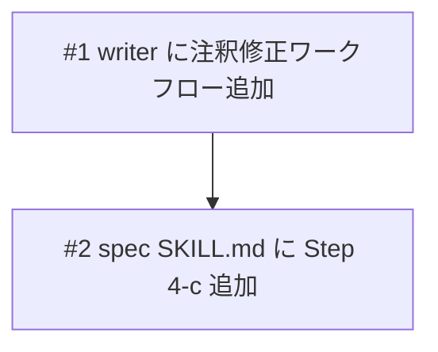

# Annotation Cycle（plan.md 注釈修正サイクル）

## 概要

spec スキルの利用者が、生成された plan.md の内容をピンポイントで修正できるようにする。plan.md 生成後（Step 4）に「Annotation Cycle」を挿入し、ユーザーが plan.md にインラインで自由形式の注釈を書き込み、writer エージェントがそれを読み取って修正する反復サイクルを提供する。最大6回の反復後、Step 5（完了処理）に進む。

## 受入条件

- [ ] AC-1: plan.md 生成後に「plan.md を確認し、修正したい箇所に注釈を書き込んでください」というプロンプトが表示される
- [ ] AC-2: ユーザーが plan.md に自由形式で注釈を書き込み、完了を通知できる
- [ ] AC-3: writer エージェントが注釈付き plan.md を読み取り、注釈に基づいて修正し、注釈を除去した clean な plan.md を出力する
- [ ] AC-4: 最大6回の反復が可能で、6回目で強制終了し Step 5 に進む
- [ ] AC-5: ユーザーが「満足」を選択した時点でサイクルを終了し、Step 5 へ進む
- [ ] AC-6: 注釈サイクルをスキップする選択肢がある（plan.md に満足ならそのまま Step 5 へ）

## スコープ

### やること

- `skills/spec/SKILL.md` に Step 4-c（Annotation Cycle）を追加
- `agents/writer/writer.md` に plan.md の注釈ベース修正ワークフローを追加

### やらないこと

- 特別な注釈フォーマットの定義やパーサーの実装
- `references/formats/plan.md`（plan.md フォーマット定義）の変更
- 他スキル（build, check, fix）への変更
- progress.md や result.md への影響

## 非機能要件

- ループ上限を6回に設定し、無限ループを防止する
- 注釈は自由形式とし、ユーザーに特別なマーカー記法を強制しない

## 設計判断

| 判断事項 | 選択 | 理由 | 検討した代替案 |
|---------|------|------|--------------|
| 注釈検出方式 | 自由形式 | ユーザーの手間を最小化。マーカー形式は記法を覚える負担がある | マーカー形式（`<!-- TODO: ... -->` 等） — 構造化しやすいがユーザー体験を損なう |
| 修正実行者 | writer エージェントに Task で委譲 | 既存の spec→writer 委譲パターンを踏襲し、一貫性を保つ | spec スキル内で直接修正 — 責務が混在し SKILL.md が肥大化する |
| 配置位置 | Step 4 の後、Step 5 の前（Step 4-c） | 高レベルの方向性確認（Step 3）は残し、詳細生成後のピンポイント修正に注力 | Step 3 に統合 — 方向性確認と詳細修正が混在し複雑化する |

## システム影響

### 影響範囲

- `skills/spec/SKILL.md`: Step 4-c として Annotation Cycle ブロックを追加（約30-40行追加）
- `agents/writer/writer.md`: 注釈修正ワークフローセクションを追加（約20-30行追加）

### リスク

- SKILL.md の行数増加 — 現在のサイズに30-40行追加しても500行制限内に収まる
- writer エージェントの責務拡大 — 注釈修正は既存の plan.md 更新パターンの延長であり、大きな逸脱はない

## 実装タスク

### 依存関係図

### タスク一覧

| # | タスク | 対象ファイル | 見積 | 依存 |
|---|--------|------------|------|------|
| 1 | writer に plan.md 注釈修正ワークフローを追加 | `agents/writer/writer.md` | S | - |
| 2 | spec SKILL.md に Step 4-c (Annotation Cycle) を追加 | `skills/spec/SKILL.md` | S | #1 |

> 見積基準: S(~1h), M(1-3h), L(3h~)

## テスト方針

### トレーサビリティ

| 受入条件 | 自動テスト | 手動検証 |
|---------|-----------|---------|
| AC-1 | - | MV-1 |
| AC-2 | - | MV-2 |
| AC-3 | - | MV-2 |
| AC-4 | - | MV-4 |
| AC-5 | - | MV-3 |
| AC-6 | - | MV-1 |

### 自動テスト

自動テストなし（Markdown プロンプトのみの変更のため）。

### ビルド確認

ビルドコマンドなし（ランタイムコードを含まない Markdown プロンプトプロジェクトのため）。

### 手動検証チェックリスト

- [ ] MV-1: `/spec` で新規 plan.md を生成後、「plan.md を確認し、修正したい箇所に注釈を書き込んでください」のプロンプトが表示されること。「スキップ」を選択すると直接 Step 5 に進むこと
- [ ] MV-2: plan.md に自由形式の注釈（例: 行末に「ここを変えたい」等）を書き込み、完了を通知すると、writer が注釈を読み取り修正を行い、注釈が除去された clean な plan.md が出力されること
- [ ] MV-3: 修正後のプロンプトで「満足」を選択するとサイクルが終了し、Step 5 に進むこと
- [ ] MV-4: 6回連続で注釈修正を行った場合、6回目で強制終了し Step 5 に進むこと
