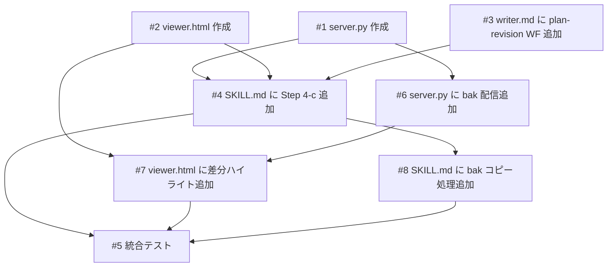

# Annotation Cycle（plan.md ブラウザレビューサイクル）

## 概要

spec スキルの利用者が、生成された plan.md の内容をブラウザ上でレビューし、セクション単位でコメントを付けて修正できるようにする。plan.md 生成後（Step 4）に「Annotation Cycle」を挿入し、ローカル HTTP サーバーで plan.md をレンダリング表示 → ユーザーがブラウザでコメント → writer エージェントがコメントに基づいて修正する反復サイクルを提供する。ユーザーが満足するまで繰り返し、コメントなしで送信すると Step 5（完了処理）に進む。

## 受入条件

- [ ] AC-1: plan.md 生成後に「ブラウザでレビューする」「スキップして次へ」の選択肢が表示される
- [ ] AC-2: 「ブラウザでレビュー」を選択するとローカルサーバーが起動し、ブラウザで plan.md がレンダリング表示される
- [ ] AC-3: ブラウザ上でセクション（h2/h3）単位にコメントを追加でき、テキスト選択による部分指定もできる
- [ ] AC-4: 「保存して完了」ボタンを押すと comments.json が保存され、サーバーが自動シャットダウンする
- [ ] AC-5: writer エージェントが comments.json を読み取り、コメントに基づいて plan.md を修正する
- [ ] AC-6: ユーザーが「満足」を選択するまでサイクルを繰り返せる（回数制限なし）
- [ ] AC-7: 2回目以降のレビュー時に、writer が修正した箇所がハイライト表示される
- [ ] AC-8: 初回レビュー時（変更前データなし）はハイライトなしで通常表示される

## スコープ

### やること

- `scripts/annotation-viewer/server.py` — ローカル HTTP サーバー（Python 3 標準ライブラリのみ）
- `scripts/annotation-viewer/viewer.html` — Markdown レンダリング + コメント UI
- `skills/spec/SKILL.md` に Step 4-c（Annotation Cycle）を追加、`allowed-tools` に `Bash` を追加
- `agents/writer/writer.md` に `plan-revision` ワークフローを追加
- `scripts/annotation-viewer/viewer.html` に jsdiff（CDN）による差分ハイライト機能を追加
- `scripts/annotation-viewer/server.py` に旧テキスト（plan.md.bak）の配信機能を追加
- `skills/spec/SKILL.md` に writer 呼び出し前の plan.md バックアップ処理を追加
- `.gitignore` に `comments.json` と `plan.md.bak` を追加

### やらないこと

- npm / ビルドツールの導入（CDN + Python 標準ライブラリのみ）
- `references/formats/plan.md`（plan.md フォーマット定義）の変更
- 他スキル（build, check, fix）への変更
- progress.md や result.md への影響

## 非機能要件

- ユーザーが「満足」を選択するまでループを継続する（回数制限なし）
- サーバーは30分の自動タイムアウトでゾンビプロセスを防止する
- 空きポートを自動検出し、ポート競合を回避する

## 設計判断

| 判断事項 | 選択 | 理由 | 検討した代替案 |
|---------|------|------|--------------|
| レビュー方式 | ブラウザベース（ローカルHTTPサーバー） | Markdown をレンダリング表示でき、セクション単位のコメント UI を提供できる | テキストベース注釈（エディタで直接書き込み）— UI が貧弱でコメント位置が曖昧になる |
| コメント粒度 | セクション（h2/h3）単位 + テキスト選択 | セクション見出しで plan.md の修正箇所を一意に特定できる | 行番号ベース — plan.md 修正で行番号がずれると追跡できなくなる |
| サーバー技術 | Python 3 http.server | 追加依存なし。プロジェクトのユーザーに Python 3 があれば動作する | Node.js — 追加依存が発生する |
| Markdown レンダリング | marked.js（CDN） | 軽量で高品質。CDN からロードするだけで使える | Python 側でレンダリング — 追加ライブラリが必要 |
| 修正実行者 | writer エージェントに Task で委譲 | 既存の spec→writer 委譲パターンを踏襲し、一貫性を保つ | spec スキル内で直接修正 — 責務が混在し SKILL.md が肥大化する |
| 配置位置 | Step 4 の後、Step 5 の前（Step 4-c） | 高レベルの方向性確認（Step 3）は残し、詳細生成後のピンポイント修正に注力 | Step 3 に統合 — 方向性確認と詳細修正が混在し複雑化する |
| 差分計算の実行場所 | ブラウザ側（jsdiff CDN） | Python 側の変更が最小。jsdiff は CDN 1行で利用可能 | Python difflib — Python 処理が複雑になり `<ins>`/`<del>` の Markdown 埋め込みが壊れやすい |
| 差分粒度 | 行単位（diffLines） | Markdown の構造（見出し、箇条書き）と一致しやすい | 単語単位 — 実装複雑。セクション単位 — セクション内変更を見逃す |
| 旧テキストの保持方法 | plan.md.bak ファイル | シンプル。SKILL.md で Bash cp するだけ | Git diff — git 操作が必要で複雑。メモリ保持 — サーバー再起動で消える |
| ハイライト適用方式 | Markdown レンダリング後に DOM ベースで適用 | marked.js の構造を壊さない | Markdown テキストに span を埋め込む — ブロック要素の構造が壊れる可能性 |

## データフロー

```
spec SKILL.md (Step 4-c)
  │
  ├─ Bash: cp plan.md plan.md.bak  ← 修正前のテキストを保存（初回はスキップ）
  │
  ├─ Bash(run_in_background): python3 server.py {plan-dir}
  │   └─ stdout: PORT:{port}
  │
  ├─ Bash: open http://localhost:{port}
  │
  ├─ [ユーザーがブラウザでコメント]
  │   ├─ GET /api/plan → {"content": "...", "old": "..." or null}
  │   │    └─ plan.md.bak があれば old に旧テキストを含める
  │   ├─ marked.js でレンダリング
  │   ├─ old がある場合: jsdiff diffLines(old, content) で差分計算 → 変更行をハイライト表示
  │   ├─ old がない場合（初回）: ハイライトなしで通常表示
  │   ├─ セクション単位でコメント追加
  │   └─ POST /api/done → comments.json 保存 + サーバー停止
  │
  ├─ Read comments.json
  │
  └─ Task(writer, plan-revision)
      ├─ Read plan.md + comments.json
      ├─ sectionHeading でセクション特定
      ├─ Edit で plan.md 修正
      └─ 修正サマリを返却
```

## comments.json フォーマット

```json
{
  "comments": [
    {
      "sectionHeading": "## 受入条件",
      "selectedText": "AC-3: ...",
      "comment": "ここをもっと具体的にしてほしい"
    }
  ]
}
```

- `sectionHeading`: コメント対象のセクション見出し（h2/h3）
- `selectedText`: ユーザーがテキスト選択すると「コメントを追加」ツールチップが表示され、そこからコメントすると選択テキストが記録される（省略可）
- `comment`: コメント本文

## システム影響

### 影響範囲

- `scripts/annotation-viewer/server.py`: 新規作成（約80行）
- `scripts/annotation-viewer/viewer.html`: 新規作成（約200行）
- `skills/spec/SKILL.md`: Step 4-c 追加 + allowed-tools 更新（約40行追加）
- `agents/writer/writer.md`: plan-revision ワークフロー追加（約25行追加）
- `.gitignore`: `comments.json` と `plan.md.bak` 追加（2行）

### リスク

- SKILL.md の行数増加 — 現在約200行に約40行追加しても500行制限内に十分収まる
- writer エージェントの責務拡大 — コメントベース修正は既存の plan.md 更新パターンの延長
- CDN 依存 — オフライン環境では marked.js / jsdiff が読み込めない（将来的にローカルバンドルで対応可能）

## 実装タスク

### 依存関係図



### タスク一覧

| # | タスク | 対象ファイル | 見積 | 依存 |
|---|--------|------------|------|------|
| 1 | Python HTTP サーバー作成 | `scripts/annotation-viewer/server.py` | M | - |
| 2 | コメント UI HTML 作成 | `scripts/annotation-viewer/viewer.html` | M | - |
| 3 | writer にコメントベース修正 WF 追加 | `agents/writer/writer.md` | S | - |
| 4 | spec SKILL.md に Step 4-c 追加 + allowed-tools 更新 | `skills/spec/SKILL.md` | S | #1, #2, #3 |
| 5 | 統合テスト + .gitignore 更新 | `.gitignore` | S | #4, #7, #8 |
| 6 | server.py に plan.md.bak 配信機能追加 | `scripts/annotation-viewer/server.py` | S | #1 |
| 7 | viewer.html に jsdiff 差分ハイライト追加 | `scripts/annotation-viewer/viewer.html` | S | #2, #6 |
| 8 | SKILL.md に bak コピー処理追加 | `skills/spec/SKILL.md` | S | #4 |

> 見積基準: S(~1h), M(1-3h), L(3h~)

## テスト方針

### トレーサビリティ

| 受入条件 | 自動テスト | 手動検証 |
|---------|-----------|---------|
| AC-1 | - | MV-1 |
| AC-2 | - | MV-2 |
| AC-3 | - | MV-3 |
| AC-4 | - | MV-4 |
| AC-5 | - | MV-5 |
| AC-6 | - | MV-6 |
| AC-7 | - | MV-7 |
| AC-8 | - | MV-8 |

### 自動テスト

自動テストなし（Markdown プロンプト + 軽量スクリプトの変更のため）。

### ビルド確認

```bash
python3 scripts/annotation-viewer/server.py docs/plans/annotation-cycle
# ブラウザで http://localhost:{PORT} にアクセスし、plan.md が表示されることを確認
```

### 手動検証チェックリスト

- [ ] MV-1: `/spec` で新規 plan.md を生成後、「ブラウザでレビューする」「スキップして次へ」の選択肢が表示されること。「スキップ」を選択すると直接 Step 5 に進むこと
- [ ] MV-2: 「ブラウザでレビュー」を選択するとサーバーが起動し、ブラウザが開き plan.md がレンダリング表示されること
- [ ] MV-3: セクションにホバーすると「+」ボタンが表示され、コメントを追加できること。テキスト選択後にコメントすると選択テキストが記録されること
- [ ] MV-4: 「保存して完了」ボタンを押すと comments.json が正しく保存され、サーバーが自動停止すること
- [ ] MV-5: writer が comments.json を読み取り、コメントに基づいて plan.md を修正し、修正サマリを返すこと
- [ ] MV-6: ユーザーが「満足」を選択するまでサイクルが繰り返され、「満足」選択で Step 5 に進むこと
- [ ] MV-7: コメントを送信して修正後、再レビュー時に変更行が緑色でハイライト表示されること
- [ ] MV-8: 初回レビュー時（plan.md.bak がない状態）ではハイライトなしで通常表示されること
