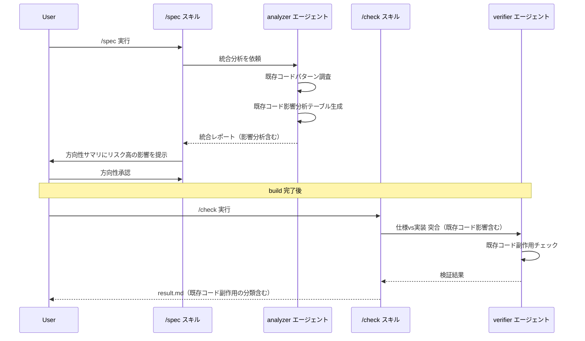
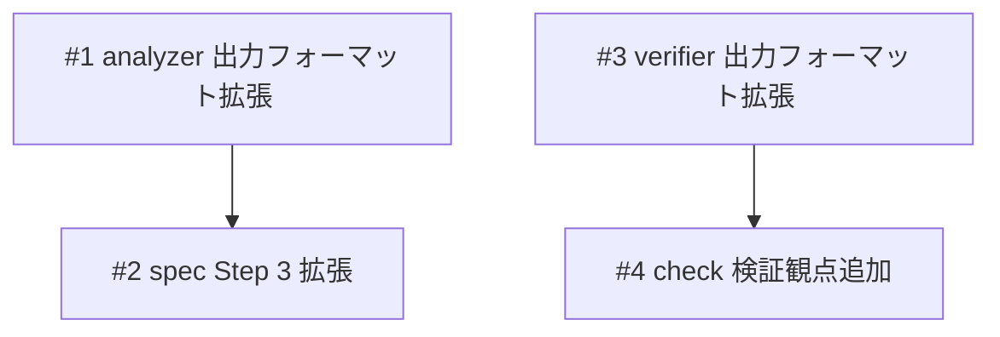

# Brownfield検証（既存コード影響分析）

## 概要

競合ツール比較（cc-sdd の validate-gap）から着想を得て、spec-flow に既存コードとの統合リスクを明示的に検証する Brownfield 検証機能を追加する。既存コードへの影響を分析・可視化し、仕様策定時と検証時の両方で既存コードとの整合性を担保する。

## 受入条件

- [ ] AC-1: `/spec` 実行時に analyzer の出力に「既存コード影響分析」テーブルが含まれる
- [ ] AC-2: spec の Step 3（方向性確認）でリスク「高」の影響箇所がユーザーに提示される
- [ ] AC-3: `/check` 実行時に verifier が「既存コード副作用」分類で不一致を検出できる

## スコープ

### やること

- analyzer 出力フォーマットへの「既存コード影響分析」セクション追加
- verifier 出力フォーマットへの「既存コード副作用」不一致分類追加
- spec スキルの方向性サマリに影響分析の提示を追加
- check スキルの検証観点に既存コード影響を追加

### やらないこと

- Living document（コード変更→spec 自動更新）— spec-flow の思想（仕様が実装をリード）と矛盾
- analyzer.md 本体の変更（出力フォーマット追加で自動対応）
- verifier.md 本体の変更（出力フォーマット追加で自動対応）
- Hooks フェーズ遷移 — 各スキル（/build, /check）の SKILL.md が既に次アクション提示のワークフローを持っており、hook での重複実装は不要。また PreToolUse が Skill ツールに発火しない制約もある

## データフロー

### Brownfield検証フロー

## 設計判断

| 判断事項 | 選択 | 理由 | 検討した代替案 |
|---------|------|------|--------------|
| analyzer の変更方法 | output フォーマットのみ拡張 | analyzer.md は出力フォーマットに従って自動的にセクションを埋める設計。本体変更不要 | analyzer.md に Step 追加 — 不要な複雑化 |
| Living document 不採用 | 導入しない | spec-flow は「仕様→実装」の一方向。コード変更で仕様を自動更新すると仕様の権威性が崩れる | Kiro 方式の自動更新 — 思想と矛盾 |
| Hooks フェーズ遷移の不採用 | 導入しない | 各スキル（/build, /check）の SKILL.md が既に次アクション提示のワークフローを持っており、hook での重複実装は不要。また PreToolUse が Skill ツールに発火しない制約もある | phase-detector.sh による PostToolUse フック — 重複実装 + 制約あり |

## システム影響

### 影響範囲

- analyzer の出力にセクション追加 → spec スキルの Step 3 が新セクションを参照
- verifier の出力に分類追加 → check スキルの result.md に新分類が含まれる

### リスク

- analyzer の影響分析が不正確な場合 → 信頼度ラベル（確認済み/推測）で対応済み

## 実装タスク

### 依存関係図

### タスク一覧

| # | タスク | 対象ファイル | 見積 | 依存 |
|---|--------|------------|------|------|
| 1 | analyzer 出力フォーマットに「既存コード影響分析」セクション追加 | `agents/analyzer/references/formats/output.md` | S | - |
| 2 | spec Step 3 の方向性サマリに「既存コードへの影響」提示を追加 | `skills/spec/SKILL.md` | S | #1 |
| 3 | verifier 出力フォーマットに「既存コード副作用」分類追加 | `agents/verifier/references/formats/output.md` | S | - |
| 4 | check の verifier 呼び出しに「既存コード影響」検証観点を追加 | `skills/check/SKILL.md` | S | #3 |

> 見積基準: S(〜1h), M(1-3h), L(3h〜)

## テスト方針

### トレーサビリティ

| 受入条件 | 自動テスト | 手動検証 |
|---------|-----------|---------|
| AC-1 | - | MV-1 |
| AC-2 | - | MV-1 |
| AC-3 | - | MV-2 |

### 自動テスト

該当なし（フォーマット変更のみのため、手動検証で確認する）

### ビルド確認

該当なし（シェルスクリプトの追加・変更なし）

### 手動検証チェックリスト

- [ ] MV-1: 既存コードがあるプロジェクトで `/spec` を実行し、方向性サマリに「既存コードへの影響」が表示されること
- [ ] MV-2: `/check` 実行後の result.md に「既存コード副作用」分類の不一致が含まれること（該当する場合）

## 参考資料

| 資料名 | URL / パス |
|--------|-----------|
| 競合機能比較リサーチ | `docs/plans/zenn-article-value/research-2026-03-10-competitor-features.md` |
| 改善候補リサーチ | `docs/plans/zenn-article-value/research-2026-03-10-improvement-candidates.md` |
| cc-sdd (brownfield参考) | https://github.com/gotalab/cc-sdd |
| Kiro Hooks (参考) | https://kiro.dev/docs/specs/ |
