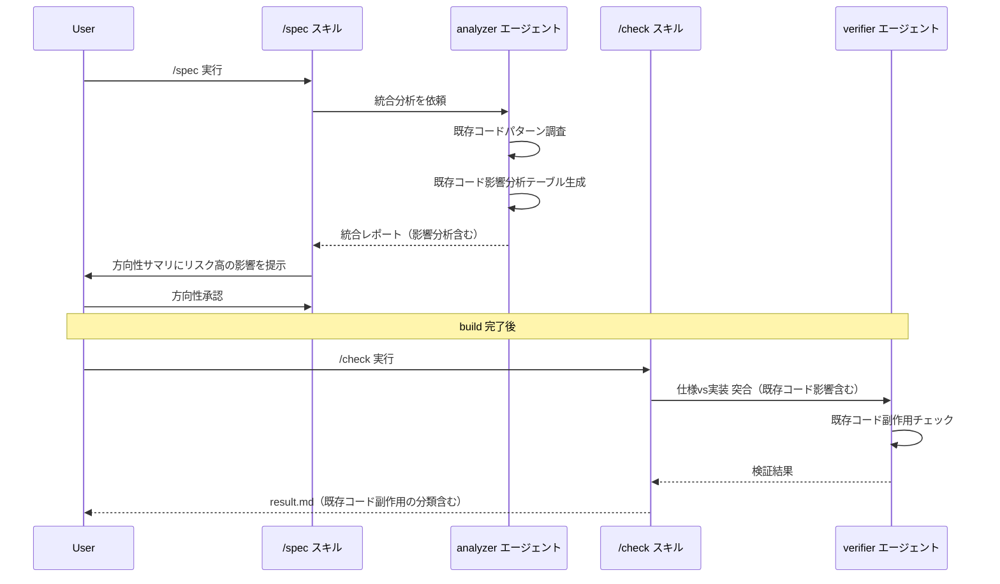
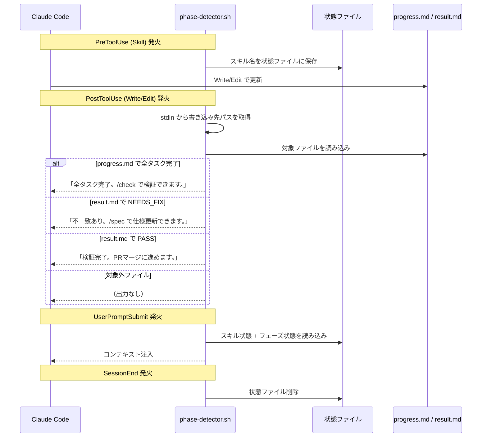
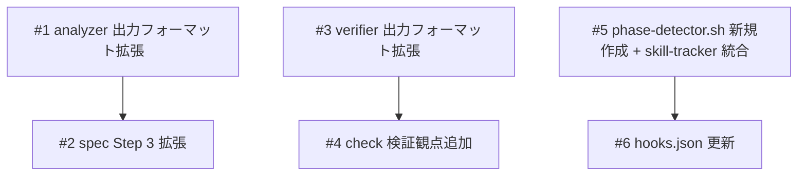

# Brownfield検証 + Hooksフェーズ遷移

## 概要

競合ツール比較（cc-sdd の validate-gap / Kiro の Hooks 自動化）から着想を得て、spec-flow に2つの機能を追加する。(1) 既存コードとの統合リスクを明示的に検証する Brownfield 検証、(2) フェーズ完了を検知して次のアクションを自動提案する Hooks フェーズ遷移。

## 受入条件

- [ ] AC-1: `/spec` 実行時に analyzer の出力に「既存コード影響分析」テーブルが含まれる
- [ ] AC-2: spec の Step 3（方向性確認）でリスク「高」の影響箇所がユーザーに提示される
- [ ] AC-3: `/check` 実行時に verifier が「既存コード副作用」分類で不一致を検出できる
- [ ] AC-4: build 完了後（progress.md の全タスク ✓）に `/check` の実行提案が stdout に出力される
- [ ] AC-5: check 完了後（result.md 生成時）に判定に応じた次のアクション提案が stdout に出力される
- [ ] AC-6: phase-detector.sh が対象外ファイル（progress.md / result.md 以外）の書き込み時に何も出力しない

## スコープ

### やること

- analyzer 出力フォーマットへの「既存コード影響分析」セクション追加
- verifier 出力フォーマットへの「既存コード副作用」不一致分類追加
- spec スキルの方向性サマリに影響分析の提示を追加
- check スキルの検証観点に既存コード影響を追加
- phase-detector.sh の新規作成（フェーズ完了検知 + 次アクション提案）
- skill-tracker.sh の機能を phase-detector.sh に統合し、skill-tracker.sh を廃止
- hooks.json への PostToolUse フック追加

### やらないこと

- Living document（コード変更→spec 自動更新）— spec-flow の思想（仕様が実装をリード）と矛盾
- analyzer.md 本体の変更（出力フォーマット追加で自動対応）
- verifier.md 本体の変更（出力フォーマット追加で自動対応）

## 非機能要件

- phase-detector.sh の実行時間は 5 秒以内（hooks の timeout 制約）
- hook の stdout 出力は日本語で簡潔に（1-2 文）

## データフロー

### Brownfield検証フロー



### Hooksフェーズ遷移フロー



## 設計判断

| 判断事項 | 選択 | 理由 | 検討した代替案 |
|---------|------|------|--------------|
| analyzer の変更方法 | output フォーマットのみ拡張 | analyzer.md は出力フォーマットに従って自動的にセクションを埋める設計。本体変更不要 | analyzer.md に Step 追加 — 不要な複雑化 |
| phase-detector の分離 | phase-detector.sh に統合（skill-tracker.sh を廃止） | どちらも spec-flow のワークフロー状態を Claude に注入する同一目的。1ファイルに統合して保守性を向上 | 別ファイルのまま維持 — 同一目的のフックが分散し保守コスト増 |
| フェーズ検知の方式 | ファイル読み込み方式 | tool_input にはファイル内容が含まれないため、対象ファイルを直接読む必要がある | tool_input パース — Edit の場合は差分しか見えない |
| hook イベント | PostToolUse | ファイル書き込み完了後に検知する必要がある | PreToolUse — 書き込み前なのでファイル内容が古い |
| Living document 不採用 | 導入しない | spec-flow は「仕様→実装」の一方向。コード変更で仕様を自動更新すると仕様の権威性が崩れる | Kiro 方式の自動更新 — 思想と矛盾 |

## システム影響

### 影響範囲

- analyzer の出力にセクション追加 → spec スキルの Step 3 が新セクションを参照
- verifier の出力に分類追加 → check スキルの result.md に新分類が含まれる
- hooks.json に PostToolUse 追加 → 全 Write/Edit 操作で phase-detector.sh が実行される
- skill-tracker.sh の廃止 → hooks.json の skill-tracker エントリを phase-detector に置換

### リスク

- phase-detector.sh の実行がすべての Write/Edit で発生 → 対象外ファイルは即 exit でオーバーヘッド最小化
- analyzer の影響分析が不正確な場合 → 信頼度ラベル（確認済み/推測）で対応済み

## 実装タスク

### 依存関係図



### タスク一覧

| # | タスク | 対象ファイル | 見積 | 依存 |
|---|--------|------------|------|------|
| 1 | analyzer 出力フォーマットに「既存コード影響分析」セクション追加 | `agents/analyzer/references/formats/output.md` | S | - |
| 2 | spec Step 3 の方向性サマリに「既存コードへの影響」提示を追加 | `skills/spec/SKILL.md` | S | #1 |
| 3 | verifier 出力フォーマットに「既存コード副作用」分類追加 | `agents/verifier/references/formats/output.md` | S | - |
| 4 | check の verifier 呼び出しに「既存コード影響」検証観点を追加 | `skills/check/SKILL.md` | S | #3 |
| 5 | phase-detector.sh を新規作成（skill-tracker.sh の機能を統合） | `hooks/phase-detector.sh`, `hooks/skill-tracker.sh`（削除） | M | - |
| 6 | hooks.json を更新（skill-tracker エントリを phase-detector に置換） | `hooks/hooks.json` | S | #5 |

> 見積基準: S(〜1h), M(1-3h), L(3h〜)

## テスト方針

### トレーサビリティ

| 受入条件 | 自動テスト | 手動検証 |
|---------|-----------|---------|
| AC-1 | - | MV-1 |
| AC-2 | - | MV-1 |
| AC-3 | - | MV-2 |
| AC-4 | #1 | MV-3 |
| AC-5 | #2, #3 | MV-4 |
| AC-6 | #4 | - |

### 自動テスト

| # | テスト | 種別 | 対象 |
|---|--------|------|------|
| 1 | progress.md 全タスク完了時に /check 提案が出力される | shell | `hooks/phase-detector.sh` |
| 2 | result.md NEEDS_FIX 時に /spec 提案が出力される | shell | `hooks/phase-detector.sh` |
| 3 | result.md PASS 時にマージ提案が出力される | shell | `hooks/phase-detector.sh` |
| 4 | 対象外ファイルの書き込み時に何も出力されない | shell | `hooks/phase-detector.sh` |
| 5 | PreToolUse (Skill) でスキル名が状態ファイルに保存される | shell | `hooks/phase-detector.sh` |
| 6 | UserPromptSubmit でスキル状態 + フェーズ状態が出力される | shell | `hooks/phase-detector.sh` |
| 7 | SessionEnd で状態ファイルが削除される | shell | `hooks/phase-detector.sh` |

### ビルド確認

```bash
bash -n hooks/phase-detector.sh  # 構文チェック
```

### 手動検証チェックリスト

- [ ] MV-1: 既存コードがあるプロジェクトで `/spec` を実行し、方向性サマリに「既存コードへの影響」が表示されること
- [ ] MV-2: `/check` 実行後の result.md に「既存コード副作用」分類の不一致が含まれること（該当する場合）
- [ ] MV-3: `/build` で全タスク完了後、ターミナルに `/check` 提案が表示されること
- [ ] MV-4: `/check` 完了後、判定に応じた次アクション提案がターミナルに表示されること

## 参考資料

| 資料名 | URL / パス |
|--------|-----------|
| 競合機能比較リサーチ | `docs/plans/zenn-article-value/research-2026-03-10-competitor-features.md` |
| 改善候補リサーチ | `docs/plans/zenn-article-value/research-2026-03-10-improvement-candidates.md` |
| cc-sdd (brownfield参考) | https://github.com/gotalab/cc-sdd |
| Kiro Hooks (参考) | https://kiro.dev/docs/specs/ |
