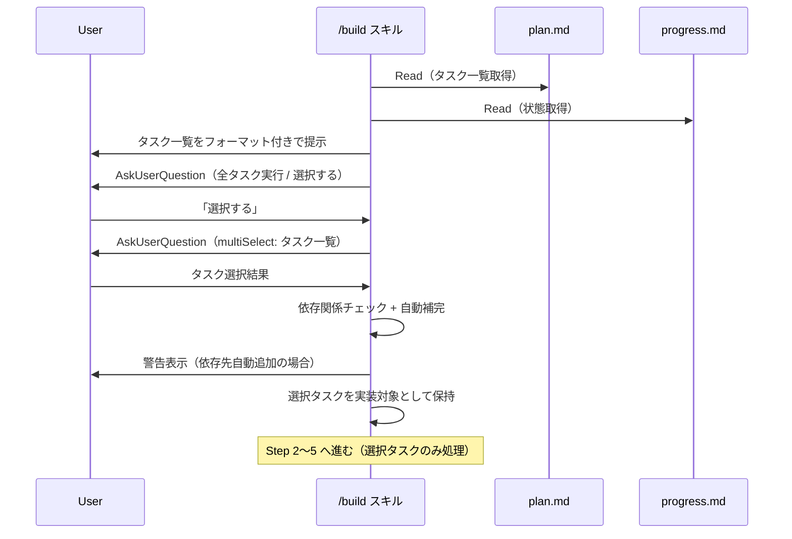
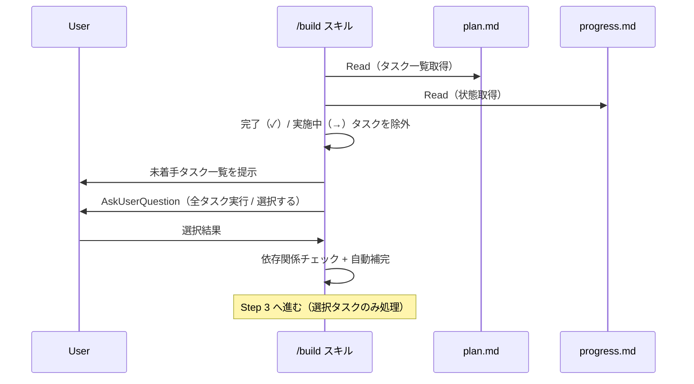
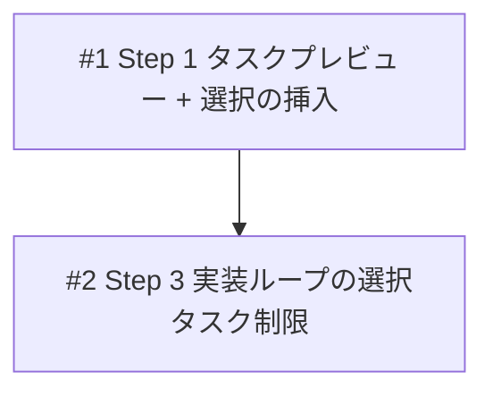

# /build タスクプレビュー + 選択機能

## 概要

/build スキル（skills/build/SKILL.md）に「タスクプレビュー + 選択」ステップを追加する。Step 0（読み込み + 再開検知）と旧 Step 1（feature ブランチ作成）の間に新しい Step 1 を差し込み、plan.md のタスク一覧をユーザーに提示して実装するタスクを取捨選択できるようにする。これにより、大きな機能の部分実装や段階的な実装が容易になる。

## 受入条件

- [ ] AC-1: /build 実行時、plan.md のタスク一覧がフォーマット付きで提示される
- [ ] AC-2: ユーザーが「全タスクを実行」を選べば従来通り全タスクが実行される
- [ ] AC-3: ユーザーが「タスクを選択する」を選んだ場合、multiSelect で個別タスクを選択できる
- [ ] AC-3a: タスクが5個以上の場合、依存関係・機能単位で4個以下のグループに分割し、グループごとに AskUserQuestion を提示する
- [ ] AC-4: 選択したタスクの依存先が未選択の場合、警告して自動的に依存先も含める
- [ ] AC-5: 選択されたタスクのみが Step 3（旧 Step 2）で実装対象となる
- [ ] AC-6: 未選択タスクは progress.md で `-`（未着手）のまま残る
- [ ] AC-7: 再開フロー時にもタスク選択ステップが表示される（既に `✓` のタスクは選択対象外）

## スコープ

### やること

- skills/build/SKILL.md への Step 1「タスクプレビュー + 選択」の挿入
- 既存 Step 番号のリナンバリング（旧 Step 1〜4 → 新 Step 2〜5）
- 2段階 AskUserQuestion による UX（全タスク実行 / 選択モード）
- 依存関係チェックと自動補完ロジックの記述
- 再開フローでの完了タスク除外表示
- Step 3（旧 Step 2）のタスク実装ループで選択タスクのみを処理対象とする記述

### やらないこと

- エージェント（agents/）の修正
- progress.md フォーマットの変更
- 新規タスク状態（skip 等）の追加
- 新規ファイルの作成

## 非機能要件

- SKILL.md は 500 行以下を維持する（プロジェクト規約）

## データフロー

### 新規開始フロー（選択モード）



### 再開フロー



## 設計判断

| 判断事項 | 選択 | 理由 | 検討した代替案 |
|---------|------|------|--------------|
| 新 Step の挿入位置 | Step 0 と旧 Step 1 の間 | タスク選択はブランチ作成前に行うべき。選択結果に応じてブランチ名を変えたいケースもある | 旧 Step 1 と旧 Step 2 の間 -- ブランチ作成後では手戻りが発生する |
| 既存 Step 番号の扱い | リナンバリング（旧 Step 1→新 Step 2 等） | 連番の一貫性を維持する | 新 Step を 0.5 や 1a とする -- 可読性が低下する |
| UX パターン | 2段階 AskUserQuestion | 多くの場合「全タスク実行」が選ばれるため、1ステップ目で素早く通過できる | 常に multiSelect を表示 -- 全タスク実行時に全選択が煩雑 |
| 多タスク時の対応 | 依存関係・機能単位で4個以下にグループ分割し、グループごとに multiSelect を提示 | AskUserQuestion の options 上限（4個）に対応しつつ、関連タスクをまとめて判断できる | テキスト入力でタスク番号指定 -- UXが悪い。除外方式 -- 除外が多い場合に不便 |
| 依存関係の未選択処理 | 警告表示 + 自動補完 | ユーザーの操作ステップを減らし UX を向上させる | ユーザーに再選択を求める -- 操作が煩雑になる |
| 未選択タスクの状態 | progress.md で `-` のまま | skip 状態の新設はスコープ外。既存フォーマットを維持 | skip 状態を新設 -- progress.md フォーマット変更が必要 |
| multi-pr との併用 | PR スコープフィルタ → ユーザー選択フィルタの順 | PR スコープが先に適用される設計が自然。ユーザーは PR 内のタスクをさらに絞る形 | ユーザー選択 → PR フィルタ -- 選択後に PR で絞られると混乱する |

## システム影響

### 影響範囲

- skills/build/SKILL.md: Step 構成の変更（Step 1 挿入 + リナンバリング）
- /build スキルの実行フロー: タスク選択ステップの追加により、全タスク実行時も1ステップ増加

### リスク

- SKILL.md の行数増加 → 500 行制限に注意。超える場合は references/ への分割を検討
- 既存の Step 番号を参照しているドキュメントや運用手順があれば更新が必要

## 実装タスク

### 依存関係図



### タスク一覧

| # | タスク | 対象ファイル | 見積 | 依存 |
|---|--------|------------|------|------|
| 1 | Step 1「タスクプレビュー + 選択」を挿入し、既存 Step 番号をリナンバリングする | `skills/build/SKILL.md` | M | - |
| 2 | Step 3（旧 Step 2）のタスク実装ループで選択タスクのみを処理対象とする記述を追加する | `skills/build/SKILL.md` | S | #1 |

> 見積基準: S(〜1h), M(1-3h), L(3h〜)

### タスク詳細

#### #1: Step 1「タスクプレビュー + 選択」の挿入

- plan.md のタスク表をフォーマット付きで表示するロジックを記述
- 第1段階 AskUserQuestion: 「全タスクを実行する（Recommended）」/「実装するタスクを選択する」
- 第2段階 AskUserQuestion（選択モード時のみ）:
  - タスクが4個以下: `multiSelect: true` で全タスクを1回で列挙
  - タスクが5個以上: 依存関係・機能単位で4個以下のグループに分割し、グループごとに `multiSelect: true` の AskUserQuestion を提示（例: 「バックエンド系タスク」「フロントエンド系タスク」）
- 依存関係チェックと自動補完ロジック: 全グループの選択結果を統合後、依存先が未選択の場合は警告メッセージを表示して自動的に依存先を追加
- 再開時の分岐: `✓`（完了）と `→`（実施中）のタスクは選択対象外として表示し、未着手 `-` のタスクのみ選択可能
- 既存の Step 1〜4 を Step 2〜5 にリナンバリング

#### #2: Step 3 実装ループの選択タスク制限

- Step 3（旧 Step 2）のタスク実装ループに「選択されたタスクのみを対象とする」条件を追加
- multi-pr フィルタとの併用: PR スコープで絞った後、さらにユーザー選択で絞る形

## テスト方針

### トレーサビリティ

| 受入条件 | 自動テスト | 手動検証 |
|---------|-----------|---------|
| AC-1 | - | MV-1 |
| AC-2 | - | MV-2 |
| AC-3 | - | MV-3 |
| AC-3a | - | MV-3a |
| AC-4 | - | MV-4 |
| AC-5 | - | MV-5 |
| AC-6 | - | MV-5 |
| AC-7 | - | MV-6 |

### ビルド確認

```bash
# SKILL.md は Markdown のため、ビルドコマンドなし
# 行数確認のみ実施
wc -l skills/build/SKILL.md
```

### 手動検証チェックリスト

- [ ] MV-1: /build を実行し、plan.md のタスク一覧がフォーマット付きで提示されること
- [ ] MV-2: 「全タスクを実行する」を選択した場合、従来通り全タスクが実装対象となること
- [ ] MV-3: 「実装するタスクを選択する」を選択した場合、multiSelect で個別タスクを選択できること
- [ ] MV-3a: タスクが5個以上の plan で /build を実行した場合、グループ分割された multiSelect が表示されること
- [ ] MV-4: 依存先が未選択のタスクを選んだ場合、警告が表示され依存先が自動的に追加されること
- [ ] MV-5: 選択したタスクのみが実装対象となり、未選択タスクは progress.md で `-` のまま残ること
- [ ] MV-6: 再開フロー時に、完了済みタスクが選択対象外として表示され、未着手タスクのみ選択可能であること
