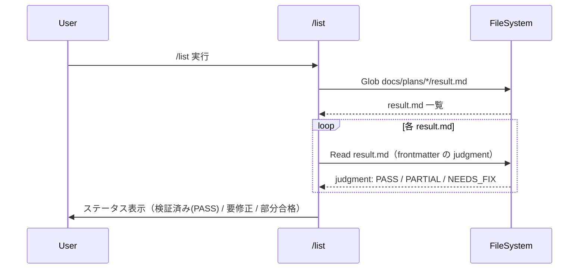
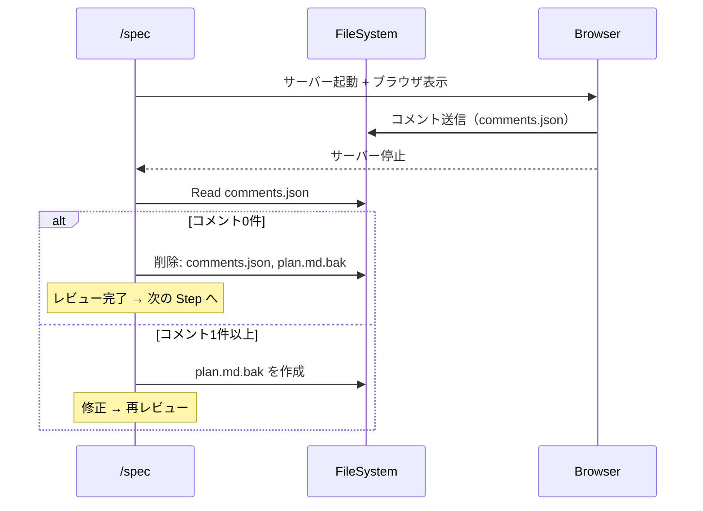
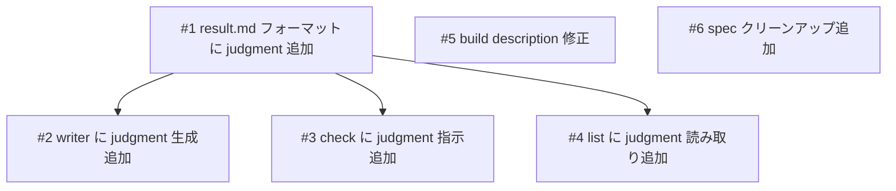

# 開発フロー改善（build/list/spec）

## 概要

spec-flow の開発フローを3点改善する。(1) build スキルの description から不正確な "PR creation" を削除、(2) list スキルで result.md の judgment を読み取り PASS/PARTIAL/NEEDS_FIX を区別表示、(3) spec スキルの Annotation Cycle 完了後に一時ファイル（comments.json, plan.md.bak）をクリーンアップ。

## 関連プラン

| プラン | 関連 |
|--------|------|
| [list-skill](../list-skill/plan.md) | list スキルの初期実装。今回はステータス判定ロジックの拡張 |
| [annotation-cycle](../annotation-cycle/plan.md) | Annotation Cycle の初期実装。今回はクリーンアップの追加 |

## 確認事項

| # | 項目 | 根拠 | ステータス |
|---|------|------|-----------|
| 1 | .gitignore は既に comments.json, plan.md.bak を含む | .gitignore:L2-L3 | ✅確認済み |
| 2 | build の PR 作成フローは /commit に任せる | ユーザー判断 | ✅確認済み |
| 3 | NEEDS_FIX の優先度は「実装中」の次 | ユーザー判断 | ✅確認済み |
| 4 | judgment は result.md frontmatter に追加 | ユーザー判断 | ✅確認済み |
| 5 | ユーザープロジェクトの .gitignore に comments.json, plan.md.bak が含まれていない可能性がある | spec-flow はプラグインとして他プロジェクトにインストールされるため | ❓要検討: spec スキル初回実行時に .gitignore への追加を提案する、または README で案内する等の対応が必要 |

## スコープ

### やること

- build SKILL.md: description 修正（"PR creation" 削除）
- list SKILL.md: ステータス判定ロジック拡張（result.md judgment 読み取り + 優先度テーブル更新）
- result.md フォーマット定義: frontmatter に judgment フィールド追加
- check SKILL.md: Step 4 の writer 委譲プロンプトに judgment 指示追加
- writer エージェント: result.md ワークフローに judgment 生成追加
- spec SKILL.md: Annotation Cycle 完了後のクリーンアップ追加

### やらないこと

- .gitignore の変更（既に comments.json, plan.md.bak が含まれている）
- 既存 result.md へのバックフィル（judgment フィールドの遡及追加はしない）
- build に PR 作成フローを追加すること

## 受入条件

- [ ] AC-1: build SKILL.md の description に "PR creation" が含まれない
- [ ] AC-2: result.md フォーマット定義に judgment フィールド（PASS/PARTIAL/NEEDS_FIX）が frontmatter として含まれる
- [ ] AC-3: check SKILL.md の Step 4 で writer に judgment を渡す指示がある
- [ ] AC-4: writer エージェントの result.md ワークフローで judgment を frontmatter に含める
- [ ] AC-5: list SKILL.md のステータス判定で result.md の judgment を読み取り、PASS/PARTIAL/NEEDS_FIX を区別表示する
- [ ] AC-6: list SKILL.md の優先度テーブルで「要修正」が「実装中」の次（優先度2位）に配置されている
- [ ] AC-7: spec SKILL.md の Annotation Cycle 完了後（コメント0件時）に comments.json と plan.md.bak を削除する処理がある
- [ ] AC-8: 既存の result.md（judgment フィールドなし）に対して list が正しくフォールバック動作する（受入条件テーブルから判定を計算）

## 非機能要件

特になし

## データフロー

### 改善2: list の judgment 読み取りフロー

### 改善3: Annotation Cycle クリーンアップフロー

## 設計判断

| 判断事項 | 選択 | 理由 | 検討した代替案 |
|---------|------|------|--------------|
| judgment の格納場所 | result.md frontmatter | list が Grep/Read で簡単に取得可能。一意のフィールド | 受入条件テーブルの全行パース（複雑、エラーリスク高い） |
| build の PR 作成 | description から削除 | /commit スキルが既に存在。責務の分離 | Step 4 に PR 作成フロー追加（build の責務過多） |
| NEEDS_FIX の優先度 | 実装中の次（2位） | 対応が必要なプランはアクティブに近い扱い | 実装完了の次（4位）（見落としリスク） |
| 既存 result.md のフォールバック | 受入条件テーブルパース | 後方互換性の確保。既存の result.md を壊さない | フォールバックなし（既存プランの表示が壊れる） |

## システム影響

### 影響範囲

- `skills/build/SKILL.md` — description 修正
- `skills/list/SKILL.md` — ステータス判定 + 優先度テーブル変更
- `skills/check/SKILL.md` — Step 4 の writer 委譲プロンプト変更
- `skills/spec/SKILL.md` — Annotation Cycle のクリーンアップ追加
- `agents/writer/writer.md` — result.md ワークフロー変更
- `agents/writer/references/formats/result.md` — frontmatter 追加

### リスク

- 既存 result.md に judgment フィールドがない場合の後方互換性 → フォールバックロジックで対応（AC-8）
- list のステータス判定ロジックが複雑化 → 優先度テーブルで明確に定義

## 実装タスク

### 依存関係図

### タスク一覧

| # | タスク | 対象ファイル | 見積 | 依存 |
|---|--------|------------|------|------|
| 1 | result.md フォーマットに judgment frontmatter 追加 | `agents/writer/references/formats/result.md` | S | - |
| 2 | writer の result.md ワークフローに judgment 生成追加 | `agents/writer/writer.md` | S | #1 |
| 3 | check の Step 4 に judgment 指示追加 | `skills/check/SKILL.md` | S | #1 |
| 4 | list のステータス判定に judgment 読み取り追加 | `skills/list/SKILL.md` | M | #1 |
| 5 | build の description 修正（"PR creation" 削除） | `skills/build/SKILL.md` | S | - |
| 6 | spec の Annotation Cycle クリーンアップ追加 | `skills/spec/SKILL.md` | S | - |

> 見積基準: S(〜1h), M(1-3h), L(3h〜)

## テスト方針

### トレーサビリティ

| 受入条件 | 自動テスト | 手動検証 |
|---------|-----------|---------|
| AC-1 | - | MV-1 |
| AC-2 | - | MV-2 |
| AC-3 | - | MV-3 |
| AC-4 | - | MV-4 |
| AC-5 | - | MV-5 |
| AC-6 | - | MV-6 |
| AC-7 | - | MV-7 |
| AC-8 | - | MV-8 |

### 自動テスト

自動テストなし（Markdown ベースプロジェクト）

### ビルド確認

なし（Markdown プロジェクト）

### 手動検証チェックリスト

- [ ] MV-1: build SKILL.md の description に "PR creation" が含まれないこと
- [ ] MV-2: result.md フォーマットの frontmatter に judgment が定義されていること
- [ ] MV-3: check SKILL.md の writer 委譲プロンプトに judgment 指示があること
- [ ] MV-4: writer の result.md ワークフローで judgment を生成すること
- [ ] MV-5: list のステータスで「要修正」「部分合格」「検証済み(PASS)」が区別されること
- [ ] MV-6: list の優先度テーブルで「要修正」が2位に配置されていること
- [ ] MV-7: spec の Annotation Cycle 完了後に comments.json と plan.md.bak が削除されること
- [ ] MV-8: judgment フィールドなしの既存 result.md でフォールバック動作すること
