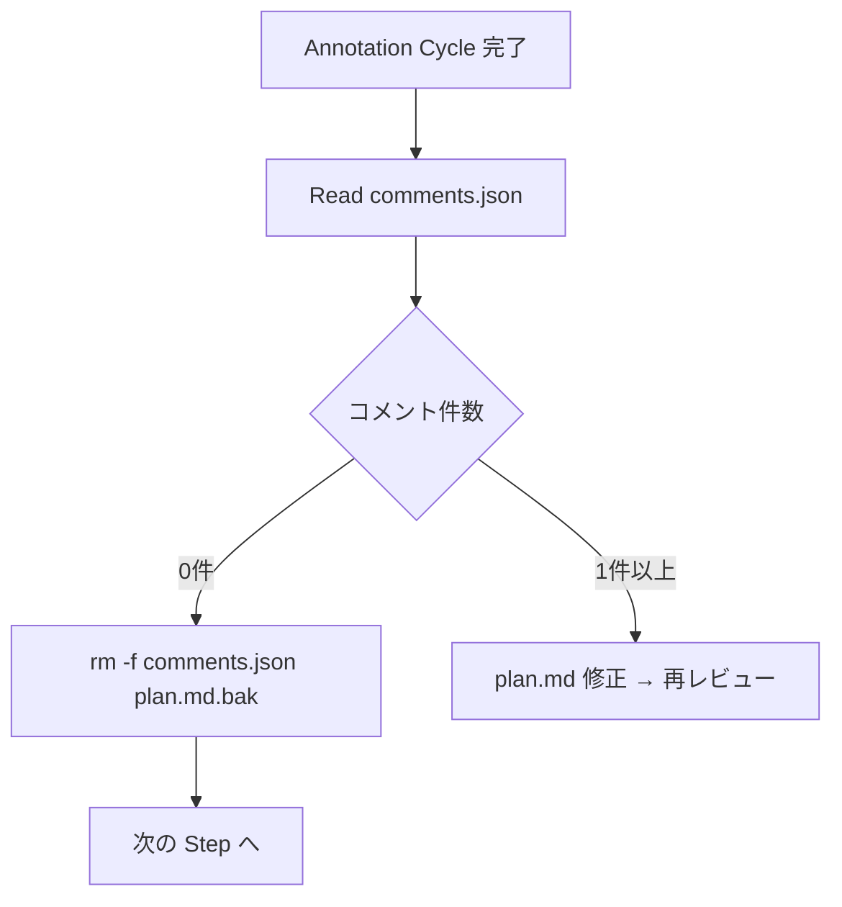

# 開発フロー改善（build/list/spec） — 最終仕様（Result）

> 生成日: 2026-03-14
> 検証モード: フル検証

## 機能概要

spec-flow の開発フローを3点改善した。build スキルの description から不正確な "PR creation" を削除し、list スキルで result.md の judgment フィールドを読み取り PASS/PARTIAL/NEEDS_FIX を区別表示するようにし、spec スキルの Annotation Cycle 完了後に一時ファイル（comments.json, plan.md.bak）をクリーンアップする処理を追加した。

## 仕様からの変更点

plan.md 通りに実装。変更なし。

## ロジック

### 仕様

- build SKILL.md の description から "PR creation" の記述を削除し、責務を明確化
- result.md フォーマット定義の frontmatter に judgment フィールド（PASS / PARTIAL / NEEDS_FIX）を追加
- check SKILL.md の Step 4 で writer に judgment を渡す指示を追加
- writer エージェントの result.md ワークフローで judgment を frontmatter に含めるよう追加
- list SKILL.md のステータス判定で result.md の judgment を読み取り、PASS（検証済み）/ PARTIAL（部分合格）/ NEEDS_FIX（要修正）を区別表示
- list SKILL.md の優先度テーブルで「要修正」を「実装中」の次（優先度2位）に配置
- spec SKILL.md の Annotation Cycle 完了後（コメント0件時）に comments.json と plan.md.bak を削除
- judgment フィールドなしの既存 result.md に対して受入条件テーブルパースによるフォールバック動作を実装

### list の judgment 読み取りフロー

```mermaid
flowchart TD
    A[/list 実行] --> B[Glob docs/plans/*/result.md]
    B --> C{result.md あり?}
    C -- なし --> D[ステータス: 他の判定ロジック]
    C -- あり --> E[Read frontmatter]
    E --> F{judgment フィールドあり?}
    F -- あり --> G[judgment の値で表示]
    G --> G1[PASS → 検証済み]
    G --> G2[PARTIAL → 部分合格]
    G --> G3[NEEDS_FIX → 要修正]
    F -- なし --> H[フォールバック: 受入条件テーブルパース]
```

### Annotation Cycle クリーンアップフロー



## 受入条件

| # | 受入条件 | 判定 | 備考 |
|---|---------|------|------|
| AC-1 | build SKILL.md の description に "PR creation" が含まれない | PASS | description 修正済み |
| AC-2 | result.md フォーマット定義に judgment フィールドが frontmatter として含まれる | PASS | frontmatter に定義済み |
| AC-3 | check SKILL.md の Step 4 で writer に judgment を渡す指示がある | PASS | Step 4-b に記述あり |
| AC-4 | writer エージェントの result.md ワークフローで judgment を frontmatter に含める | PASS | Step 2 に記述済み |
| AC-5 | list SKILL.md のステータス判定で NEEDS_FIX/PARTIAL/PASS を区別表示する | PASS | 区別表示ロジック実装済み |
| AC-6 | list SKILL.md の優先度テーブルで「要修正」が優先度2位に配置されている | PASS | 優先度テーブル更新済み |
| AC-7 | spec SKILL.md の Annotation Cycle 完了後に comments.json と plan.md.bak を削除する | PASS | rm -f による削除処理あり |
| AC-8 | 既存 result.md（judgment なし）に対してフォールバック動作する | PASS | 受入条件テーブルパースによるフォールバックあり |
