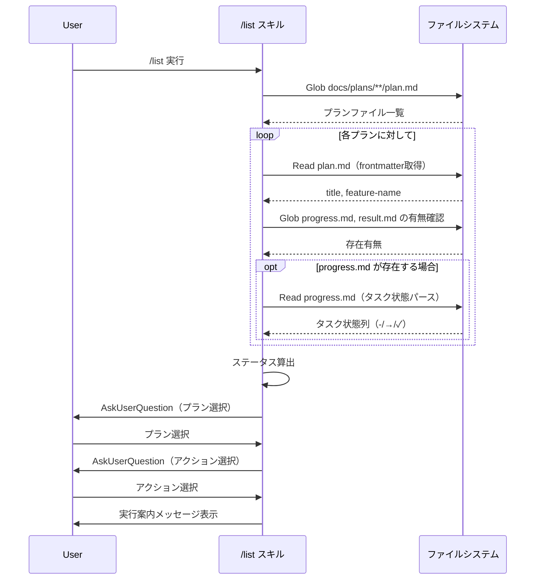

# プラン一覧表示スキル

## 概要

`/list` スキルを新規作成し、`docs/plans/` 配下の全プランをステータス付きで一覧表示する。ユーザーがプランを選択後、`/spec`・`/build`・`/research`・`/check` のいずれかのアクションを選べるようにすることで、プラン管理のハブとして機能させる。

## スコープ

### やること

- `docs/plans/**/plan.md` の走査によるプラン一覧取得
- 各プランのステータス（フェーズ情報）の算出・表示
- AskUserQuestion によるプラン選択
- AskUserQuestion によるアクション選択（`/spec`・`/build`・`/research`・`/check`）
- 選択されたアクションの実行案内メッセージ表示

### やらないこと

- 他スキルの直接実行（案内メッセージのみ）
- プラン削除機能
- 新規プラン作成（`/spec` の役割）
- プランの内容編集

## 受入条件

- [ ] AC-1: `docs/plans/**/plan.md` を走査し、全プランを一覧表示できる
- [ ] AC-2: 各プランにステータス（フェーズ情報）が表示される
- [ ] AC-3: ユーザーが AskUserQuestion でプランを選択できる
- [ ] AC-4: 選択後、`/spec`・`/build`・`/research`・`/check` の4つのアクションから選べる
- [ ] AC-5: アクション選択後、該当スキルの実行案内が表示される

## 非機能要件

- プランが0件の場合はエラーではなく「プランが見つかりません。`/spec` で新規作成してください。」と案内する
- プランが5件以上の場合、AskUserQuestion のオプション数制限（2-4）を考慮し、番号入力方式またはページング方式で対応する

## データフロー

### プラン一覧表示フロー



## 設計判断

| 判断事項 | 選択 | 理由 | 検討した代替案 |
|---------|------|------|--------------|
| スキル構成 | スキル単体で完結（エージェント委譲なし） | 読み取り+表示のみで複雑なロジックがない | エージェント委譲 — オーバーヘッドが大きい |
| ステータス算出方式 | ファイルベース推論 | 既存のフェーズ管理パターン（state.json 不使用）を踏襲 | state.json による状態管理 — プロジェクト規約に反する |
| アクション実行方式 | 案内メッセージのみ | スキルから別スキルの直接実行はアーキテクチャ上推奨されない | 直接実行 — スキル間の結合度が高くなる |
| 5件以上のプラン対応 | 番号付きリスト表示 + 番号入力で選択 | AskUserQuestion のオプション数制限（2-4）を回避 | ページング — 実装が複雑になる |

## システム影響

### 影響範囲

- 新規: `skills/list/SKILL.md` のみ
- 既存ファイルへの変更なし

### リスク

- 既存スキル・エージェントへの影響なし（新規ファイルの追加のみ）
- プラン数が非常に多い場合の表示量 → 番号付きリスト形式で対応

## 実装タスク

### 依存関係図


### タスク一覧

| # | タスク | 対象ファイル | 見積 | 依存 |
|---|--------|------------|------|------|
| 1 | /list スキルの SKILL.md 新規作成（frontmatter + ワークフロー定義） | `skills/list/SKILL.md` | M | - |

> 見積基準: S(〜1h), M(1-3h), L(3h〜)

## テスト方針

### トレーサビリティ

| 受入条件 | 自動テスト | 手動検証 |
|---------|-----------|---------|
| AC-1 | - | MV-1 |
| AC-2 | - | MV-2 |
| AC-3 | - | MV-3 |
| AC-4 | - | MV-4 |
| AC-5 | - | MV-5 |

### 自動テスト

自動テスト対象なし（SKILL.md はマークダウンファイルのため、ユニットテスト不可）。

### ビルド確認

```bash
# SKILL.md の構文チェック（frontmatter の必須フィールド確認）
head -10 skills/list/SKILL.md
```

### 手動検証チェックリスト

- [ ] MV-1: `/list` を実行して `docs/plans/` 配下の全プランが一覧表示されること
- [ ] MV-2: 各プランにステータス（仕様作成済み / 未着手 / 実装中 / 実装完了 / 検証済み）が正しく表示されること
- [ ] MV-3: プラン選択で AskUserQuestion が表示され、選択できること
- [ ] MV-4: プラン選択後、`/spec`・`/build`・`/research`・`/check` の4アクションが選択肢として表示されること
- [ ] MV-5: アクション選択後、該当スキルの実行案内メッセージが表示されること
- [ ] MV-6: プランが0件の場合、「プランが見つかりません」と案内されること
- [ ] MV-7: プランが5件以上の場合でも正常にプラン選択ができること
