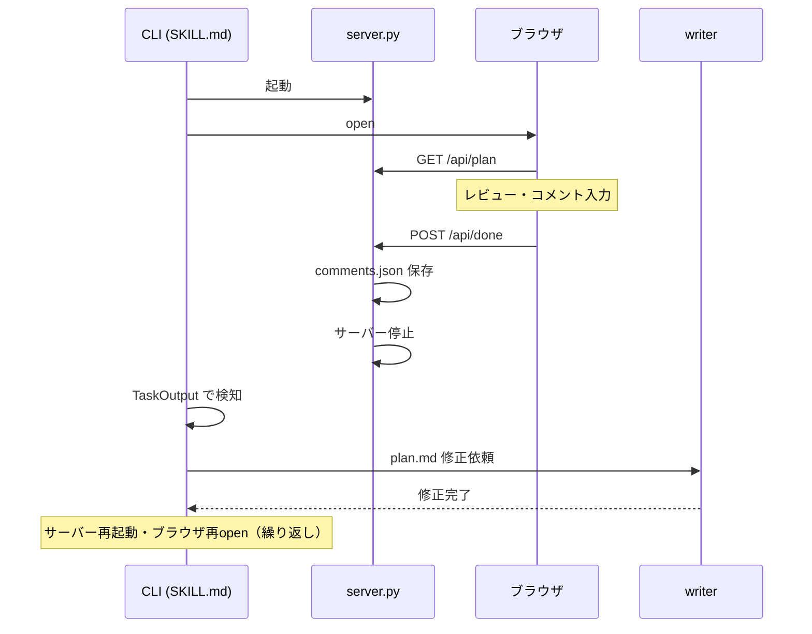
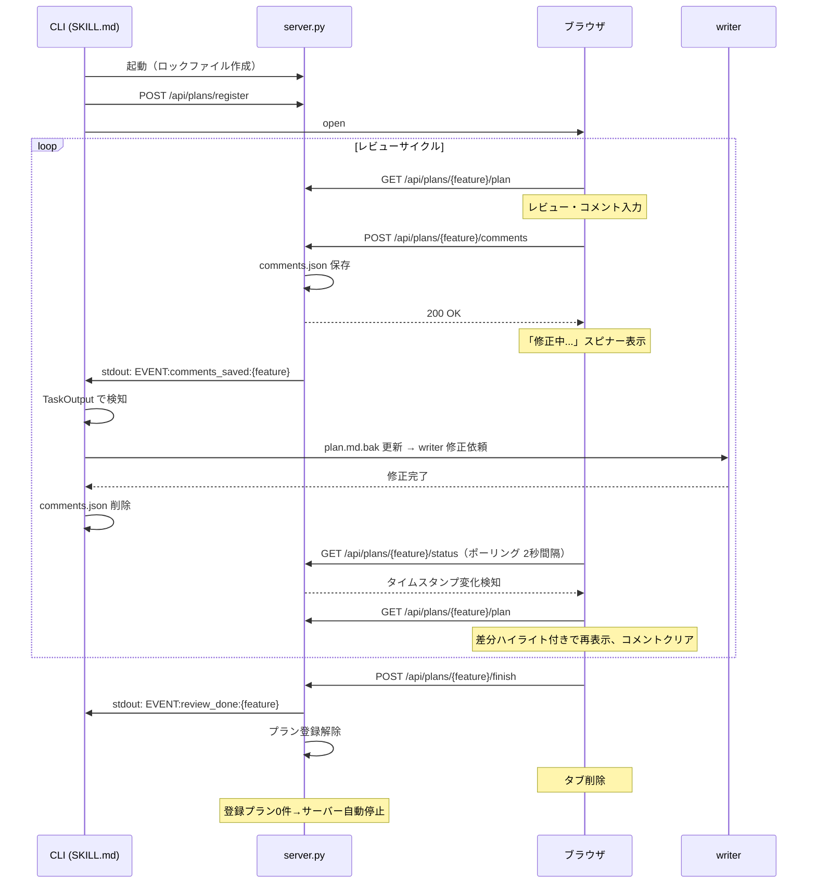
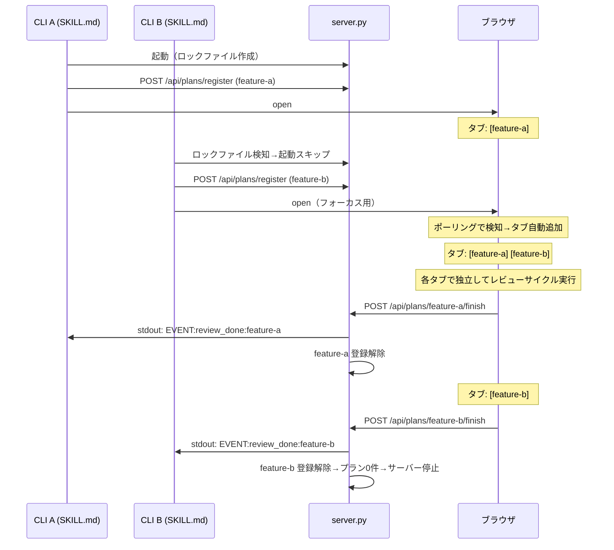
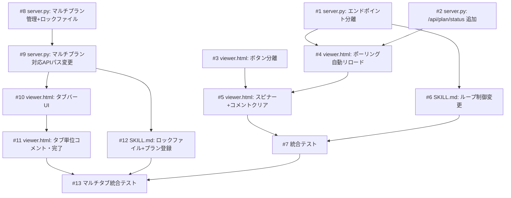

# ライブレビュー（マルチタブ対応 + Annotation Cycle 常駐化）

## 概要

現在の Annotation Cycle はコメント送信のたびにサーバーが停止しブラウザを閉じる必要がある。これをサーバー常駐型に変更し、コメント送信 → writer 修正 → ブラウザ自動リロード（差分ハイライト付き）のループをブラウザを開いたまま行えるようにする。「レビュー完了」ボタンを新設し、それを押した時のみサーバーが停止する。

さらに、複数の `/spec` セッションが同時に実行される場合、1つのサーバーインスタンス（1ポート）を共有し、ブラウザ上でタブUIにより複数の plan.md を切り替えてレビューできるようにする。

## 確認事項

| # | 項目 | 根拠 | ステータス |
|---|------|------|-----------|
| 1 | `TaskOutput(block=true)` が stdout の行単位読み取りに対応しているか | Python の `print(flush=True)` で即時出力すれば行単位で読み取り可能と想定 | ✅確認済み |
| 2 | writer 修正中のブラウザ表示 | 「修正中...」スピナーを表示する方針 | ✅確認済み |
| 3 | comments.json のクリアタイミング | writer 処理後に SKILL.md 側で削除する方針 | ✅確認済み |

## スコープ

### やること

- サーバー常駐化（コメント送信でサーバーを停止しない）
- コメント送信と完了のエンドポイント分離
- ブラウザのポーリングによる自動リロード（差分ハイライト付き）
- 修正中スピナー表示
- SKILL.md のイベントベースループ制御
- ポート1つ化（複数 `/spec` セッションで1サーバーインスタンスを共有）
- ブラウザ上のタブUIで複数 plan.md を切り替え表示
- ロックファイルによるサーバー起動管理
- プラン登録・登録解除API

### やらないこと

- SSE / WebSocket によるリアルタイム通知（Python 標準ライブラリのみの制約）
- コメント履歴の永続化（サイクルごとにクリア）

## 受入条件

- [ ] AC-1: コメント送信後、サーバーは停止せず comments.json を保存して CLI 側に通知する
- [ ] AC-2: writer が plan.md を修正した後、ブラウザが自動的にリロードして差分ハイライト付きで再表示される
- [ ] AC-3: 「コメントを送信」ボタンと「レビュー完了」ボタンが分離されている
- [ ] AC-4: 「レビュー完了」ボタンを押した時のみサーバーが停止する
- [ ] AC-5: コメント送信後〜writer 修正完了までの間、ブラウザに「修正中...」表示がされる
- [ ] AC-6: 自動リロード後にコメントリストがクリアされる
- [ ] AC-7: SKILL.md のループ制御でサーバー再起動・ブラウザ再表示が不要になる
- [ ] AC-8: 複数の `/spec` セッションが同時実行される場合、1つのポートでサーバーが共有される
- [ ] AC-9: ブラウザ上にタブバーが表示され、各 `/spec` セッションの plan.md をタブで切り替えて閲覧・レビューできる
- [ ] AC-10: `/spec` 完了時にそのプランのタブが登録解除され、全プラン解除でサーバーが自動停止する
- [ ] AC-11: 新しい `/spec` セッションが開始されると、ブラウザにタブが自動的に追加される（ポーリングで検知）
- [ ] AC-12: 各タブのコメント送信・レビュー完了がタブ単位で独立して動作する

## 非機能要件

- ポーリング間隔: 2秒（writer の修正は通常数秒〜十数秒かかるため十分）
- Python 3 標準ライブラリのみ（外部依存なし）
- 30分の自動タイムアウトは維持

## データフロー

### 現在のフロー



### 変更後のフロー（シングルセッション）



### 変更後のフロー（マルチセッション）



## バックエンド変更

### API設計

| メソッド | パス | 説明 | 状態 |
|---------|------|------|------|
| POST | `/api/done` | コメント保存+サーバー停止 | 廃止 |
| POST | `/api/plans/register` | 新しいプランを登録 | 新規 |
| POST | `/api/plans/unregister` | プランを登録解除 | 新規 |
| GET | `/api/plans` | 登録中の全プラン一覧を返す | 新規 |
| GET | `/api/plans/{feature-name}/plan` | 特定プランの plan.md + plan.md.bak を返す | 新規（既存 `/api/plan` の拡張） |
| GET | `/api/plans/{feature-name}/status` | 特定プランの plan.md 最終更新時刻を返す | 新規（既存 `/api/plan/status` の拡張） |
| POST | `/api/plans/{feature-name}/comments` | 特定プランにコメント保存 | 新規（既存 `/api/comments` の拡張） |
| POST | `/api/plans/{feature-name}/finish` | 特定プランのレビュー完了・登録解除 | 新規（既存 `/api/finish` の拡張） |

#### POST /api/plans/register

- 入力: `{"feature": "feature-name", "planDir": "/absolute/path/to/plan-dir"}`
- 出力: `{"status": "ok"}`
- 処理: 辞書にプラン情報を追加（feature-name → plan-dir パス）

#### POST /api/plans/unregister

- 入力: `{"feature": "feature-name"}`
- 出力: `{"status": "ok"}`
- 処理: 辞書からプランを削除。登録プランが0件になったらサーバーを自動停止

#### GET /api/plans

- 入力: なし
- 出力: `{"plans": [{"feature": "feature-a", "planDir": "/path/to/dir"}, ...]}`
- 用途: ブラウザのタブ一覧更新用。ポーリングで監視される

#### GET /api/plans/{feature-name}/plan

- 入力: なし
- 出力: `{"plan": "...", "backup": "..."}`（plan.md + plan.md.bak の内容）
- 処理: 辞書から planDir を取得し、そのディレクトリ内の plan.md を読み取る

#### GET /api/plans/{feature-name}/status

- 入力: なし
- 出力: `{"lastModified": 1710000000.0}`（plan.md の `os.path.getmtime` 値）
- 用途: ポーリング用の軽量エンドポイント。タイムスタンプの変化で plan.md の更新を検知する

#### POST /api/plans/{feature-name}/comments

- 入力: コメント配列（既存の `/api/done` と同じ形式）
- 出力: `{"status": "ok"}`
- 処理: 対応する planDir に comments.json 保存 → `print("EVENT:comments_saved:{feature-name}", flush=True)` → レスポンス返却

#### POST /api/plans/{feature-name}/finish

- 入力: なし
- 出力: `{"status": "ok"}`
- 処理: `print("EVENT:review_done:{feature-name}", flush=True)` → プラン登録解除 → レスポンス返却 → 登録プラン0件ならサーバー停止

### サーバー管理

- 起動時にロックファイル（`/tmp/annotation-viewer.lock`）を作成し、ポート番号を記録
- ロックファイルが既に存在する場合、そのポートでサーバーが起動中か確認
- サーバー停止時にロックファイルを削除
- 複数プランディレクトリを辞書で管理: `{feature-name: plan-dir-path}`

### 対象ファイル

- 変更: `scripts/annotation-viewer/server.py` — マルチプラン管理、ロックファイル管理、新規エンドポイント追加、既存エンドポイントのパス変更

## フロントエンド変更

### 画面・UI設計

- 「保存して完了」ボタンを「コメントを送信」と「レビュー完了」の2つに分離
- コメント送信後: 「修正中...」スピナーを表示し、ボタンを無効化
- `setInterval` で `/api/plans/{feature}/status` を2秒間隔でポーリング
- タイムスタンプ変化を検知したら `/api/plans/{feature}/plan` を取得して Markdown を再レンダリング（差分ハイライト付き）
- 自動リロード後: コメントリストをクリア、スピナーを非表示
- 「レビュー完了」ボタン: `POST /api/plans/{feature}/finish` → タブを削除
- ヘッダー下にタブバーを追加（各タブ = feature-name）
- タブ切り替えで表示するプランとコメントリストを切り替え
- 各タブごとに独立したコメントリストを保持
- `setInterval` で `/api/plans` を5秒間隔でポーリングし、タブの追加・削除を検知して自動反映

### ワイヤーフレーム

#### タブバー + コンテンツ（全体レイアウト）

```
+--------------------------------------------------+
| Annotation Viewer                                |
+--------------------------------------------------+
| [feature-a] [feature-b] [feature-c]              |
+--------------------------------------------------+
| plan.md 内容表示                                  |
|                                                  |
| ## 概要                                           |
| ...                                              |
|                                                  |
+--------------------------------------------------+
| コメント一覧 (feature-a)                          |
|  [セクション名] コメント内容...                    |
|  [セクション名] コメント内容...                    |
|                                                  |
| +----------------+  +------------------+         |
| | コメントを送信  |  | レビュー完了      |         |
| +----------------+  +------------------+         |
+--------------------------------------------------+
```

#### 修正中スピナー表示

```
+--------------------------------------------------+
| Annotation Viewer                                |
+--------------------------------------------------+
| [feature-a] [feature-b]                          |
+--------------------------------------------------+
| plan.md 内容表示                                  |
| ...                                              |
+--------------------------------------------------+
| コメント一覧 (feature-a)                          |
|  (空)                                            |
|                                                  |
|        [spinner] 修正中...                        |
|                                                  |
| +----------------+  +------------------+         |
| | コメントを送信  |  | レビュー完了      |         |
| | (disabled)     |  | (disabled)       |         |
| +----------------+  +------------------+         |
+--------------------------------------------------+
```

### 対象ファイル

- 変更: `scripts/annotation-viewer/viewer.html` — タブバーUI追加、タブ切り替え、プラン一覧ポーリング、ボタン分離、ポーリング、スピナー、コメントクリア

## 設計判断

| 判断事項 | 選択 | 理由 | 検討した代替案 |
|---------|------|------|--------------|
| CLI通知方式 | stdout イベント行 | Python 標準ライブラリのみで実現可能。TaskOutput で行単位読み取り可能 | ファイル監視（inotify）— プラットフォーム依存 |
| 自動リロード方式 | ポーリング（setInterval + /api/plan/status） | Python 標準ライブラリのみの制約で最もシンプル | SSE — http.server での実装が複雑 |
| ポーリング間隔 | 2秒 | writer の修正は通常数秒〜十数秒かかるため十分 | 1秒 — 不要な負荷。5秒 — レスポンスが遅い |
| エンドポイント分離 | /api/done → /api/plans/{feature}/comments + /api/plans/{feature}/finish | 責務の明確化（コメント保存とサーバー停止を分離）+ マルチプラン対応 | /api/done にモードパラメータ追加 — 後方互換だが責務が不明瞭 |
| サーバー共有方式 | ロックファイル（/tmp/annotation-viewer.lock） | Python 標準ライブラリのみで実現可能。ポート番号をファイルで共有 | UNIXソケット — プラットフォーム依存。環境変数 — 別プロセスでの共有が困難 |
| タブ追加検知 | ポーリング（/api/plans を5秒間隔） | Python 標準ライブラリのみの制約でシンプル | SSE — http.server での実装が複雑 |
| サーバー停止条件 | 登録プラン0件で自動停止 | 使われなくなったサーバーを残さない | タイムアウトのみ — プランが残っている間は停止すべきでない |

## システム影響

### 影響範囲

- `scripts/annotation-viewer/server.py`: マルチプラン管理、ロックファイル管理、エンドポイント追加・変更
- `scripts/annotation-viewer/viewer.html`: タブUI追加、マルチプラン対応、ポーリング追加
- `skills/spec/SKILL.md`: Step 4-c のループ制御変更、ロックファイルチェック、プラン登録・解除

### リスク

- ポーリングによるリクエスト負荷 → 2秒間隔かつ軽量エンドポイント（/api/plans/{feature}/status）で軽減
- writer 修正が長時間かかった場合のスピナー表示 → 30分の自動タイムアウトが安全弁として機能
- POST /api/done の廃止 → 同バージョンの viewer.html と server.py がセットで更新されるため後方互換の問題なし
- ロックファイルの残留（クラッシュ時） → サーバー起動確認でポートの疎通チェックを行い、応答がなければロックファイルを削除して新規起動
- 複数CLIセッションのイベント分離 → stdout イベントに feature-name を含めることで各CLIが自分のイベントのみ処理

## 実装タスク

### 依存関係図



### タスク一覧

| # | タスク | 対象ファイル | 見積 | 依存 |
|---|--------|------------|------|------|
| 1 | POST /api/done を POST /api/comments + POST /api/finish に分離、stdout イベント出力追加 | `scripts/annotation-viewer/server.py` | M | - |
| 2 | GET /api/plan/status エンドポイント追加 | `scripts/annotation-viewer/server.py` | S | - |
| 3 | ボタン分離（「コメントを送信」「レビュー完了」） | `scripts/annotation-viewer/viewer.html` | S | - |
| 4 | ポーリングによる自動リロード機能追加（setInterval + /api/plan/status） | `scripts/annotation-viewer/viewer.html` | M | #1, #2 |
| 5 | コメント送信後の「修正中...」スピナー表示 + リロード後のコメントクリア | `scripts/annotation-viewer/viewer.html` | S | #3, #4 |
| 6 | Step 4-c のループ制御をイベントベースに変更 | `skills/spec/SKILL.md` | M | #1 |
| 7 | 統合テスト | - | M | #5, #6 |
| 8 | マルチプラン辞書管理 + ロックファイル（起動・停止・残留対応） | `scripts/annotation-viewer/server.py` | M | - |
| 9 | APIパスをマルチプラン対応に変更（/api/plans/register, /api/plans/unregister, /api/plans, /api/plans/{feature}/\*） | `scripts/annotation-viewer/server.py` | M | #8 |
| 10 | タブバーUI追加 + /api/plans ポーリングによるタブ自動追加・削除 | `scripts/annotation-viewer/viewer.html` | M | #9 |
| 11 | タブ単位のコメント管理・送信・レビュー完了 | `scripts/annotation-viewer/viewer.html` | M | #10 |
| 12 | SKILL.md ロックファイルチェック + プラン登録・登録解除 | `skills/spec/SKILL.md` | M | #9 |
| 13 | マルチタブ統合テスト（2セッション同時実行） | - | M | #7, #11, #12 |

> 見積基準: S(~1h), M(1-3h), L(3h~)

## テスト方針

### トレーサビリティ

| 受入条件 | 自動テスト | 手動検証 |
|---------|-----------|---------|
| AC-1 | - | MV-1 |
| AC-2 | - | MV-2 |
| AC-3 | - | MV-3 |
| AC-4 | - | MV-4 |
| AC-5 | - | MV-5 |
| AC-6 | - | MV-6 |
| AC-7 | - | MV-7 |
| AC-8 | - | MV-8 |
| AC-9 | - | MV-9 |
| AC-10 | - | MV-10 |
| AC-11 | - | MV-11 |
| AC-12 | - | MV-12 |

### 自動テスト

自動テストなし（Markdown プロンプト + 軽量 Python スクリプトのため、手動検証で対応）

### ビルド確認

```bash
python3 -c "import scripts.annotation_viewer.server" 2>/dev/null || python3 scripts/annotation-viewer/server.py --help
```

### 手動検証チェックリスト

- [ ] MV-1: コメントを入力して「コメントを送信」を押した後、サーバーが停止せず comments.json が保存されること
- [ ] MV-2: writer が plan.md を修正した後、ブラウザを手動リロードせずに差分ハイライト付きで再表示されること
- [ ] MV-3: 「コメントを送信」ボタンと「レビュー完了」ボタンが別々に表示されていること
- [ ] MV-4: 「レビュー完了」ボタンを押すとサーバーが停止すること
- [ ] MV-5: コメント送信後〜writer 修正完了までの間、「修正中...」スピナーが表示されること
- [ ] MV-6: 自動リロード後にコメントリストが空になっていること
- [ ] MV-7: 複数回のレビューサイクルをブラウザを閉じずに連続して実行できること
- [ ] MV-8: 2つの `/spec` セッションを同時実行した際、2つ目がサーバーを新規起動せず既存サーバーに登録されること
- [ ] MV-9: ブラウザにタブバーが表示され、複数プランをタブで切り替えて閲覧できること
- [ ] MV-10: あるタブの「レビュー完了」を押すとそのタブのみ消え、最後のタブ完了でサーバーが停止すること
- [ ] MV-11: 新しい `/spec` セッションを開始すると、ブラウザにタブが自動追加されること
- [ ] MV-12: タブAでコメント送信中に、タブBで独立してコメント入力・送信ができること
