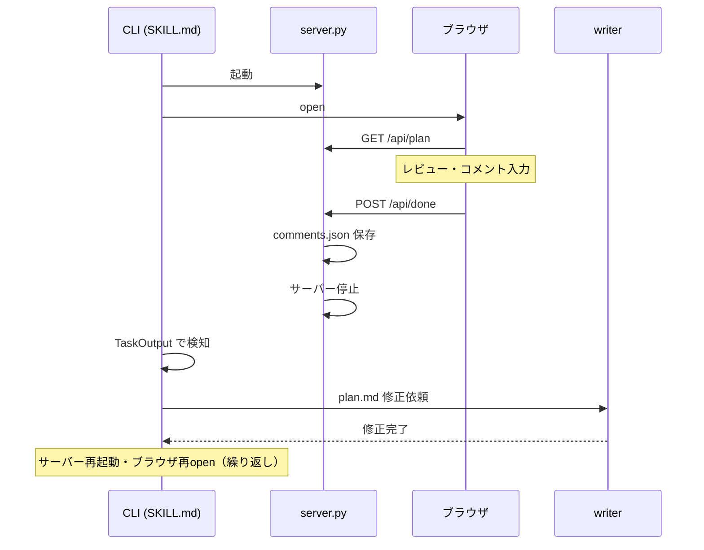
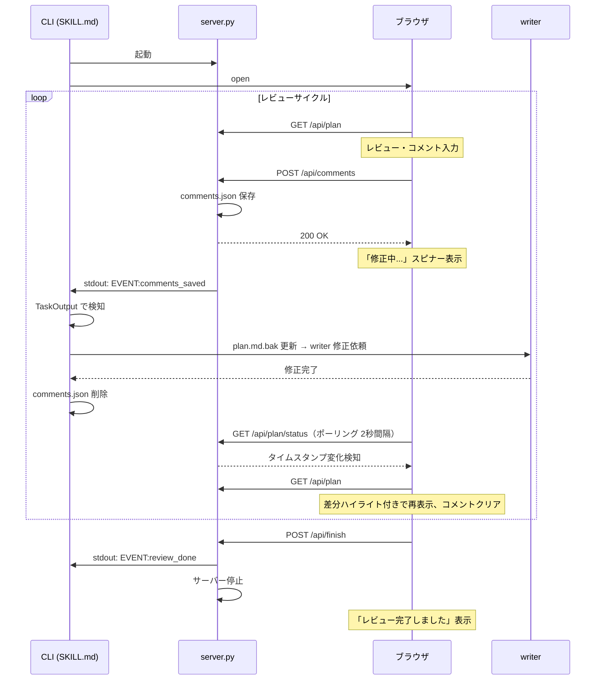
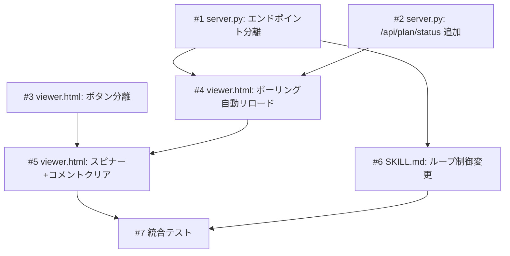

# ライブレビュー（Annotation Cycle 常駐化）

## 概要

現在の Annotation Cycle はコメント送信のたびにサーバーが停止しブラウザを閉じる必要がある。これをサーバー常駐型に変更し、コメント送信 → writer 修正 → ブラウザ自動リロード（差分ハイライト付き）のループをブラウザを開いたまま行えるようにする。「レビュー完了」ボタンを新設し、それを押した時のみサーバーが停止する。

## 確認事項

| # | 項目 | 根拠 | ステータス |
|---|------|------|-----------|
| 1 | `TaskOutput(block=true)` が stdout の行単位読み取りに対応しているか | Python の `print(flush=True)` で即時出力すれば行単位で読み取り可能と想定 | ✅確認済み |
| 2 | writer 修正中のブラウザ表示 | 「修正中...」スピナーを表示する方針 | ✅確認済み |
| 3 | comments.json のクリアタイミング | writer 処理後に SKILL.md 側で削除する方針 | ✅確認済み |

## スコープ

### やること

- サーバー常駐化（コメント送信でサーバーを停止しない）
- コメント送信と完了のエンドポイント分離
- ブラウザのポーリングによる自動リロード（差分ハイライト付き）
- 修正中スピナー表示
- SKILL.md のイベントベースループ制御

### やらないこと

- SSE / WebSocket によるリアルタイム通知（Python 標準ライブラリのみの制約）
- コメント履歴の永続化（サイクルごとにクリア）
- 複数ブラウザタブでの同時レビュー対応

## 受入条件

- [ ] AC-1: コメント送信後、サーバーは停止せず comments.json を保存して CLI 側に通知する
- [ ] AC-2: writer が plan.md を修正した後、ブラウザが自動的にリロードして差分ハイライト付きで再表示される
- [ ] AC-3: 「コメントを送信」ボタンと「レビュー完了」ボタンが分離されている
- [ ] AC-4: 「レビュー完了」ボタンを押した時のみサーバーが停止する
- [ ] AC-5: コメント送信後〜writer 修正完了までの間、ブラウザに「修正中...」表示がされる
- [ ] AC-6: 自動リロード後にコメントリストがクリアされる
- [ ] AC-7: SKILL.md のループ制御でサーバー再起動・ブラウザ再表示が不要になる

## 非機能要件

- ポーリング間隔: 2秒（writer の修正は通常数秒〜十数秒かかるため十分）
- Python 3 標準ライブラリのみ（外部依存なし）
- 30分の自動タイムアウトは維持

## データフロー

### 現在のフロー



### 変更後のフロー



## バックエンド変更

### API設計

| メソッド | パス | 説明 | 状態 |
|---------|------|------|------|
| POST | `/api/done` | コメント保存+サーバー停止 | 廃止 |
| POST | `/api/comments` | コメント保存、サーバーは停止しない | 新規 |
| POST | `/api/finish` | レビュー完了、サーバー停止 | 新規 |
| GET | `/api/plan` | plan.md + plan.md.bak の内容を JSON で返す | 既存維持 |
| GET | `/api/plan/status` | plan.md の最終更新時刻のみ返す | 新規 |

#### POST /api/comments

- 入力: コメント配列（既存の `/api/done` と同じ形式）
- 出力: `{"status": "ok"}`
- 処理: comments.json 保存 → `print("EVENT:comments_saved", flush=True)` → レスポンス返却（サーバー停止しない）

#### POST /api/finish

- 入力: なし
- 出力: `{"status": "ok"}`
- 処理: `print("EVENT:review_done", flush=True)` → レスポンス返却 → サーバー停止

#### GET /api/plan/status

- 入力: なし
- 出力: `{"lastModified": 1710000000.0}`（plan.md の `os.path.getmtime` 値）
- 用途: ポーリング用の軽量エンドポイント。タイムスタンプの変化で plan.md の更新を検知する

### 対象ファイル

- 変更: `scripts/annotation-viewer/server.py` — エンドポイント分離、stdout イベント出力、ステータスエンドポイント追加

## フロントエンド変更

### 画面・UI設計

- 「保存して完了」ボタンを「コメントを送信」と「レビュー完了」の2つに分離
- コメント送信後: 「修正中...」スピナーを表示し、ボタンを無効化
- `setInterval` で `/api/plan/status` を2秒間隔でポーリング
- タイムスタンプ変化を検知したら `/api/plan` を取得して Markdown を再レンダリング（差分ハイライト付き）
- 自動リロード後: コメントリストをクリア、スピナーを非表示
- 「レビュー完了」ボタン: `POST /api/finish` → 「レビュー完了しました。このタブを閉じてください」と表示

### ワイヤーフレーム

#### ボタン領域（コメントパネル下部）

```
+------------------------------------------+
| コメント一覧                              |
|  [セクション名] コメント内容...            |
|  [セクション名] コメント内容...            |
|                                          |
| +----------------+  +------------------+ |
| | コメントを送信  |  | レビュー完了      | |
| +----------------+  +------------------+ |
+------------------------------------------+
```

#### 修正中スピナー表示

```
+------------------------------------------+
| コメント一覧                              |
|  (空)                                    |
|                                          |
|        [spinner] 修正中...                |
|                                          |
| +----------------+  +------------------+ |
| | コメントを送信  |  | レビュー完了      | |
| | (disabled)     |  | (disabled)       | |
| +----------------+  +------------------+ |
+------------------------------------------+
```

### 対象ファイル

- 変更: `scripts/annotation-viewer/viewer.html` — ボタン分離、ポーリング、スピナー、コメントクリア

## 設計判断

| 判断事項 | 選択 | 理由 | 検討した代替案 |
|---------|------|------|--------------|
| CLI通知方式 | stdout イベント行 | Python 標準ライブラリのみで実現可能。TaskOutput で行単位読み取り可能 | ファイル監視（inotify）— プラットフォーム依存 |
| 自動リロード方式 | ポーリング（setInterval + /api/plan/status） | Python 標準ライブラリのみの制約で最もシンプル | SSE — http.server での実装が複雑 |
| ポーリング間隔 | 2秒 | writer の修正は通常数秒〜十数秒かかるため十分 | 1秒 — 不要な負荷。5秒 — レスポンスが遅い |
| エンドポイント分離 | /api/done → /api/comments + /api/finish | 責務の明確化（コメント保存とサーバー停止を分離） | /api/done にモードパラメータ追加 — 後方互換だが責務が不明瞭 |

## システム影響

### 影響範囲

- `scripts/annotation-viewer/server.py`: エンドポイント追加・変更
- `scripts/annotation-viewer/viewer.html`: UI変更・ポーリング追加
- `skills/spec/SKILL.md`: Step 4-c のループ制御変更

### リスク

- ポーリングによるリクエスト負荷 → 2秒間隔かつ軽量エンドポイント（/api/plan/status）で軽減
- writer 修正が長時間かかった場合のスピナー表示 → 30分の自動タイムアウトが安全弁として機能
- POST /api/done の廃止 → 同バージョンの viewer.html と server.py がセットで更新されるため後方互換の問題なし

## 実装タスク

### 依存関係図



### タスク一覧

| # | タスク | 対象ファイル | 見積 | 依存 |
|---|--------|------------|------|------|
| 1 | POST /api/done を POST /api/comments + POST /api/finish に分離、stdout イベント出力追加 | `scripts/annotation-viewer/server.py` | M | - |
| 2 | GET /api/plan/status エンドポイント追加 | `scripts/annotation-viewer/server.py` | S | - |
| 3 | ボタン分離（「コメントを送信」「レビュー完了」） | `scripts/annotation-viewer/viewer.html` | S | - |
| 4 | ポーリングによる自動リロード機能追加（setInterval + /api/plan/status） | `scripts/annotation-viewer/viewer.html` | M | #1, #2 |
| 5 | コメント送信後の「修正中...」スピナー表示 + リロード後のコメントクリア | `scripts/annotation-viewer/viewer.html` | S | #3, #4 |
| 6 | Step 4-c のループ制御をイベントベースに変更 | `skills/spec/SKILL.md` | M | #1 |
| 7 | 統合テスト | - | M | #5, #6 |

> 見積基準: S(~1h), M(1-3h), L(3h~)

## テスト方針

### トレーサビリティ

| 受入条件 | 自動テスト | 手動検証 |
|---------|-----------|---------|
| AC-1 | - | MV-1 |
| AC-2 | - | MV-2 |
| AC-3 | - | MV-3 |
| AC-4 | - | MV-4 |
| AC-5 | - | MV-5 |
| AC-6 | - | MV-6 |
| AC-7 | - | MV-7 |

### 自動テスト

自動テストなし（Markdown プロンプト + 軽量 Python スクリプトのため、手動検証で対応）

### ビルド確認

```bash
python3 -c "import scripts.annotation_viewer.server" 2>/dev/null || python3 scripts/annotation-viewer/server.py --help
```

### 手動検証チェックリスト

- [ ] MV-1: コメントを入力して「コメントを送信」を押した後、サーバーが停止せず comments.json が保存されること
- [ ] MV-2: writer が plan.md を修正した後、ブラウザを手動リロードせずに差分ハイライト付きで再表示されること
- [ ] MV-3: 「コメントを送信」ボタンと「レビュー完了」ボタンが別々に表示されていること
- [ ] MV-4: 「レビュー完了」ボタンを押すとサーバーが停止すること
- [ ] MV-5: コメント送信後〜writer 修正完了までの間、「修正中...」スピナーが表示されること
- [ ] MV-6: 自動リロード後にコメントリストが空になっていること
- [ ] MV-7: 複数回のレビューサイクルをブラウザを閉じずに連続して実行できること
