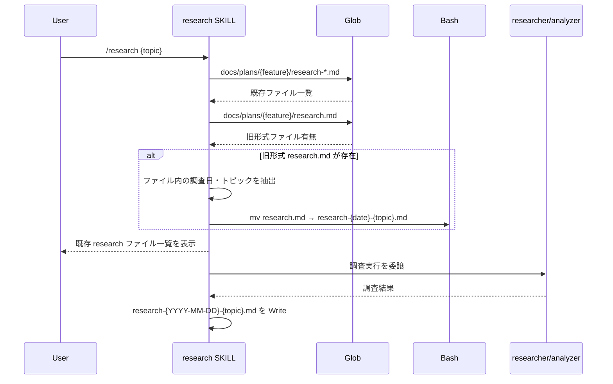
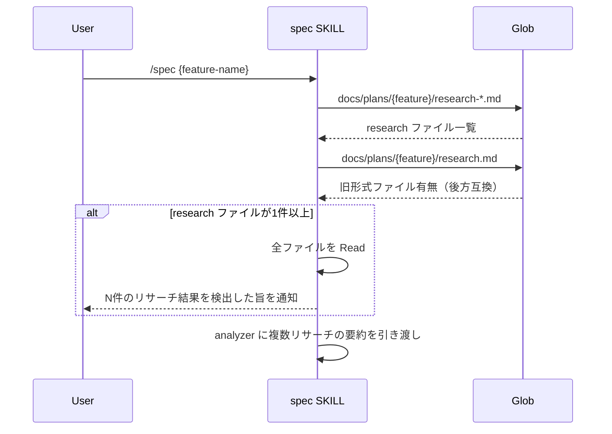
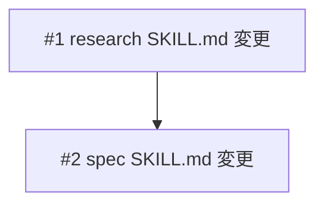

# 複数リサーチファイル管理

## 概要

research スキルで同一 plan ディレクトリに対して複数のリサーチを管理できるようにする。出力ファイル名を `research-{YYYY-MM-DD}-{topic}.md` 形式に変更し、既存の単一 `research.md` は自動的に新形式にリネームする。spec スキルの参照部分も複数ファイル対応にする。

## 受入条件

- [ ] AC-1: research スキルが `research-{YYYY-MM-DD}-{topic}.md` 形式でファイルを出力する
- [ ] AC-2: 同一 plan ディレクトリに複数の research ファイルを保持できる
- [ ] AC-3: 既存の `research.md` がある場合、自動的に新形式にリネームする（ファイル内の調査日とトピックから命名）
- [ ] AC-4: spec スキルが `Glob research-*.md` で複数 research ファイルを検出し、すべてをコンテキストとして読み込む
- [ ] AC-5: research スキルの追記モードが廃止されている（別トピックは別ファイル）
- [ ] AC-6: 既存の research ファイル一覧を表示し、ユーザーが参照できる

## スコープ

### やること

- research SKILL.md の出力パス変更（`research-{YYYY-MM-DD}-{topic}.md` 形式）
- 既存ファイル検出ロジックの変更（`Glob research-*.md` パターン）
- 既存 `research.md` の自動移行処理（ファイル内の調査日・トピックを抽出してリネーム）
- 追記モードの廃止（別トピックは別ファイル方式に統一）
- spec SKILL.md の Step 0-c を複数 research ファイル対応に変更

### やらないこと

- researcher エージェント本体の変更
- annotation-viewer の変更
- README 更新

## 非機能要件

特になし

## データフロー

### 新規リサーチ実行フロー

### spec スキルでの複数リサーチ読み込みフロー

## 設計判断

| 判断事項 | 選択 | 理由 | 検討した代替案 |
|---------|------|------|--------------|
| ファイル命名規則 | `research-{YYYY-MM-DD}-{topic}.md` | fix スキルの `debug-{YYYY-MM-DD}-{N}.md` パターンを踏襲し、一貫性を保つ | `research-{N}.md`（連番）— 日付・トピックが不明で検索性が低い |
| 追記モード | 廃止 | 別トピックは別ファイルの方が検索性・可読性が高い | 追記モード維持 — 1ファイルが肥大化し管理しにくい |
| 自動移行の方法 | ファイル内の調査日・トピックを抽出してリネーム | 既存ユーザーの手動対応が不要 | 手動リネームを案内 — ユーザー負担が大きい |
| spec スキルの後方互換 | `research.md`（旧形式）も検出対象に含める | 移行漏れがあっても spec スキルが正常動作する | 旧形式を無視 — 移行前のファイルが読み込まれなくなる |

## システム影響

### 影響範囲

- `skills/research/SKILL.md` — 出力パス、既存ファイル確認、フォーマット、追記モード廃止
- `skills/spec/SKILL.md` — Step 0-c の Glob パターンと読み込みロジック

### リスク

- 既存の `research.md` からの自動移行時、調査日やトピックが抽出できない場合 → フォールバックとして `research-unknown-unknown.md` 等のデフォルト名を使用
- 後方互換のため旧形式 `research.md` も検出対象に含めるが、新規作成は新形式のみ

## 実装タスク

### 依存関係図

### タスク一覧

| # | タスク | 対象ファイル | 見積 | 依存 |
|---|--------|------------|------|------|
| 1 | research SKILL.md — 出力ファイル名形式変更、既存ファイル確認ロジック変更、自動移行処理追加、追記モード廃止 | `skills/research/SKILL.md` | M | - |
| 2 | spec SKILL.md — Step 0-c の複数 research ファイル対応 | `skills/spec/SKILL.md` | S | #1 |

> 見積基準: S(~1h), M(1-3h), L(3h~)

## テスト方針

### トレーサビリティ

| 受入条件 | 自動テスト | 手動検証 |
|---------|-----------|---------|
| AC-1 | - | MV-1 |
| AC-2 | - | MV-2 |
| AC-3 | - | MV-3 |
| AC-4 | - | MV-4 |
| AC-5 | - | MV-5 |
| AC-6 | - | MV-6 |

### 手動検証チェックリスト

- [ ] MV-1: `/research` を実行し、`research-{YYYY-MM-DD}-{topic}.md` 形式でファイルが生成されること
- [ ] MV-2: 同一ディレクトリで `/research` を異なるトピックで複数回実行し、それぞれ別ファイルとして保存されること
- [ ] MV-3: 既存の `research.md` がある plan ディレクトリで `/research` を実行し、旧ファイルが新形式に自動リネームされること
- [ ] MV-4: 複数の research ファイルがある状態で `/spec` を実行し、すべてのファイルが検出・読み込みされること
- [ ] MV-5: `/research` 実行時に追記モードの選択肢が表示されないこと
- [ ] MV-6: 既存 research ファイルがある状態で `/research` を実行し、既存ファイル一覧が表示されること
