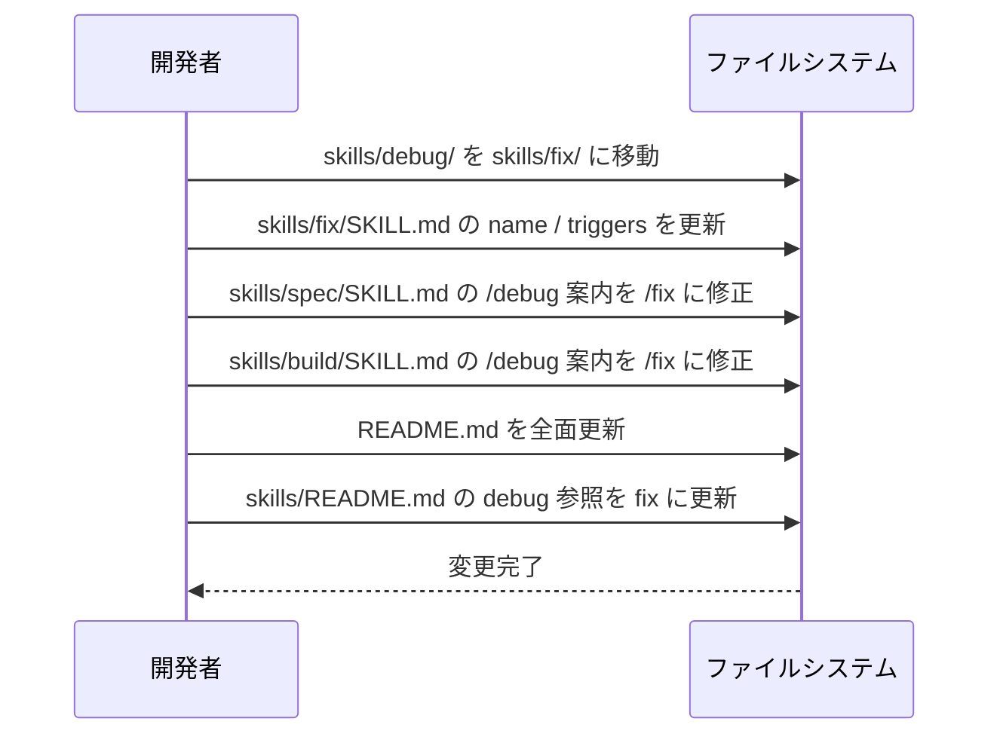
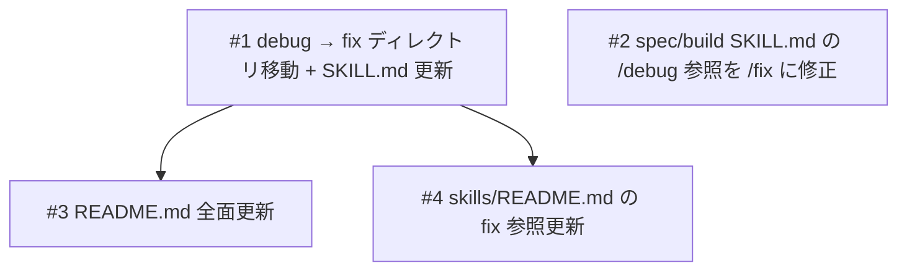

# debug スキルの fix リネームと README 改善

## 概要

spec-flow プラグインの利用者が、Claude Code 本体の `/debug` コマンドと混同することなく修正フローを呼び出せるようにするため、`debug` スキルを `fix` にリネームする。あわせて README.md を刷新し、軽量仕様駆動開発ツールとしての位置づけを明確にする。

## 受入条件

- [ ] AC-1: `skills/debug/` が `skills/fix/` に移動し、`SKILL.md` の `name` が `fix` になっている
- [ ] AC-2: `skills/fix/SKILL.md` の `triggers` から `"debug"` が除外され、`"fix"` 関連のトリガーが含まれている
- [ ] AC-3: `skills/spec/SKILL.md` と `skills/build/SKILL.md` 内の `/debug` 案内が `/fix` に更新されている
- [ ] AC-4: `README.md` の冒頭で「軽量仕様駆動開発」が強調されている
- [ ] AC-5: `README.md` のインストールセクションに `/plugin marketplace add 884js/spec-flow` と `/plugin install spec-flow@884js-spec-flow` が記載されている
- [ ] AC-6: `README.md` にマーケットプレイスセクションが追加されている
- [ ] AC-7: `README.md` と `skills/README.md` で `debug` → `fix` の参照が全て更新されている
- [ ] AC-8: `debug-{date}-{N}.md` のファイル命名規則は変更されていない（互換性維持）
- [ ] AC-9: `state.json` テンプレートの `"debug"` キーは変更されていない（互換性維持）

## スコープ

### やること

- `skills/debug/` ディレクトリを `skills/fix/` に移動し、`SKILL.md` の `name` および `triggers` を更新する
- `skills/spec/SKILL.md` と `skills/build/SKILL.md` 内の `/debug` 参照を `/fix` に修正する
- `README.md` を全面更新する（軽量仕様駆動開発の強調、インストールコマンド修正、マーケットプレイスセクション追加、`fix` への参照変更）
- `skills/README.md` の `debug` 参照を `fix` に更新する

### やらないこと

- `debug-{date}-{N}.md` のファイル命名規則の変更
- `agents/writer/references/templates/state.json` の `"debug"` キーの変更
- `agents/` 配下のドキュメント変更（`debug` コンテキストは概念参照であり変更不要）
- `plugin.json` の変更（`agents` 登録のみで `skills` は登録されていないため）

## 非機能要件

- 後方互換性: 既存の `state.json` ファイルや `debug-*.md` のグロブパターンが壊れないこと

## データフロー

### ファイル変更フロー



## 設計判断

| 判断事項 | 選択 | 理由 | 検討した代替案 |
|---------|------|------|--------------|
| リネーム先の名前 | `fix` | 短く直感的。Claude Code の `/debug` と明確に区別できる | `diagnose` — 長すぎる。`investigate` — 長すぎる。`troubleshoot` — 旧スキル名と混同の恐れ |
| `debug-*.md` ファイル命名 | 変更しない | 既存の `state.json` や他スキルからのグロブパターンとの互換性を維持 | `fix-*.md` に変更 — 既存データとの互換性が壊れる |
| `state.json` の `debug` キー | 変更しない | データ構造キーとして定着。既存の `state.json` との後方互換性を維持 | `fix` に変更 — 既存 `state.json` が壊れる |
| `triggers` での `debug` 除外 | `debug` を `triggers` から除外 | Claude Code 本体の `/debug` との混同を避けるのがリネームの目的 | 残す — リネームの意味がなくなる |

## システム影響

### 影響範囲

- `skills/debug/` → `skills/fix/`（ディレクトリ移動 + `SKILL.md` 更新）
- `skills/spec/SKILL.md`（`/debug` → `/fix` の案内文修正）
- `skills/build/SKILL.md`（`/debug` → `/fix` の案内文修正）
- `README.md`（全面更新）
- `skills/README.md`（`fix` への参照変更）

### リスク

- `plugin.json` は `agents` 登録のみのため変更不要だが、将来 `skills` が登録される際に `fix` の名前で追加する必要がある
- `debug-*.md` ファイル命名の非変更により、エンドユーザーが出力ファイル名と呼び出しコマンドの不一致に気づく可能性がある（許容範囲と判断）

## 実装タスク

### 依存関係図



### タスク一覧

| # | タスク | 対象ファイル | 見積 | 依存 |
|---|--------|------------|------|------|
| 1 | `debug` → `fix` ディレクトリ移動 + `SKILL.md` 更新 | `skills/debug/` → `skills/fix/`, `skills/fix/SKILL.md` | S | - |
| 2 | `spec` / `build` `SKILL.md` の `/debug` 参照を `/fix` に修正 | `skills/spec/SKILL.md`, `skills/build/SKILL.md` | S | - |
| 3 | `README.md` 全面更新（軽量仕様駆動開発の強調、インストールコマンド修正、マーケットプレイス追加、`fix` 参照更新） | `README.md` | S | #1 |
| 4 | `skills/README.md` の `fix` 参照更新 | `skills/README.md` | S | #1 |

> 見積基準: S(〜1h), M(1-3h), L(3h〜)

## テスト方針

### トレーサビリティ

| 受入条件 | 自動テスト | 手動検証 |
|---------|-----------|---------|
| AC-1 | - | MV-1 |
| AC-2 | - | MV-2 |
| AC-3 | - | MV-3 |
| AC-4 | - | MV-4 |
| AC-5 | - | MV-5 |
| AC-6 | - | MV-6 |
| AC-7 | ビルド確認（grep） | MV-7 |
| AC-8 | - | MV-8 |
| AC-9 | - | MV-9 |

### 自動テスト

なし（ドキュメント更新 + ファイル移動のみ）

### ビルド確認

```bash
# fix ディレクトリの存在確認
ls skills/fix/SKILL.md

# 旧 debug ディレクトリが削除されていること
! ls skills/debug/SKILL.md 2>/dev/null

# README 内の旧 /spec-flow:debug 参照がないこと
! grep -r "/spec-flow:debug" README.md skills/README.md
```

### 手動検証チェックリスト

- [ ] MV-1: `skills/fix/SKILL.md` が存在し、`name: fix` になっていること
- [ ] MV-2: `skills/fix/SKILL.md` の `triggers` に `"debug"` が含まれず、`"fix"` 関連のトリガーがあること
- [ ] MV-3: `skills/spec/SKILL.md` と `skills/build/SKILL.md` 内の `/debug` 案内が `/fix` に更新されていること
- [ ] MV-4: `README.md` の冒頭で「軽量仕様駆動開発」が強調されていること
- [ ] MV-5: `README.md` のインストールセクションに `/plugin marketplace add 884js/spec-flow` と `/plugin install spec-flow@884js-spec-flow` が記載されていること
- [ ] MV-6: `README.md` にマーケットプレイスセクションが追加されていること
- [ ] MV-7: `README.md` と `skills/README.md` で `/spec-flow:debug` の参照が残っていないこと
- [ ] MV-8: `skills/fix/SKILL.md` 内の `debug-{date}-{N}.md` の命名規則が変更されていないこと
- [ ] MV-9: `agents/writer/references/templates/state.json` の `"debug"` キーが変更されていないこと
