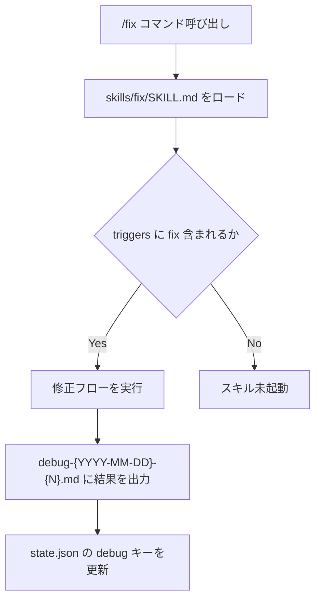

# debug スキルの fix リネームと README 改善 — 最終仕様（Result）

> 生成日: 2026-03-03
> 検証モード: フル検証

## 機能概要

spec-flow プラグインの `debug` スキルを `fix` にリネームし、Claude Code 本体の `/debug` コマンドとの混同を解消した。あわせて README.md を全面更新し、軽量仕様駆動開発ツールとしての位置づけを明確化するとともに、Marketplace インストール手順とマーケットプレイスセクションを追加した。既存の `state.json` ファイルや `debug-*.md` のファイル命名規則は後方互換性のため変更していない。

## 仕様からの変更点

plan.md 通りに実装。変更なし。

## ロジック

### 仕様

- ユーザーは `/fix` コマンドで修正フローを呼び出す（旧: `/debug`）
- `skills/fix/SKILL.md` の `name` フィールドが `fix`、`triggers` に `"fix"` 関連のトリガーが含まれる
- `skills/spec/SKILL.md` と `skills/build/SKILL.md` は修正フロー案内として `/fix` を参照する
- `README.md` の冒頭で「軽量仕様駆動開発（lightweight spec-driven development）」を強調する
- `README.md` のインストールセクションに Marketplace 経由と直接インストールの2コマンドを記載する
- 出力ファイルの命名規則 `debug-{YYYY-MM-DD}-{N}.md` および `state.json` の `"debug"` キーは変更しない

### ファイル変更フロー

## 受入条件

| # | 受入条件 | 判定 | 備考 |
|---|---------|------|------|
| AC-1 | `skills/debug/` が `skills/fix/` に移動し、`SKILL.md` の `name` が `fix` になっている | PASS | `skills/fix/SKILL.md` 存在確認済み、`skills/debug/` 削除済み |
| AC-2 | `skills/fix/SKILL.md` の `triggers` から `"debug"` が除外され、`"fix"` 関連のトリガーが含まれている | PASS | triggers 内容を直接確認 |
| AC-3 | `skills/spec/SKILL.md` と `skills/build/SKILL.md` 内の `/debug` 案内が `/fix` に更新されている | PASS | 両ファイルの参照更新を確認 |
| AC-4 | `README.md` の冒頭で「軽量仕様駆動開発」が強調されている | PASS | "lightweight spec-driven development" の記述確認 |
| AC-5 | `README.md` のインストールセクションに2コマンドが記載されている | PASS | `/plugin marketplace add 884js/spec-flow` および `/plugin install spec-flow@884js-spec-flow` を確認 |
| AC-6 | `README.md` にマーケットプレイスセクションが追加されている | PASS | `## Marketplace` セクション追加済み |
| AC-7 | `README.md` と `skills/README.md` で `debug` → `fix` の参照が全て更新されている | PASS | `/spec-flow:debug` の参照なしを grep 確認 |
| AC-8 | `debug-{date}-{N}.md` のファイル命名規則は変更されていない | PASS | 命名規則の後方互換性を維持 |
| AC-9 | `agents/writer/references/templates/state.json` の `"debug"` キーは変更されていない | PASS | `"debug"` キーの維持を確認 |
