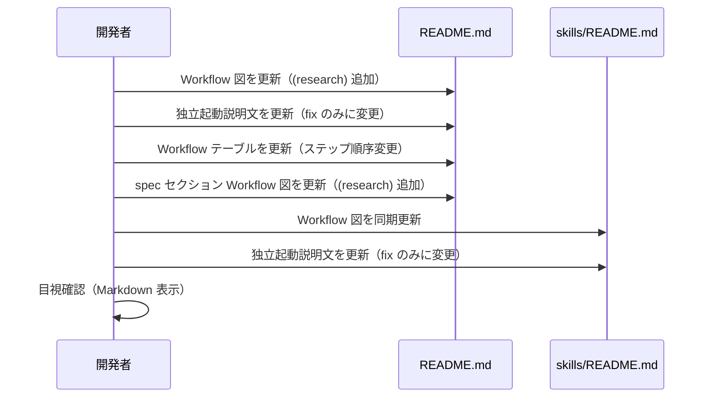
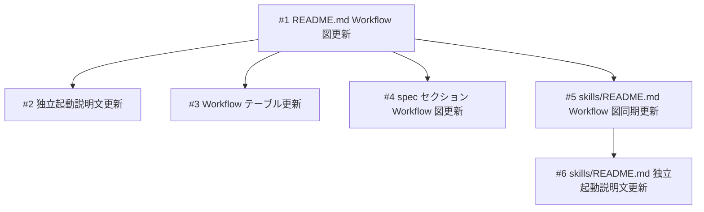

# README Workflow に (research) ステップを追加

## 概要

README.md の Workflow セクションに (research) ステップを spec の前段（オプショナル）として追加する。research は任意タイミングで独立起動可能だが、ワークフロー図上では spec の前段として位置づけることで、調査→設計→実装の流れを視覚的に表現する。

## 受入条件

- [ ] AC-1: README.md の Workflow 図に (research) が spec の前に表示されている
- [ ] AC-2: README.md の Workflow テーブルで research のステップ番号が適切に変更されている
- [ ] AC-3: skills/README.md の Workflow 図も同期更新されている
- [ ] AC-4: research は括弧付き（オプショナル）として表現されている
- [ ] AC-5: fix は引き続き独立起動のまま変更されていない
- [ ] AC-6: README.md L21 の独立起動説明から research が除外され、fix のみになっている
- [ ] AC-7: README.md spec セクションの Workflow 図に (research) からの流れが反映されている
- [ ] AC-8: skills/README.md の独立起動説明文から research が除外され、fix のみになっている

## スコープ

### やること

- README.md の Workflow 図を更新（(research) を spec の前に追加）
- README.md の Workflow テーブルを更新（research のステップ順序を変更）
- README.md の独立起動説明文を更新（research を除外し fix のみに変更）
- README.md spec セクションの Workflow 図を更新（(research) からの流れを追加）
- skills/README.md の Workflow 図を同期更新
- skills/README.md の独立起動説明文を更新（research を除外し fix のみに変更）

### やらないこと

- スキル定義やエージェント定義の変更
- SKILL.md の変更
- research セクションの説明文の変更（既に spec 連携の記述があるため）

## データフロー

### Workflow 図の更新フロー

## 設計判断

| 判断事項 | 選択 | 理由 | 検討した代替案 |
|---------|------|------|--------------|
| research の表記 | 括弧付き `(research)` | オプショナルであることを視覚的に表現するため | 括弧なし — 必須ステップと区別がつかない |
| fix の扱い | 独立起動のまま変更しない | fix はワークフローの特定位置に属さないため | spec の前に配置 — fix の性質に合わない |
| ステップ番号の扱い | research を先頭に配置しテーブルの順序を調整 | 調査→設計→実装の自然な流れに合わせるため | 末尾に配置 — ワークフローの流れと一致しない |

## システム影響

### 影響範囲

- README.md（L13-22: Workflow 図、L21: 独立起動説明文、L24-30: Workflow テーブル、L40-43: spec セクション Workflow 図）
- skills/README.md（L7-15: Workflow 図、L13-14: 独立起動説明文）

### リスク

- ドキュメントのみの変更のため、機能的なリスクはなし
- Mermaid 等のレンダリングへの影響もなし（ASCII アートのため）

## 実装タスク

### 依存関係図

### タスク一覧

| # | タスク | 対象ファイル | 見積 | 依存 |
|---|--------|------------|------|------|
| 1 | README.md の Workflow 図を更新（(research) を spec の前に追加） | `README.md` | S | - |
| 2 | README.md の独立起動説明文を更新（research を除外し fix のみに変更） | `README.md` | S | #1 |
| 3 | README.md の Workflow テーブルを更新（research のステップ順序を変更） | `README.md` | S | #1 |
| 4 | README.md spec セクションの Workflow 図を更新（(research) からの流れを追加） | `README.md` | S | #1 |
| 5 | skills/README.md の Workflow 図を同期更新 | `skills/README.md` | S | #1 |
| 6 | skills/README.md の独立起動説明文を更新（research を除外し fix のみに変更） | `skills/README.md` | S | #5 |

> 見積基準: S(〜1h), M(1-3h), L(3h〜)

## テスト方針

### トレーサビリティ

| 受入条件 | 自動テスト | 手動検証 |
|---------|-----------|---------|
| AC-1 | - | MV-1 |
| AC-2 | - | MV-2 |
| AC-3 | - | MV-3 |
| AC-4 | - | MV-1, MV-3 |
| AC-5 | - | MV-4 |
| AC-6 | - | MV-5 |
| AC-7 | - | MV-6 |
| AC-8 | - | MV-7 |

### 手動検証チェックリスト

- [ ] MV-1: README.md の Workflow 図で (research) が spec の前に括弧付きで表示されていること
- [ ] MV-2: README.md の Workflow テーブルで research が適切なステップ番号で表示されていること
- [ ] MV-3: skills/README.md の Workflow 図で (research) が spec の前に括弧付きで表示されていること
- [ ] MV-4: fix が独立起動のまま変更されていないこと
- [ ] MV-5: README.md の独立起動説明文が `fix can be invoked independently at any time` に変更されていること
- [ ] MV-6: README.md spec セクションの Workflow 図に (research) からの流れが含まれていること
- [ ] MV-7: skills/README.md の独立起動説明文が fix のみに変更されていること
