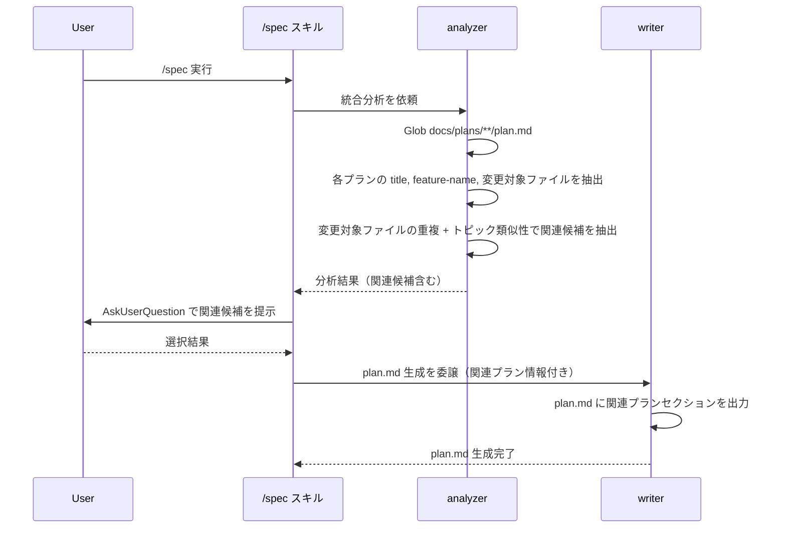
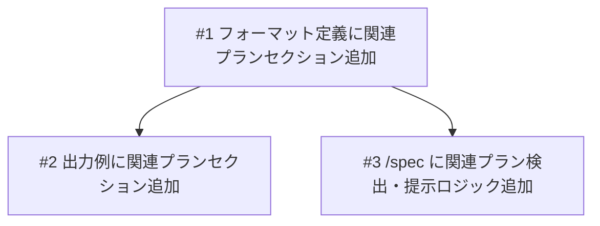

# 関連プランリンク機能

## 概要

plan.md に「関連プラン」セクションを新設し、/spec 実行時に既存プランから関連候補を自動検出してユーザーに提示する機能。プランが蓄積されてきた際に、過去のプランとの関連性（変更対象ファイルの重複やトピック類似性）を把握しやすくする。

## スコープ

### やること

- plan.md フォーマット定義に「関連プラン」セクション定義を追加（概要の直後、省略可能セクション）
- plan.md 出力例に関連プランセクションの具体例を追加
- /spec Step 2 の並行開発チェックを拡張して関連プラン候補の検出・提示ロジックを追加
- writer への委譲時に関連プラン情報を渡す

### やらないこと

- 既存プランへの遡及的なリンク追加
- 関連性のスコアリングアルゴリズムの高度化（キーワードマッチ等の簡易的なもので十分）
- 関連プランのグラフ可視化

## 受入条件

- [ ] AC-1: plan.md フォーマット定義に「関連プラン」セクションが定義されている（「概要」の直後、省略可能）
- [ ] AC-2: plan.md の出力例に「関連プラン」セクションの具体例が含まれている
- [ ] AC-3: /spec 実行時（Step 2）に既存プランをスキャンし、変更対象ファイルの重複やトピック類似性から関連候補が検出される
- [ ] AC-4: 検出された関連候補が全て自動的に plan.md に挿入される
- [ ] AC-5: 関連プランが無い場合、セクション自体が省略される

## 非機能要件

- 既存プランのスキャンはファイル数に依存するが、通常の規模（数十プラン程度）では実行時間に影響しない
- 既存の /spec ワークフローに副作用を与えない（関連プランが見つからない場合はスキップ）

## データフロー

### 関連プラン検出・挿入フロー

## 設計判断

| 判断事項 | 選択 | 理由 | 検討した代替案 |
|---------|------|------|--------------|
| セクション形式 | 本文中テーブル | ブラウザレビュー（annotation-viewer）でそのまま表示可能。writer が既にテーブル出力に慣れている | frontmatter に配列として格納 -- パース処理の追加が必要 |
| セクション配置 | 概要の直後 | プランを読み始めた時点で関連する文脈が分かる | 末尾の参考資料セクション内 -- 見落とされやすい |
| 検出方式 | 半自動（自動検出 + ユーザー選択） | 完全自動だと不要なリンクが含まれる可能性がある | 完全手動 -- 既存プランの把握が前提となり負担が大きい |
| 関連説明 | 自由記述 | 固定カテゴリにするとプラン数が少ないうちは過剰 | 固定カテゴリ（前提/競合/拡張等） -- 分類の学習コストが発生 |

## システム影響

### 影響範囲

- plan.md フォーマット定義: 新セクション追加、省略ルールテーブルに行追加
- plan.md 出力例: 関連プランセクションの具体例追加
- /spec スキル: Step 2 の分析ロジック拡張、Step 4 の writer 委譲パラメータ追加

### リスク

- 既存プランが存在しない場合のスキャン: 0件時はスキップするため影響なし
- フォーマット定義の変更: 既存の plan.md には影響しない（省略可能セクション）

## 実装タスク

### 依存関係図

### タスク一覧

| # | タスク | 対象ファイル | 見積 | 依存 |
|---|--------|------------|------|------|
| 1 | フォーマット定義に関連プランセクション追加 | `agents/writer/references/formats/plan.md` | S | - |
| 2 | 出力例に関連プランセクションの具体例追加 | `agents/writer/references/examples/plan.md` | S | #1 |
| 3 | /spec Step 2 に関連プラン検出・提示ロジック追加、Step 4 の writer 委譲に関連プラン情報追加 | `skills/spec/SKILL.md` | M | #1 |

> 見積基準: S(~1h), M(1-3h), L(3h~)

## テスト方針

### トレーサビリティ

| 受入条件 | 自動テスト | 手動検証 |
|---------|-----------|---------|
| AC-1 | - | MV-1 |
| AC-2 | - | MV-2 |
| AC-3 | - | MV-3 |
| AC-4 | - | MV-4 |
| AC-5 | - | MV-5 |

### 自動テスト

該当なし。Markdown ベースのスキル/エージェント定義の変更であり、自動テスト対象のコードは含まれない。

### ビルド確認

該当なし。Markdown ファイルのみの変更のため、ビルドコマンドは不要。

### 手動検証チェックリスト

- [ ] MV-1: `agents/writer/references/formats/plan.md` に「関連プラン」セクションが「概要」の直後に定義されており、省略ルールに含まれていること
- [ ] MV-2: `agents/writer/references/examples/plan.md` に「関連プラン」セクションのテーブル具体例が含まれていること
- [ ] MV-3: /spec 実行時に既存プランがスキャンされ、変更対象ファイルの重複やトピック類似性から関連候補が検出されること
- [ ] MV-4: 検出された関連候補が AskUserQuestion で提示され、選択したプランのみが生成される plan.md に含まれること
- [ ] MV-5: 関連プランが検出されない場合、生成される plan.md に「関連プラン」セクションが含まれないこと
