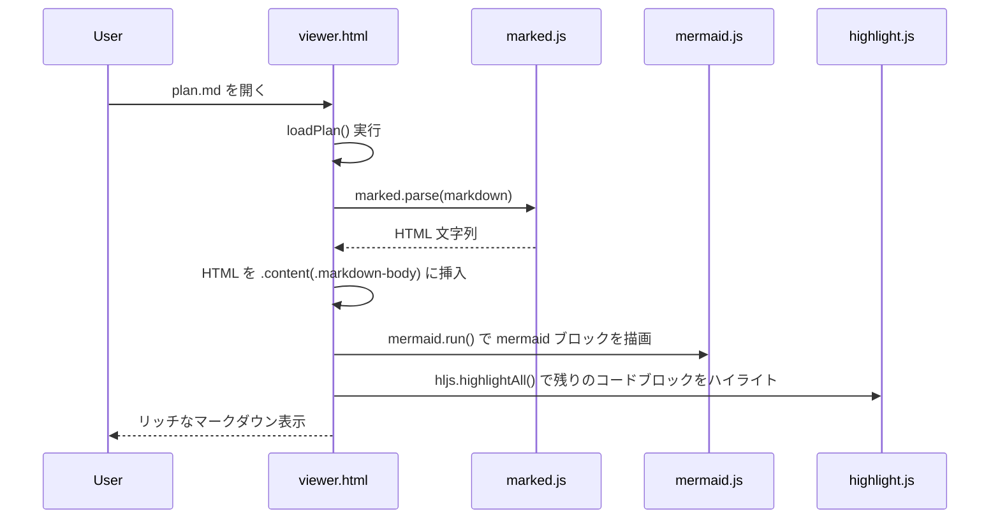
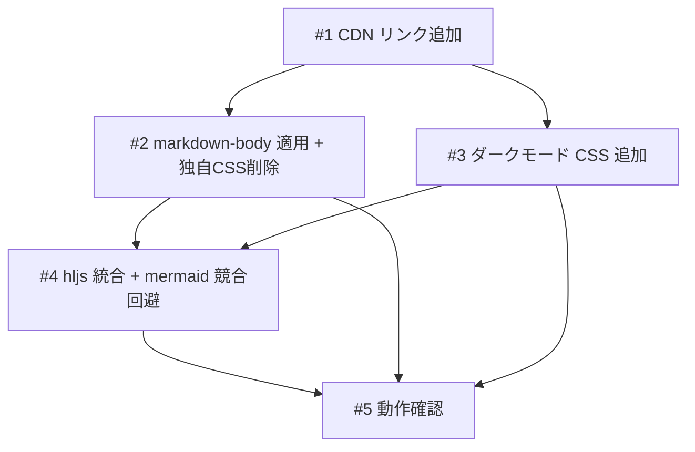

# Annotation Viewer マークダウン表示のリッチ化

## 概要

Annotation Viewer のマークダウン表示を k1LoW/mo レベルにリッチ化する。github-markdown-css による GitHub 風スタイリング、highlight.js によるシンタックスハイライト、OS 設定連動のダーク/ライト自動切替を導入し、plan.md のレビュー体験を向上させる。

## 受入条件

- [ ] AC-1: github-markdown-css によるリッチなマークダウン表示（テーブル、リスト、見出し等が GitHub 風に表示される）
- [ ] AC-2: highlight.js によるシンタックスハイライト（言語自動検出）
- [ ] AC-3: ダーク/ライト自動切替（prefers-color-scheme 連動）
- [ ] AC-4: 既存のコメントUI・差分ハイライト機能が正常に動作する
- [ ] AC-5: mermaid ダイアグラムが正常に描画される（highlight.js との競合なし）

## スコープ

### やること

- github-markdown-css の CDN 追加と `.markdown-body` クラス適用
- highlight.js の CDN 追加とシンタックスハイライト統合
- ダーク/ライト自動切替（`prefers-color-scheme` メディアクエリ連動）
- 独自マークダウン CSS の削除（github-markdown-css に委譲）
- highlight.js と mermaid の競合回避

### やらないこと

- server.py の変更
- marked.js からの移行
- 目次パネル・フロントマター表示等の UI 追加
- ローカルライブラリのインストール

## 非機能要件

- パフォーマンス: CDN 追加による読み込みは highlight.js 本体 16 KiB + CSS のみ（許容範囲）
- 後方互換性: 既存のコメントUI・差分ハイライト機能を壊さない

## データフロー

### マークダウンレンダリングフロー



## フロントエンド変更

### 画面・UI設計

- マークダウン表示領域に github-markdown-css のスタイルを適用し、GitHub 風の見た目にする
- コードブロックに highlight.js でシンタックスハイライトを適用する
- OS のダーク/ライト設定に連動してテーマが自動切替される
- 既存のコメントボタン、コメント入力フォーム、差分ハイライトは変更なし

### ワイヤーフレーム

#### ライトモード表示

```
+--------------------------------------------------+
| Plan Review  [version v]  [Reload]  [comment-on]  |
+--------------------------------------------------+
|                                                    |
|  # 見出し                          [comment btn]   |
|  ─────────────────────────────                     |
|                                                    |
|  本文テキスト（GitHub 風フォント・行間）              |
|                                                    |
|  | col1 | col2 |   <- GitHub 風テーブル             |
|  |------|------|                                   |
|  | val  | val  |                                   |
|                                                    |
|  ```python                                         |
|  def hello():     <- シンタックスハイライト付き       |
|      print("hi")                                   |
|  ```                                               |
|                                                    |
|  [mermaid diagram]  <- 従来通り描画                  |
|                                                    |
+--------------------------------------------------+
```

#### ダークモード表示

```
+--------------------------------------------------+
| (背景: ダーク、テキスト: ライト)                      |
| ヘッダー・コンテンツ・コメントUI 全てダーク対応        |
| highlight.js: github-dark テーマ適用                |
| github-markdown-css: ダークモード変数適用            |
+--------------------------------------------------+
```

### 対象ファイル

- 変更: `scripts/annotation-viewer/viewer.html` — CDN 追加、CSS 変更、JS 変更

## 設計判断

| 判断事項 | 選択 | 理由 | 検討した代替案 |
|---------|------|------|--------------|
| シンタックスハイライター | highlight.js（16 KiB） | 軽量で言語自動検出あり、CDN 対応 | Shiki（280 KiB、WASM 含み重い）、Prism.js（TypeScript に弱点） |
| マークダウン CSS | github-markdown-css v5 | mo と最も近い見た目、ダーク/ライト対応、メンテナンス不要 | 独自 CSS 拡張（メンテコスト高） |
| パーサー | marked.js（現行維持） | (1) 変更コスト最小、(2) GFM デフォルト対応（テーブル・チェックリスト等）、(3) plan.md は信頼できるソース（自プロジェクト生成物）のみ表示するため DOMPurify 不要でセキュリティリスクなし | markdown-it: CommonMark 準拠・セキュリティデフォルト安全・拡張性高いが、GFM にはプラグイン追加が必要で移行コスト発生。現用途では marked.js の弱点が顕在化しないため維持が合理的 |
| highlight.js テーマ切替 | CSS の media 属性 | JS 不要で `prefers-color-scheme` に連動 | JS による動的切替（不要な複雑さ） |
| mermaid 競合回避 | mermaid 変換を先に実行し、残りに hljs 適用 | 実装がシンプルで確実 | marked renderer カスタマイズ（複雑） |

## システム影響

### 影響範囲

- `scripts/annotation-viewer/viewer.html`: CSS・JS の変更（単一ファイル）
- 外部 CDN への新規依存追加: github-markdown-css, highlight.js

### リスク

- github-markdown-css と独自レイアウト CSS の競合 → `.markdown-body` の `max-width`, `padding` を独自 CSS で上書きして対応
- highlight.js が mermaid コードブロックを処理してしまう → mermaid 変換を先に実行する順序制御で回避
- ダークモードで既存のコメント UI・差分ハイライトの視認性低下 → CSS 変数によるダーク対応を追加

## 実装タスク

### 依存関係図



### タスク一覧

| # | タスク | 対象ファイル | 見積 | 依存 |
|---|--------|------------|------|------|
| 1 | CDN リンク追加（github-markdown-css, highlight.js 本体・テーマ）+ highlight.js テーマの media 属性設定 | `scripts/annotation-viewer/viewer.html` | S | - |
| 2 | `.content` に `.markdown-body` クラス追加 + 独自マークダウン CSS（L98-L158 相当）削除 + 共存調整 | `scripts/annotation-viewer/viewer.html` | S | #1 |
| 3 | ダークモード CSS 変数・独自 UI（ヘッダー、コメント UI、差分ハイライト）のダーク対応追加 | `scripts/annotation-viewer/viewer.html` | M | #1 |
| 4 | JS: `loadPlan()` 内で mermaid 変換後に `hljs.highlightAll()` を呼び出す処理を追加 | `scripts/annotation-viewer/viewer.html` | S | #2, #3 |
| 5 | 動作確認: シンタックスハイライト、mermaid 描画、コメント UI、差分ハイライト、ダーク/ライト切替 | `scripts/annotation-viewer/viewer.html` | M | #4 |

> 見積基準: S(〜1h), M(1-3h), L(3h〜)

## テスト方針

### トレーサビリティ

| 受入条件 | 自動テスト | 手動検証 |
|---------|-----------|---------|
| AC-1 | - | MV-1 |
| AC-2 | - | MV-2 |
| AC-3 | - | MV-3 |
| AC-4 | - | MV-4 |
| AC-5 | - | MV-5 |

### ビルド確認

```bash
# Python サーバーの起動確認
python3 scripts/annotation-viewer/server.py &
# ブラウザで http://localhost:8765 にアクセスして目視確認
```

### 手動検証チェックリスト

- [ ] MV-1: テーブル、リスト、見出し、blockquote 等が GitHub 風に表示されること
- [ ] MV-2: コードブロック（Python, TypeScript, bash 等）にシンタックスハイライトが適用されていること
- [ ] MV-3: OS 設定をダークモードに切替えると、ページ全体（ヘッダー、コンテンツ、コメント UI）がダークテーマに切り替わること
- [ ] MV-4: コメントボタンのホバー表示、コメント入力フォーム、差分ハイライト表示が正常に動作すること
- [ ] MV-5: mermaid ダイアグラム（sequenceDiagram, graph TD 等）が正常に描画され、コードとして表示されないこと

## 参考資料

| 資料名 | URL / パス |
|--------|-----------|
| リサーチ結果 | `docs/plans/rich-markdown-preview/research.md` |
| 現行仕様（Annotation Cycle） | `docs/plans/annotation-cycle/plan.md` |
| k1LoW/mo | https://github.com/k1LoW/mo |
| github-markdown-css | https://github.com/sindresorhus/github-markdown-css |
| highlight.js | https://highlightjs.org/ |
