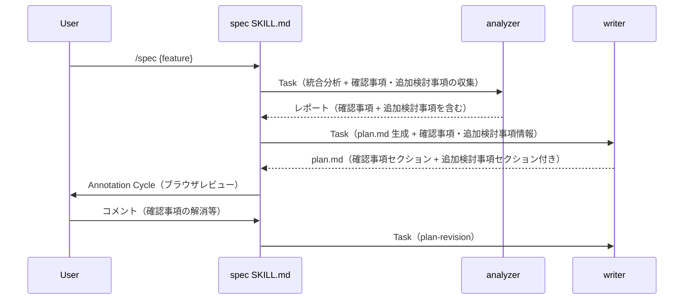
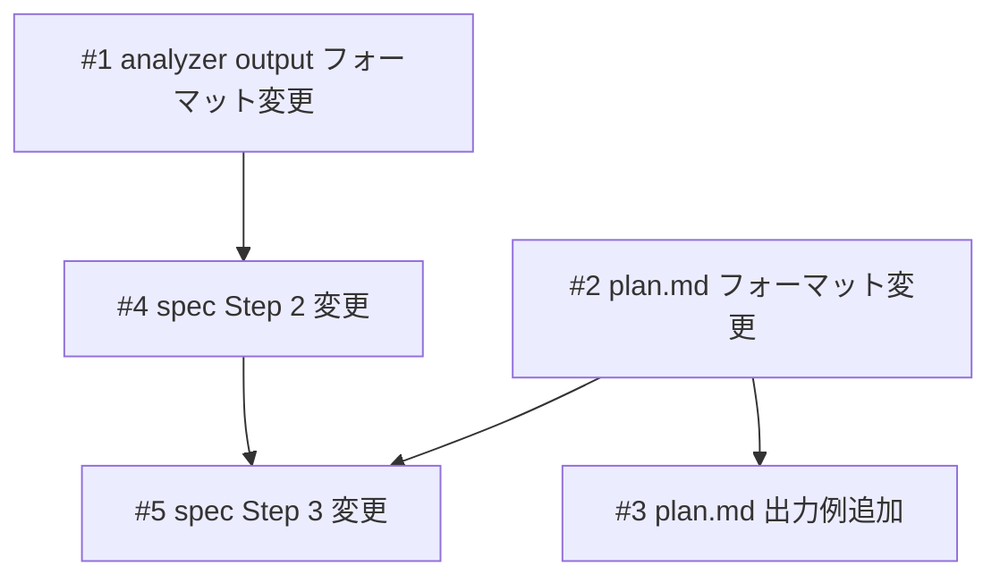

# 仕様の確信度可視化

## 概要

spec-flow の仕様作成フローに「仕様の確信度可視化」を組み込む。tsumiki の「信号機システム」と「徹底的な質問」の思想を、spec-flow のアーキテクチャに合わせた形で取り入れる。具体的には、plan.md に「確認事項（Assumptions）」セクションを追加する仕組み（A）と、plan.md に追加検討事項も出力し Annotation Cycle でレビューする仕組み（B）の2つを導入する。

## 関連プラン

| プラン | 関連 |
|--------|------|
| [brownfield-hooks](../brownfield-hooks/plan.md) | 完了済み。同一ファイルへの変更があったが解消済み |

## スコープ

### やること

- analyzer output フォーマット（output.md）の確認事項セクションに、4観点カテゴリ（エッジケース / 非機能要件 / 暗黙の前提 / 技術的制約）ごとの検出トリガー（「〜の場合は検出する」条件リスト）を追加
- analyzer output フォーマット（output.md）の確認事項・追加検討事項に根拠（出典）の必須化ルールを追加（出典なし = ❓要議論）
- plan.md フォーマットに「確認事項」「追加検討事項」セクション定義追加
- plan.md 出力例に確認事項・追加検討事項の例を追加
- spec SKILL.md の Step 2 プロンプトに、確認事項と追加検討事項の定義・分離指示を明記（確認事項=仕様内の不確かな部分、追加検討事項=仕様外のコードベース起点の影響観点）
- spec SKILL.md の Step 3（writer 呼び出し）に確認事項・追加検討事項の引き渡し追加

### やらないこと

- analyzer.md 本体の変更（output.md フォーマット追従で自動対応）
- writer.md 本体の変更（plan.md フォーマット追従で自動対応）
- spec SKILL.md への対話ステップ追加（Annotation Cycle で代替）
- Annotation Cycle での確認事項ハイライト（将来の拡張）
- check スキルでの確認事項検証（将来の拡張）

## 受入条件

- [ ] AC-1: plan.md に「確認事項（Assumptions）」セクションが生成される。各項目は ✅確認済み / ⚠️要確認 / ❓要議論 の3段階ステータスを持つ
- [ ] AC-2: analyzer の出力に「確認事項」セクション（分析中に発見した推測・仮定）が含まれる
- [ ] AC-3: analyzer の出力に「追加検討事項」セクション（仕様で触れていないが影響しそうな観点）が含まれる
- [ ] AC-4: plan.md に追加検討事項セクションが生成され、Annotation Cycle でレビュー可能である（追加検討事項がある場合のみ）
- [ ] AC-5: spec スキルの Step 3（writer 呼び出し）で、writer に確認事項情報が渡され plan.md に反映される
- [ ] AC-6: 確認事項セクションは省略可能（確認事項がない場合はセクション自体を削除）
- [ ] AC-7: 既存の plan.md 生成（確認事項なし）が壊れない（後方互換性）
- [ ] AC-8: analyzer への指示に4観点カテゴリ（エッジケース / 非機能要件 / 暗黙の前提 / 技術的制約）が含まれ、各カテゴリを検討した上で確認事項を検出する
- [ ] AC-9: 確認事項の「根拠」列にコードのファイルパスまたは仕様の出典が記載される。根拠なしの項目は自動的に ❓要議論 ステータスになる

## 非機能要件

- 後方互換性: 確認事項がない場合は既存と同一の出力を維持する
- フォーマット追従設計: analyzer.md / writer.md 本体は変更せず、フォーマット定義ファイルの変更のみで対応する

## データフロー

### 確認事項収集・反映フロー



## 設計判断

| 判断事項 | 選択 | 理由 | 検討した代替案 |
|---------|------|------|--------------|
| 確認事項の配置位置 | 概要の直後 | 仕様の詳細（スコープ・設計・タスク）を読む前に「どこが不確実か」を把握でき、読み手がリスク意識を持った状態で仕様を評価できる。tsumiki の信号機が冒頭にある設計と同じ意図 | スコープの後（不確実性の把握が遅れる）、テスト方針の前（設計を読み終えた後では注意喚起の効果が薄い） |
| ステータス表現 | ✅/⚠️/❓ の絵文字 | plan.md の他セクション（チェックボックス等）と統一感がある | 青/黄/赤の信号機（tsumiki 方式） |
| 追加検討事項の提示方法 | plan.md に出力 + Annotation Cycle でレビュー | analyzer 結果を plan.md に出力し、既存のブラウザレビュー機能でユーザーがレビュー。新しい対話ステップ不要 | spec Step 3 に対話ステップ追加（SKILL.md が肥大化し、spec 実行時しか使えない） |
| 確認事項のステータス初期判定 | analyzer が付与 | tsumiki の信号機システムと同様、AI が資料・コードの根拠に基づき初期判定する。「情報の出自」としてのメタ情報であり事実報告の延長 | spec がユーザー対話で決定（ユーザー負担が増える） |
| analyzer.md の変更 | しない | output.md フォーマット追従設計を活用 | analyzer.md にも指示を追加 |
| writer.md の変更 | しない | plan.md フォーマット追従設計を活用 | writer.md にも指示を追加 |
| 確認事項セクションの省略 | セクション自体を削除 | plan.md の既存省略ルールと統一 | 「確認事項なし」と明記 |
| 確認事項の検出方法 | 4観点カテゴリ（エッジケース/非機能要件/暗黙の前提/技術的制約）を明示 | tsumiki が各カテゴリに具体的な検出トリガーを記述して品質を担保。カテゴリだけでなく、各カテゴリの検出条件を明示することでモデルが何を見るべきか分かる | カテゴリなし（モデル任せ）、tsumiki の5カテゴリをそのまま採用（spec-flow のコンテキストに合わない部分がある） |
| 根拠の必須化 | 出典なし = ❓要議論を強制 | tsumiki の「出典なし = 🔴」と同じ設計。根拠なき推測の混入を防ぐ | 根拠をオプションにする（品質低下のリスク） |

### 検出トリガー定義

output.md の確認事項セクションに記述する、各カテゴリの検出トリガー:

#### エッジケース
- 仕様に「N件まで」「N文字以内」等の数量制限がある → N+1 や上限超過時の扱いが未定義なら検出
- 一覧表示の仕様がある → 0件時の表示が未定義なら検出
- 検索・一覧機能がある → ページネーション・表示上限が未定義なら検出
- 複数ユーザーが同じリソースを操作しうる → 同時操作・排他制御が未定義なら検出

#### 非機能要件
- N+1 問題が発生しうるデータ取得パターンが存在する → パフォーマンス要件が未定義なら検出
- 認証済みルートへのアクセスがある → アクセス制御が仕様に書かれていなければ検出
- ロール・権限による操作制限が想定される → 認可ルールが未定義なら検出
- 個人情報・センシティブデータを扱う → データ保護の取り扱いが未定義なら検出

#### 暗黙の前提（既存コードとの衝突）
- 既存エンドポイントのシグネチャを変更する → 他の呼び出し元が存在するなら検出
- カラム追加・変更がある → 既存データのマイグレーション要否が未定義なら検出
- 既存の型定義を変更する → 他コンポーネントへの影響伝播が未定義なら検出
- 既存の計算ロジックに前提（「値は必ず正」等）がある → 新機能がその前提を崩す可能性があれば検出

#### 技術的制約
- フレームワークの特定バージョンを使用 → そのバージョンで制限される実装方法があれば検出
- トランザクション境界・外部キー制約がある → 仕様の操作がこれらと衝突する可能性があれば検出
- 外部 API を利用する → レート制限・タイムアウト・ペイロードサイズ制限が未定義なら検出
- ファイルアップロード機能がある → 容量・形式制限が未定義なら検出

## システム影響

### 影響範囲

- `agents/analyzer/references/formats/output.md` — 「確認事項」「追加検討事項」セクション追加
- `agents/writer/references/formats/plan.md` — 「確認事項」「追加検討事項」セクション定義・省略ルール追加
- `agents/writer/references/examples/plan.md` — 確認事項・追加検討事項セクションの出力例追加
- `skills/spec/SKILL.md` — Step 2, 3 に記述追加

### リスク

- 他スキル（build, check, fix, list）への影響なし

## 実装タスク

### 依存関係図



### タスク一覧

| # | タスク | 対象ファイル | 見積 | 依存 |
|---|--------|------------|------|------|
| 1 | analyzer output フォーマットに「確認事項」「追加検討事項」セクションを追加（4観点カテゴリのチェック指示 + 根拠必須化ルールを含む） | `agents/analyzer/references/formats/output.md` | S | - |
| 2 | plan.md フォーマットに「確認事項」「追加検討事項」セクション定義を追加 + 省略ルール更新 | `agents/writer/references/formats/plan.md` | S | - |
| 3 | plan.md 出力例に確認事項・追加検討事項セクションの例を追加 | `agents/writer/references/examples/plan.md` | S | #2 |
| 4 | spec SKILL.md の Step 2 プロンプトに確認事項と追加検討事項の定義・分離指示・4観点カテゴリを明記 | `skills/spec/SKILL.md` | S | #1 |
| 5 | spec SKILL.md の Step 3 に確認事項・追加検討事項の writer 引き渡しを追加 | `skills/spec/SKILL.md` | S | #2, #4 |

> 見積基準: S(~1h), M(1-3h), L(3h~)

## テスト方針

### トレーサビリティ

| 受入条件 | 自動テスト | 手動検証 |
|---------|-----------|---------|
| AC-1 | - | MV-1, MV-2 |
| AC-2 | - | MV-1 |
| AC-3 | - | MV-3 |
| AC-4 | - | MV-3 |
| AC-5 | - | MV-1 |
| AC-6 | - | MV-4 |
| AC-7 | - | MV-4 |
| AC-8 | - | MV-5 |
| AC-9 | - | MV-6 |

### ビルド確認

```bash
# Markdown のみのため、ビルドコマンドなし
echo "No build required (Markdown-only changes)"
```

### 手動検証チェックリスト

- [ ] MV-1: /spec で新規 plan.md を生成し、確認事項セクションが含まれること。各項目が ✅/⚠️/❓ のいずれかのステータスを持つこと
- [ ] MV-2: 確認事項セクションのテーブルに「#」「項目」「根拠」「ステータス」の4列が含まれること
- [ ] MV-3: plan.md に追加検討事項セクションが生成されること。Annotation Cycle で確認事項をレビュー・更新できること
- [ ] MV-4: 確認事項がない単純な機能で /spec を実行し、確認事項セクションが省略されること。既存の plan.md 構造が壊れていないこと
- [ ] MV-5: /spec で生成された plan.md の確認事項に、4観点カテゴリ（エッジケース/非機能要件/暗黙の前提/技術的制約）のうち該当するものが反映されていること
- [ ] MV-6: 確認事項の各項目の「根拠」列にファイルパスまたは仕様の出典が記載されていること。根拠なしの項目が ❓要議論 になっていること

## 参考資料

| 資料名 | URL / パス |
|--------|-----------|
| tsumiki 比較リサーチ | `docs/plans/tsumiki-comparison/research-2026-03-13-tsumiki-comparison.md` |
| tsumiki リポジトリ | `https://github.com/classmethod/tsumiki` |
| analyzer 責務調査 | `docs/plans/spec-confidence/research-2026-03-13-analyzer-responsibility.md` |
| analyzer 指示最適化リサーチ | `docs/plans/spec-confidence/research-2026-03-13-analyzer-instructions.md` |
