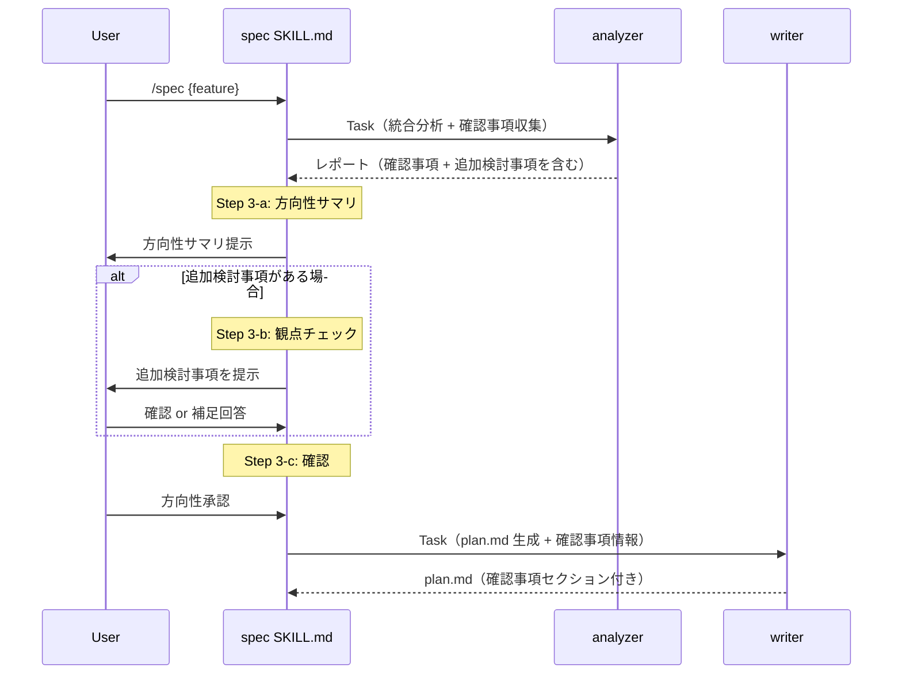
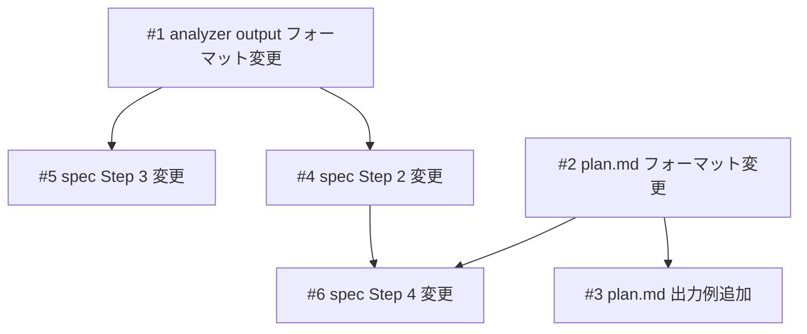

# 仕様の確信度可視化

## 概要

spec-flow の仕様作成フローに「仕様の確信度可視化」を組み込む。tsumiki の「信号機システム」と「徹底的な質問」の思想を、spec-flow のアーキテクチャに合わせた形で取り入れる。具体的には、plan.md に「確認事項（Assumptions）」セクションを追加する仕組み（A）と、analyzer 駆動の観点チェックを Step 3 に追加する仕組み（B）の2つを導入する。

## 関連プラン

| プラン | 関連 |
|--------|------|
| [brownfield-hooks](../brownfield-hooks/plan.md) | skills/spec/SKILL.md と agents/analyzer/references/formats/output.md を同時に変更中。本機能は brownfield-hooks マージ後に作業開始が推奨 |

## スコープ

### やること

- analyzer output フォーマット（output.md）に「確認事項」「追加検討事項」セクション追加
- plan.md フォーマットに「確認事項」セクション定義追加
- plan.md 出力例に確認事項の例を追加
- spec SKILL.md の Step 2（analyzer 呼び出し）に確認事項収集の指示追加
- spec SKILL.md の Step 3 に観点チェック（3-b）追加
- spec SKILL.md の Step 4（writer 呼び出し）に確認事項の引き渡し追加

### やらないこと

- analyzer.md 本体の変更（output.md フォーマット追従で自動対応）
- writer.md 本体の変更（plan.md フォーマット追従で自動対応）
- Annotation Cycle での確認事項ハイライト（将来の拡張）
- check スキルでの確認事項検証（将来の拡張）

## 受入条件

- [ ] AC-1: plan.md に「確認事項（Assumptions）」セクションが生成される。各項目は ✅確認済み / ⚠️要確認 / ❓要議論 の3段階ステータスを持つ
- [ ] AC-2: analyzer の出力に「確認事項」セクション（分析中に発見した推測・仮定）が含まれる
- [ ] AC-3: analyzer の出力に「追加検討事項」セクション（仕様で触れていないが影響しそうな観点）が含まれる
- [ ] AC-4: spec スキルの Step 3（方向性確認）で、analyzer が検出した追加検討事項がユーザーに提示される（追加検討事項がある場合のみ）
- [ ] AC-5: spec スキルの Step 4 で、writer に確認事項情報が渡され plan.md に反映される
- [ ] AC-6: 確認事項セクションは省略可能（確認事項がない場合はセクション自体を削除）
- [ ] AC-7: 既存の plan.md 生成（確認事項なし）が壊れない（後方互換性）

## 非機能要件

- 後方互換性: 確認事項がない場合は既存と同一の出力を維持する
- フォーマット追従設計: analyzer.md / writer.md 本体は変更せず、フォーマット定義ファイルの変更のみで対応する

## データフロー

### 確認事項収集・反映フロー



## 設計判断

| 判断事項 | 選択 | 理由 | 検討した代替案 |
|---------|------|------|--------------|
| 確認事項の配置位置 | 概要の直後 | 仕様の詳細（スコープ・設計・タスク）を読む前に「どこが不確実か」を把握でき、読み手がリスク意識を持った状態で仕様を評価できる。tsumiki の信号機が冒頭にある設計と同じ意図 | スコープの後（不確実性の把握が遅れる）、テスト方針の前（設計を読み終えた後では注意喚起の効果が薄い） |
| ステータス表現 | ✅/⚠️/❓ の絵文字 | plan.md の他セクション（チェックボックス等）と統一感がある | 青/黄/赤の信号機（tsumiki 方式） |
| 観点チェックの配置 | Step 3-b（方向性確認内） | analyzer 結果が出た後なのでコードベース文脈を踏まえた質問が可能 | Step 1（ヒアリング時） |
| analyzer.md の変更 | しない | output.md フォーマット追従設計を活用 | analyzer.md にも指示を追加 |
| writer.md の変更 | しない | plan.md フォーマット追従設計を活用 | writer.md にも指示を追加 |
| 確認事項セクションの省略 | セクション自体を削除 | plan.md の既存省略ルールと統一 | 「確認事項なし」と明記 |

## システム影響

### 影響範囲

- `agents/analyzer/references/formats/output.md` — 「確認事項」「追加検討事項」セクション追加
- `agents/writer/references/formats/plan.md` — 「確認事項」セクション定義・省略ルール追加
- `agents/writer/references/examples/plan.md` — 確認事項セクションの出力例追加
- `skills/spec/SKILL.md` — Step 2, 3, 4 に記述追加

### リスク

- brownfield-hooks ブランチと `skills/spec/SKILL.md`、`agents/analyzer/references/formats/output.md` が競合する可能性がある。brownfield-hooks マージ後に作業開始することでリスクを回避する
- 他スキル（build, check, fix, list）への影響なし

## 実装タスク

### 依存関係図



### タスク一覧

| # | タスク | 対象ファイル | 見積 | 依存 |
|---|--------|------------|------|------|
| 1 | analyzer output フォーマットに「確認事項」「追加検討事項」セクションを追加 | `agents/analyzer/references/formats/output.md` | S | - |
| 2 | plan.md フォーマットに「確認事項」セクション定義を追加 + 省略ルール更新 | `agents/writer/references/formats/plan.md` | S | - |
| 3 | plan.md 出力例に確認事項セクションの例を追加 | `agents/writer/references/examples/plan.md` | S | #2 |
| 4 | spec SKILL.md の Step 2 に確認事項収集の指示を追加 | `skills/spec/SKILL.md` | S | #1 |
| 5 | spec SKILL.md の Step 3 に観点チェック（3-b）を追加 | `skills/spec/SKILL.md` | S | #1 |
| 6 | spec SKILL.md の Step 4 に確認事項の writer 引き渡しを追加 | `skills/spec/SKILL.md` | S | #2, #4 |

> 見積基準: S(~1h), M(1-3h), L(3h~)

## テスト方針

### トレーサビリティ

| 受入条件 | 自動テスト | 手動検証 |
|---------|-----------|---------|
| AC-1 | - | MV-1, MV-2 |
| AC-2 | - | MV-1 |
| AC-3 | - | MV-3 |
| AC-4 | - | MV-3 |
| AC-5 | - | MV-1 |
| AC-6 | - | MV-4 |
| AC-7 | - | MV-4 |

### ビルド確認

```bash
# Markdown のみのため、ビルドコマンドなし
echo "No build required (Markdown-only changes)"
```

### 手動検証チェックリスト

- [ ] MV-1: /spec で新規 plan.md を生成し、確認事項セクションが含まれること。各項目が ✅/⚠️/❓ のいずれかのステータスを持つこと
- [ ] MV-2: 確認事項セクションのテーブルに「#」「項目」「根拠」「ステータス」の4列が含まれること
- [ ] MV-3: Step 3 で追加検討事項がユーザーに提示されること。追加検討事項がない場合は提示がスキップされること
- [ ] MV-4: 確認事項がない単純な機能で /spec を実行し、確認事項セクションが省略されること。既存の plan.md 構造が壊れていないこと

## 参考資料

| 資料名 | URL / パス |
|--------|-----------|
| tsumiki 比較リサーチ | `docs/plans/tsumiki-comparison/research-2026-03-13-tsumiki-comparison.md` |
