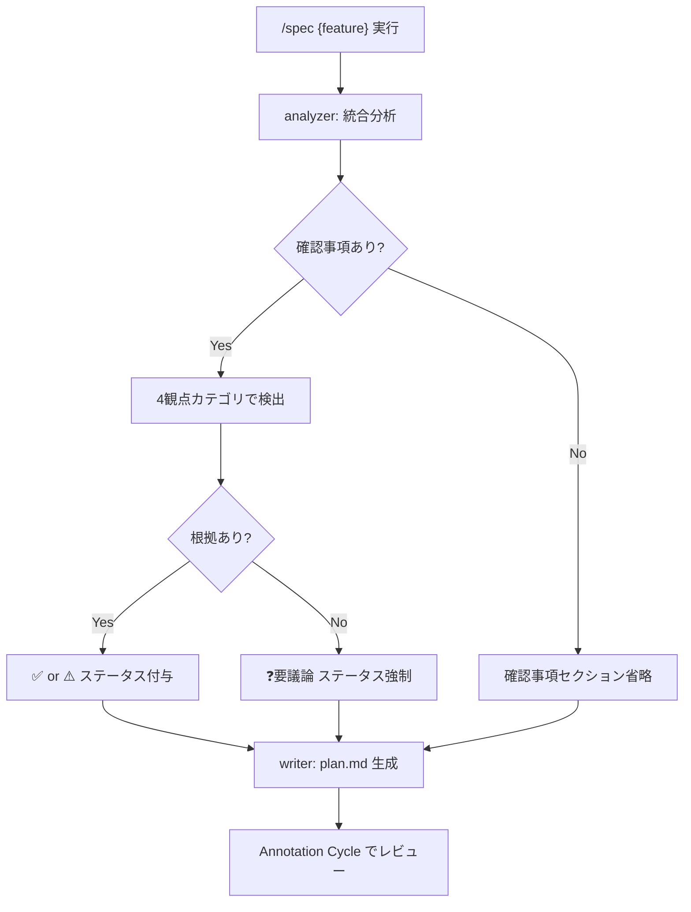

# 仕様の確信度可視化 — 最終仕様（Result）

> 生成日: 2026-03-13
> 検証モード: フル検証

## 機能概要

spec-flow の仕様作成フローに「確信度可視化」を組み込んだ。analyzer output フォーマットに確認事項・追加検討事項セクションを追加し、plan.md フォーマットに対応するセクション定義と出力例を追加した。spec SKILL.md の Step 2・3 に確認事項の収集・引き渡し指示を明記し、フォーマット追従設計により analyzer.md / writer.md 本体は未変更で後方互換性を維持した。

## 仕様からの変更点

plan.md 通りに実装。変更なし。

## ロジック

### 仕様

- analyzer が分析時に4観点カテゴリ（エッジケース / 非機能要件 / 暗黙の前提 / 技術的制約）に基づき確認事項を検出する
- 各確認事項には根拠（ファイルパスまたは仕様の出典）が必須。根拠なしの項目は自動的に ❓要議論 ステータスになる
- 確認事項は ✅確認済み / ⚠️要確認 / ❓要議論 の3段階ステータスで表現する
- 追加検討事項は仕様外のコードベース起点の影響観点として分離して出力する
- 確認事項・追加検討事項がない場合はセクション自体を省略する（既存の省略ルールと統一）
- spec SKILL.md の Step 3 で writer に確認事項・追加検討事項情報を引き渡し、plan.md に反映する

### 確認事項収集・反映フロー

## 受入条件

| # | 受入条件 | 判定 | 備考 |
|---|---------|------|------|
| AC-1 | plan.md に「確認事項（Assumptions）」セクションが生成される。各項目は ✅確認済み / ⚠️要確認 / ❓要議論 の3段階ステータスを持つ | PASS | `writer/formats/plan.md:41-51` に定義、`examples/plan.md:20-27` に出力例あり |
| AC-2 | analyzer の出力に「確認事項」セクションが含まれる | PASS | `analyzer/formats/output.md:131-173` に定義済み |
| AC-3 | analyzer の出力に「追加検討事項」セクションが含まれる | PASS | `analyzer/formats/output.md:175-185` に定義済み |
| AC-4 | plan.md に追加検討事項セクションが生成され、Annotation Cycle でレビュー可能である | PASS | `writer/formats/plan.md:53-59` に定義、`examples/plan.md:29-34` に出力例あり |
| AC-5 | spec スキルの Step 3 で writer に確認事項情報が渡され plan.md に反映される | PASS | `skills/spec/SKILL.md:189-190` に引き渡し記述済み |
| AC-6 | 確認事項セクションは省略可能 | PASS | `writer/formats/plan.md:185` 省略ルール追加済み、`output.md:173` に省略条件あり |
| AC-7 | 既存の plan.md 生成が壊れない（後方互換性） | PASS | analyzer.md / writer.md 本体は未変更。フォーマット追従設計で後方互換性維持 |
| AC-8 | analyzer への指示に4観点カテゴリが含まれ、各カテゴリを検討した上で確認事項を検出する | PASS | `skills/spec/SKILL.md:132-136` に4観点カテゴリ、`output.md:137-159` に検出トリガー定義済み |
| AC-9 | 確認事項の「根拠」列にコードのファイルパスまたは仕様の出典が記載される。根拠なしの項目は ❓要議論 になる | PASS | `output.md:167-168` に根拠必須化ルール、`writer/formats/plan.md:46` に根拠列あり |
