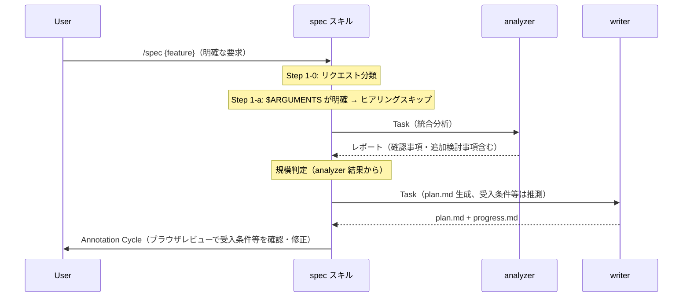
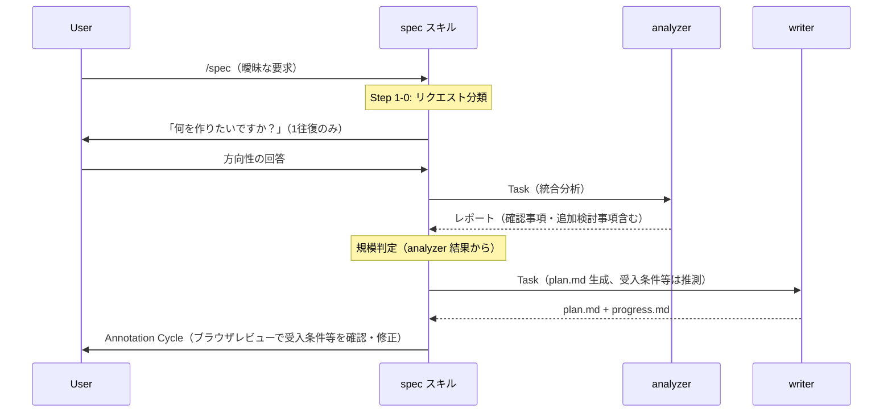
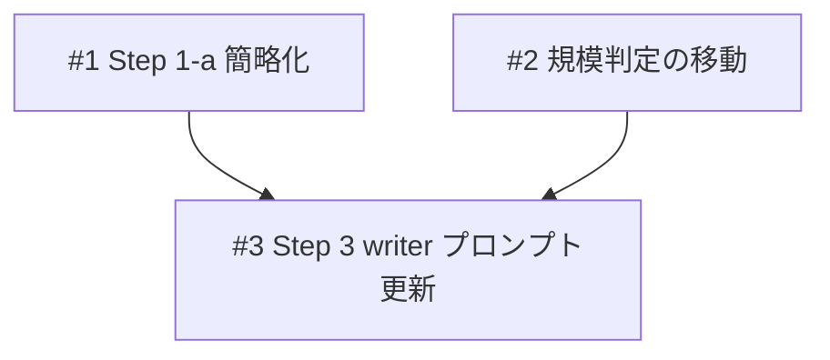

# 要件ヒアリング簡略化

## 概要

spec スキルの Step 1（要件ヒアリング）を簡略化する。現在は受入条件・スコープ外・非機能要件まで事前に聞いているが、「何を作るかの方向性」が明確なら即座に analyzer に進み、詳細は writer が推測生成し Annotation Cycle でユーザーがレビューする形に変更する。ヒアリングの往復を減らし、仕様作成の速度を向上させる。

## 関連プラン

| プラン | 関連 |
|--------|------|
| [spec-confidence](../spec-confidence/plan.md) | 確認事項セクションの前提機能。本プランはその確認事項をヒアリングの代替として活用 |
| [live-review](../live-review/plan.md) | 同一ファイル（SKILL.md）を変更するが対象セクションが異なる（本プラン: Step 1, Step 3 / live-review: Annotation Cycle） |

## 確認事項

| # | 項目 | 根拠 | ステータス |
|---|------|------|-----------|
| 1 | 「明確な $ARGUMENTS」の判定基準。何をもって「明確」とするか | `skills/spec/SKILL.md:L83-L93` の現在の分岐条件 | ✅確認済み |
| 2 | writer が受入条件を推測生成する品質。ユーザーの意図と乖離するリスク | `agents/writer/references/formats/plan.md:L196`（受入条件は常に必須） | ⚠️要確認 |
| 3 | check スキルが受入条件を基準に検証する。writer 推測の受入条件が Annotation Cycle で修正されずに残った場合の check 時の問題 | `skills/check/SKILL.md:L124-L131` | ⚠️要確認 |

## 追加検討事項

| # | 観点 | 詳細 | 根拠 |
|---|------|------|------|
| 1 | build スキルの仕様矛盾検知への影響 | writer 推測の受入条件が build 中の仕様参照時に矛盾を起こす可能性 | `skills/build/SKILL.md:L218-L234` |
| 2 | live-review プランとの並行開発 | live-review のタスク #6 も `skills/spec/SKILL.md` の Annotation Cycle セクションを変更するが、本タスクは Step 1 と Step 3 の writer プロンプトが対象のため低リスク | `docs/plans/live-review/plan.md` |

## スコープ

### やること

- Step 1-a の簡略化: $ARGUMENTS が明確なら即 Step 2 へ。不明な場合のみ「何を作りたいか」を1往復で確認
- Step 1-a の旧4項目（受入条件・スコープ外・非機能要件のヒアリング）を廃止
- Step 1-b（規模判定）を Step 2 の後に移動（analyzer 結果を見てから判定する方が正確）
- Step 3 の writer プロンプトを更新:「確定した受入条件」等の表現を「要求と分析結果から推測した受入条件」に変更
- Annotation Viewer の横幅を拡大（現在 780px → より広く）

### やらないこと

- Step 1-0（リクエスト分類）の変更
- Step 1-a2（入力ファイル検出）の変更
- analyzer.md / writer.md 本体の変更
- plan.md フォーマットの変更

## 受入条件

- [ ] AC-1: Step 1-a で受入条件・スコープ外・非機能要件を聞かなくなること
- [ ] AC-2: $ARGUMENTS が明確な場合はヒアリングなしで Step 2（analyzer）に進むこと
- [ ] AC-3: $ARGUMENTS が不明確な場合は「何を作りたいか」のみ確認して Step 2 に進むこと
- [ ] AC-4: 規模判定が Step 2（analyzer）の後に実行されること
- [ ] AC-5: writer プロンプトが「推測した受入条件」を受け取る形に更新されること
- [ ] AC-6: 既存の更新モード（Step 0-b）に影響しないこと
- [ ] AC-7: Annotation Viewer の横幅が拡大されていること

## 非機能要件

特になし

## データフロー

### 新フロー（$ARGUMENTS が明確な場合）



### 新フロー（$ARGUMENTS が不明確な場合）



## 設計判断

| 判断事項 | 選択 | 理由 | 検討した代替案 |
|---------|------|------|--------------|
| ヒアリング廃止の範囲 | 受入条件・スコープ外・非機能要件の3項目を廃止。方向性確認は残す | 方向性が不明だと analyzer も writer も的外れになる | 全廃止（$ARGUMENTS のみ）→ 要求が曖昧すぎるとやり直しコストが大きい |
| 規模判定の移動先 | Step 1-b → Step 2 の後 | analyzer の結果を見てからの方が正確に判定できる | 維持（Step 1）→ ヒアリング結果がないと判定が不正確 |
| writer の受入条件生成 | writer が要求 + analyzer 結果から推測 → Annotation Cycle でレビュー | 「まず出して、レビューで直す」方が効率的 | 受入条件だけはヒアリング → 結局 Step 1 が長くなる |
| 確認事項との関係 | 受入条件を確認事項に統合しない | 確認事項は「不確かさの検出」、受入条件は「完成基準」。性質が異なる | 受入条件も確認事項で管理 → 意味が異なるものが混在する |

## システム影響

### 影響範囲

- `skills/spec/SKILL.md` — Step 1（要件ヒアリング）、Step 2 後の規模判定、Step 3 の writer プロンプト
- `scripts/annotation-viewer/viewer.html` — max-width の拡大

### リスク

- writer が推測した受入条件がユーザーの意図と大きく乖離する可能性 → Annotation Cycle で修正可能
- 規模判定の移動により Step 2 の実行後でないと分割判断ができなくなる → analyzer 結果があるため判定精度は向上

## 実装タスク

### 依存関係図



### タスク一覧

| # | タスク | 対象ファイル | 見積 | 依存 |
|---|--------|------------|------|------|
| 1 | Step 1-a を簡略化（受入条件・スコープ外・非機能要件ヒアリングを削除、方向性不明時のみ質問） | `skills/spec/SKILL.md` | S | - |
| 2 | Step 1-b（規模判定）を Step 2 の後に移動 | `skills/spec/SKILL.md` | S | - |
| 3 | Step 3 の writer プロンプトを更新（「確定した受入条件」→「推測した受入条件」等） | `skills/spec/SKILL.md` | S | #1, #2 |
| 4 | Annotation Viewer の横幅を拡大 | `scripts/annotation-viewer/viewer.html` | S | - |

> 見積基準: S(~1h), M(1-3h), L(3h~)

## テスト方針

### トレーサビリティ

| 受入条件 | 自動テスト | 手動検証 |
|---------|-----------|---------|
| AC-1 | - | MV-1, MV-2 |
| AC-2 | - | MV-1 |
| AC-3 | - | MV-2 |
| AC-4 | - | MV-1, MV-2 |
| AC-5 | - | MV-3, MV-4 |
| AC-6 | - | MV-5 |
| AC-7 | - | MV-6 |

### ビルド確認

```bash
echo "No build required (Markdown-only changes)"
```

### 手動検証チェックリスト

- [ ] MV-1: 明確な $ARGUMENTS で /spec を実行し、ヒアリングなしで analyzer に進むこと。規模判定が analyzer の後に行われること
- [ ] MV-2: 曖昧な $ARGUMENTS で /spec を実行し、「何を作りたいか」のみ確認されること。受入条件・スコープ外・非機能要件は聞かれないこと
- [ ] MV-3: plan.md の受入条件・スコープが writer によって推測生成されること
- [ ] MV-4: Annotation Cycle で受入条件を修正できること
- [ ] MV-5: 更新モードが影響を受けないこと（既存の plan.md を /spec で更新）
- [ ] MV-6: Annotation Viewer でレビュー時に横幅が以前より広くなっていること
