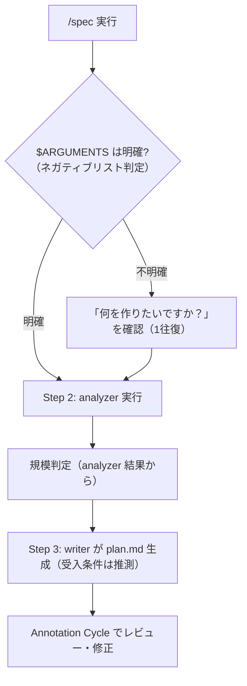

# 要件ヒアリング簡略化 — 最終仕様（Result）

> 生成日: 2026-03-14
> 検証モード: フル検証

## 機能概要

spec スキルの Step 1（要件ヒアリング）を簡略化し、受入条件・スコープ外・非機能要件の事前ヒアリングを廃止した。方向性が明確なら即座に analyzer へ進み、不明確な場合のみ「何を作りたいか」を1往復で確認する。受入条件は writer が推測生成し、Annotation Cycle でユーザーがレビュー・修正する形に変更された。

## 仕様からの変更点

plan.md 通りに実装。変更なし。

## ロジック

### 仕様

- $ARGUMENTS が明確な場合、ヒアリングをスキップして即座に Step 2（analyzer）へ進む
- $ARGUMENTS が不明確な場合、「何を作りたいですか？」のみ1往復で確認してから Step 2 へ進む
- 「不明確」の判定はネガティブリスト方式（該当条件に当てはまらなければ明確とみなす）
- 規模判定は Step 2（analyzer）の後に実行される（analyzer 結果を元に判定精度を向上）
- writer は要求と analyzer 結果から受入条件を推測生成する
- 推測された受入条件は Annotation Cycle でユーザーがレビュー・修正できる
- 既存の更新モード（Step 0-b）には影響しない
- Annotation Viewer の横幅が 780px から 960px に拡大された

### ヒアリング判定フロー

## 受入条件

| # | 受入条件 | 判定 | 備考 |
|---|---------|------|------|
| AC-1 | Step 1-a で受入条件・スコープ外・非機能要件を聞かなくなること | PASS | `SKILL.md:96` — 受入条件・スコープ外・非機能要件のヒアリング削除済み |
| AC-2 | $ARGUMENTS が明確な場合はヒアリングなしで Step 2（analyzer）に進むこと | PASS | `SKILL.md:91` — 不明確条件に該当しなければヒアリングスキップ |
| AC-3 | $ARGUMENTS が不明確な場合は「何を作りたいか」のみ確認して Step 2 に進むこと | PASS | `SKILL.md:92` — 不明確に該当 → 「何を作りたいですか？」のみ1往復 |
| AC-4 | 規模判定が Step 2（analyzer）の後に実行されること | PASS | `SKILL.md:141-154` — Step 2 の後に配置 |
| AC-5 | writer プロンプトが「推測した受入条件」を受け取る形に更新されること | PASS | `SKILL.md:172-179` — writer プロンプトが「推測した受入条件」形式 |
| AC-6 | 既存の更新モード（Step 0-b）に影響しないこと | PASS | `SKILL.md:42-55` — 更新モード未変更 |
| AC-7 | Annotation Viewer の横幅が拡大されていること | PASS | `viewer.html:110` — max-width: 960px |
