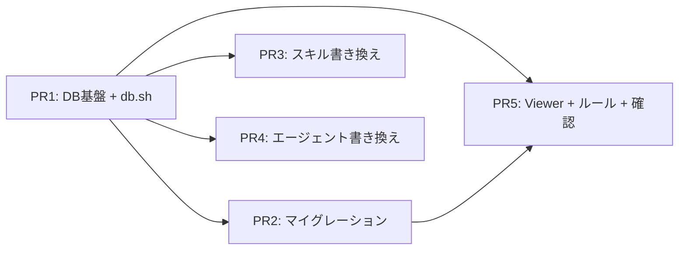

# sqlite-plan-storage — 実装進捗

## 現在の状況

全 PR（PR1〜PR5）の実装が完了。全 20 プランの DB マイグレーションも成功。

## 次にやること

動作確認と /check での仕様検証。

## タスク進捗

| # | タスク | 対象ファイル | 見積 | PR | リスク | 状態 |
|---|-------|------------|------|-----|--------|------|
| 1 | DB スキーマ設計 + マイグレーション基盤（projects テーブル含む） | `migrations/0001_initial_schema.sql`, `scripts/db.sh` | M | PR1 | 低 | ✓ |
| 2 | db.sh コア実装（プロジェクト管理 + plan CRUD + body 操作） | `scripts/db.sh` | L | PR1 | 中 | ✓ |
| 3 | db.sh タスク操作 | `scripts/db.sh` | M | PR1 | 低 | ✓ |
| 4 | db.sh 結果・リサーチ・デバッグ操作 | `scripts/db.sh` | M | PR1 | 低 | ✓ |
| 5 | db.sh リレーション操作 | `scripts/db.sh` | S | PR1 | 低 | ✓ |
| 20 | db.sh progress 操作（update-progress, get-progress） | `scripts/db.sh` | M | PR1 | 低 | ✓ |
| 7 | 既存 md -> DB マイグレーションスクリプト | `scripts/migrate-md-to-db.sh` | L | PR2 | 高 | ✓ |
| 8 | /list スキル書き換え | `skills/list/SKILL.md` | M | PR3 | 中 | ✓ |
| 9 | /spec スキル書き換え | `skills/spec/SKILL.md` | M | PR3 | 中 | ✓ |
| 10 | /build スキル書き換え | `skills/build/SKILL.md` | M | PR3 | 低 | ✓ |
| 11 | /check スキル書き換え | `skills/check/SKILL.md` | S | PR3 | 低 | ✓ |
| 12 | /fix スキル書き換え | `skills/fix/SKILL.md` | S | PR3 | 低 | ✓ |
| 13 | /research スキル書き換え | `skills/research/SKILL.md` | S | PR3 | 低 | ✓ |
| 14 | writer エージェント書き換え | `agents/writer/writer.md`, `agents/writer/references/formats/` | L | PR4 | 高 | ✓ |
| 15 | verifier エージェント書き換え | `agents/verifier/verifier.md` | S | PR4 | 低 | ✓ |
| 16 | analyzer エージェント書き換え | `agents/analyzer/analyzer.md` | S | PR4 | 低 | ✓ |
| 21 | researcher エージェント書き換え | `agents/researcher/researcher.md` | S | PR4 | 低 | ✓ |
| 17 | Annotation Viewer DB 対応 | `scripts/annotation-viewer/server.py` | M | PR5 | 中 | ✓ |
| 18 | ルール更新 | `.claude/rules/plugin-structure.md` | S | PR5 | 低 | ✓ |
| 19 | 既存 20 プランのマイグレーション実行 + 動作確認 | - | M | PR5 | 高 | ✓ |

> タスク定義の詳細は [plan.md](./plan.md) を参照

## デリバリープラン

### PR 一覧

| PR | タスク | 概要 | 依存 |
|----|--------|------|------|
| PR1 | #1-#5, #20 | DB 基盤 + db.sh コア実装（プロジェクト管理 + progress 操作含む） | - |
| PR2 | #7 | マイグレーションスクリプト + 既存データ移行 | PR1 |
| PR3 | #8-#13 | 全スキル書き換え | PR1 |
| PR4 | #14-#16, #21 | エージェント書き換え | PR1 |
| PR5 | #17-#19 | Annotation Viewer + ルール更新 + 最終確認 | PR1, PR2 |

### 依存関係図

### 判断根拠

- **PR1 を最初に独立してマージ**: db.sh が全ての後続 PR の前提となるため、先行して安定させる
- **PR2 と PR3/PR4 は並行可能**: マイグレーションスクリプトとスキル/エージェント書き換えは独立して進められる
- **PR5 を最後に実施**: Annotation Viewer の改修と既存データのマイグレーション実行は、db.sh とマイグレーションスクリプトの両方が完成した後に行う
- **PR3 と PR4 は並行可能**: スキルとエージェントの書き換えは相互に依存しないため、並行して作業できる

### リスク軽減策

| リスク | 対策 |
|--------|------|
| PR1 の db.sh に不具合がある場合、後続全 PR に影響 | PR1 で db.sh の全サブコマンドを手動テストしてからマージ |
| PR2 の既存 md パース失敗 | frontmatter パースを堅牢に実装。失敗プランをスキップしてログ出力 |
| PR3/PR4 でスキル/エージェントの動作が壊れる | 各スキルの書き換え後に個別動作確認を実施 |
| PR5 の既存 19 プランマイグレーションで一部失敗 | 元の md ファイルが残っているのでロールバック可能 |

## ブランチ・PR

| PR | ブランチ | PR URL | 状態 |
|----|---------|--------|------|
| PR1 | feature/sqlite-plan-storage-db-core | - | 未着手 |
| PR2 | feature/sqlite-plan-storage-migration | - | 未着手 |
| PR3 | feature/sqlite-plan-storage-skills | - | 未着手 |
| PR4 | feature/sqlite-plan-storage-agents | - | 未着手 |
| PR5 | feature/sqlite-plan-storage-viewer | - | 未着手 |

## 作業ログ

| 日時 | 内容 |
|------|------|
| 2026-03-14 | plan.md, progress.md 作成 |
| 2026-03-16 | plan.md 更新: researcher エージェント追加（タスク #21）、既存プラン数 19→20、関連プラン追加（sse-annotation-cycle, wider-annotation-viewer） |
