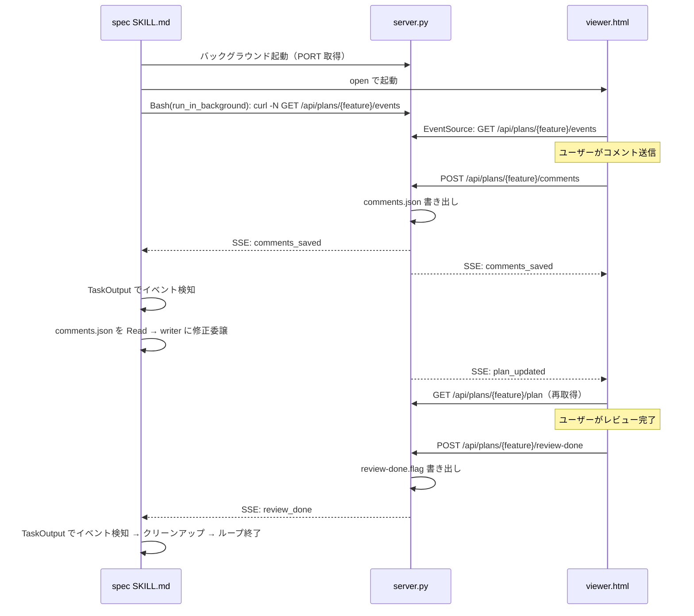
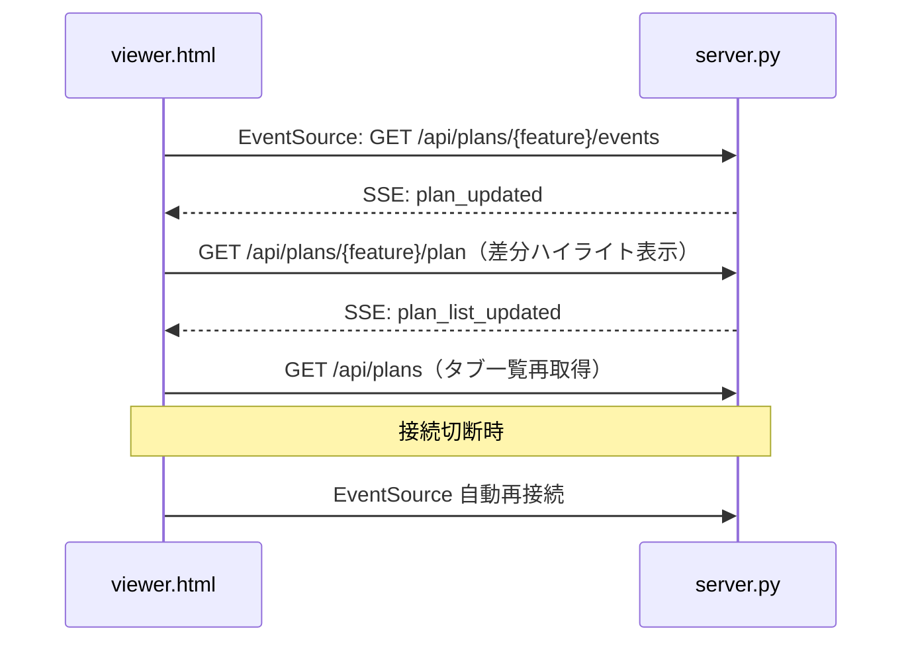
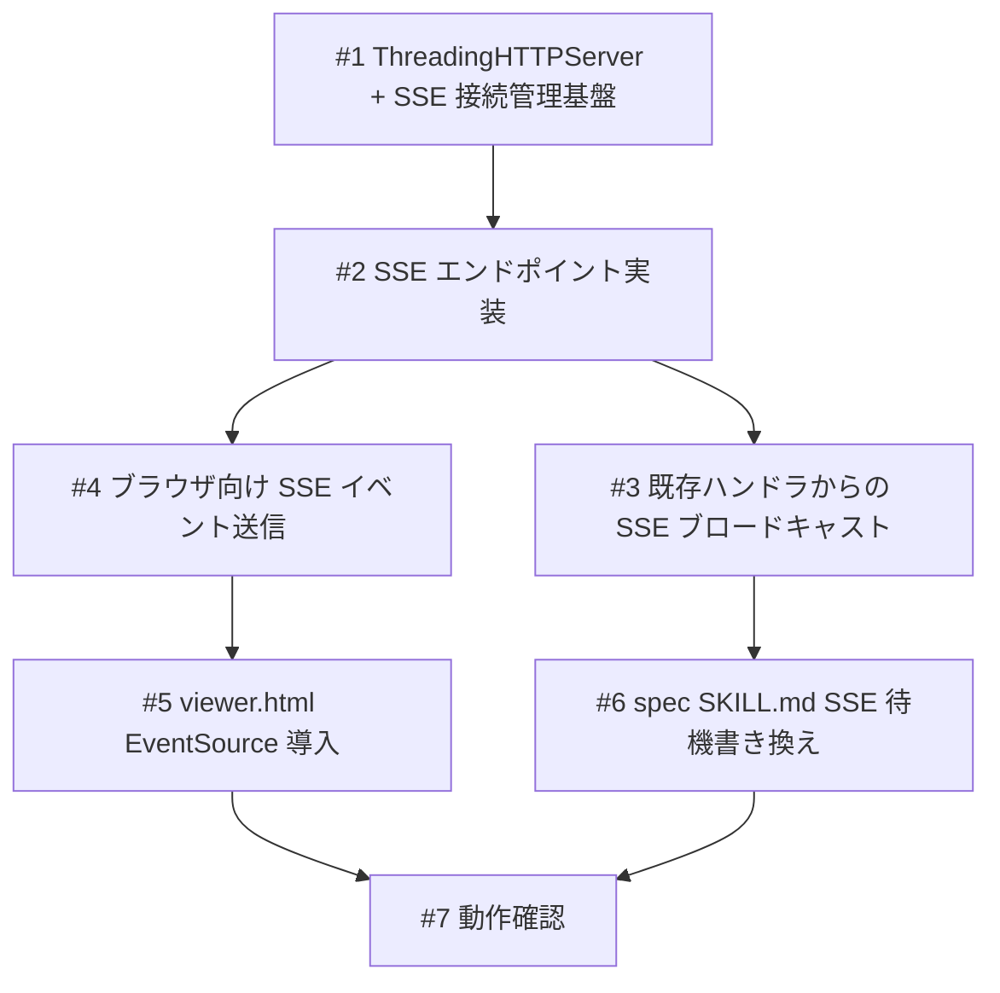

# Annotation Cycle の SSE 化

## 概要

Annotation Cycle のファイルポーリング（while true; sleep 2 で comments.json / review-done.flag の出現を監視）を SSE（Server-Sent Events）に置き換える。ポーリングの非効率性を解消し、イベント駆動でリアルタイムにコメント・レビュー完了を検知できるようにする。

## 関連プラン

| プラン | 関連 |
|--------|------|
| [annotation-cycle](../annotation-cycle/plan.md) | 初期 Annotation Cycle の仕様。今回はその通信方式を SSE に置換 |
| [live-review](../live-review/plan.md) | マルチタブ対応。stdout イベント → ファイルポーリングの切り替え経緯。今回 SSE で再びイベント駆動に |
| [dev-flow-improvements](../dev-flow-improvements/plan.md) | Annotation Cycle クリーンアップ。review-done.flag の導入経緯 |
| [sqlite-plan-storage](../sqlite-plan-storage/plan.md) | server.py の DB 直接読み取り対応を含む。server.py の変更が競合する可能性 |

## 確認事項

| # | 項目 | 根拠 | ステータス |
|---|------|------|-----------|
| 1 | HTTPServer → ThreadingHTTPServer への変更 | SSE 長寿命コネクションが他リクエストをブロック。Python 標準ライブラリの ThreadingHTTPServer で解決 | ✅確認済み |
| 2 | Bash タイムアウト対策 | デフォルト2分、最大10分。run_in_background + TaskOutput で対応。タイムアウト時は再接続案内 | ✅確認済み |
| 3 | マルチセッションでの SSE 独立動作 | 以前 stdout イベントで「2番目以降の CLI が受信できない」問題発生。SSE は各 CLI が個別 HTTP コネクションを開くため解決 | ✅確認済み |
| 4 | SSE エンドポイントの feature フィルタリング | /api/plans/{feature}/events で feature 単位のイベントを返す。各 CLI は自分の feature のみ受信 | ✅確認済み |
| 5 | review-done.flag / comments.json の維持 | SSE 移行後もファイル書き出しは維持（フォールバック・ログ目的） | ✅確認済み |

## 追加検討事項

| # | 観点 | 詳細 | 根拠 |
|---|------|------|------|
| 1 | live-review plan.md でのスコープ外宣言 | 「SSE / WebSocket によるリアルタイム通知」がスコープ外だったが、Python 標準ライブラリのみで SSE 実装可能と判明。制約が解消されたため今回実装する | `docs/plans/live-review/plan.md:L41` |
| 2 | 30分自動タイムアウト | server.py の30分タイムアウトで SSE コネクションが切断される。curl 側が接続終了を検知して終了するため、TaskOutput がプロセス終了を返す | `server.py:L20` |
| 3 | ブラウザ側の EventSource 自動再接続 | EventSource API は切断時に自動再接続する。サーバー再起動時もブラウザ側は自動復帰 | EventSource 仕様 |

## スコープ

### やること

- server.py に SSE エンドポイント追加（GET /api/plans/{feature}/events）
- HTTPServer → ThreadingHTTPServer に変更（SSE の長寿命コネクション対応）
- spec スキルの SKILL.md の Annotation Cycle をファイルポーリングから SSE 待機（run_in_background + TaskOutput）に変更
- ブラウザ側のポーリングを EventSource による SSE 受信に置き換え
- タイムアウト時の再接続案内

### やらないこと

- review-done.flag / comments.json の完全廃止（server.py 側のファイル書き出しは維持。SSE が使えない環境へのフォールバック）
- WebSocket への移行（SSE で十分）

## 受入条件

- [ ] AC-1: server.py に GET /api/plans/{feature}/events の SSE エンドポイントが存在し、comments_saved / review_done イベントを送信する
- [ ] AC-2: server.py が ThreadingHTTPServer を使用し、SSE コネクション中も他の HTTP リクエストが処理される
- [ ] AC-3: spec スキルの Annotation Cycle が run_in_background の Bash で curl -N による SSE 待機を行い、TaskOutput でイベントを取得する
- [ ] AC-4: SSE タイムアウト（Bash のタイムアウト到達）時にユーザーに再接続の案内を表示する
- [ ] AC-5: ブラウザ側（viewer.html）が EventSource で SSE を受信し、plan status / plan list のポーリングを廃止する
- [ ] AC-6: マルチセッション時、各 CLI が自分の feature のイベントのみ受信し、独立して動作する

## 非機能要件

- スレッド安全性: SSE コネクション管理のリストへの同時アクセスに threading.Lock を使用する
- ファイル書き出し順序保証: comments.json の書き込み完了後に SSE イベントを送信する

## データフロー

### メインフロー（SSE 移行後の Annotation Cycle）



### ブラウザ側フロー



## バックエンド変更

### API設計

| メソッド | パス | 説明 |
|---------|------|------|
| GET | `/api/plans/{feature}/events` | SSE エンドポイント。feature 単位のイベントストリーム |

- 入力: パスパラメータ `feature`（対象の feature-name）
- 出力: SSE ストリーム（`text/event-stream`）
  - CLI 向けイベント: `comments_saved`, `review_done`
  - ブラウザ向けイベント: `plan_updated`, `plan_list_updated`
- 接続維持: レスポンスヘッダーに `Cache-Control: no-cache`, `Connection: keep-alive` を設定
- 切断検知: 送信時の BrokenPipeError で切断を検知し、コネクションリストから除去

### 対象ファイル

- 変更: `scripts/annotation-viewer/server.py` — ThreadingHTTPServer 化、SSE エンドポイント追加、SSE ストリーム管理、既存ハンドラからの SSE ブロードキャスト

## フロントエンド変更

### 画面・UI設計

- setInterval による plan status ポーリングを廃止し、EventSource で plan_updated イベントを受信して plan.md を再取得・差分ハイライト表示
- setInterval による plan list ポーリングを廃止し、EventSource で plan_list_updated イベントを受信してタブ一覧を再取得
- EventSource の onerror ハンドリングで再接続中の UI 表示を追加

### 対象ファイル

- 変更: `scripts/annotation-viewer/viewer.html` — EventSource 導入、ポーリング廃止、再接続中 UI 表示

## 設計判断

| 判断事項 | 選択 | 理由 | 検討した代替案 |
|---------|------|------|--------------|
| CLI 側の SSE 受信方式 | run_in_background + TaskOutput | Bash タイムアウト制限を回避しつつイベント駆動を実現 | curl -N の直接実行（タイムアウト制限あり）、ファイルポーリング維持（非効率） |
| ブラウザ側の SSE 受信方式 | EventSource API | 自動再接続あり、ポーリングより効率的 | ポーリング維持（現状維持だが非効率）、WebSocket（SSE で十分） |
| サーバーのスレッドモデル | ThreadingHTTPServer | SSE 長寿命コネクション + 通常 API の並行処理が必要 | asyncio（オーバーキル）、HTTPServer のまま（ブロッキング問題） |
| SSE エンドポイント設計 | feature 単位（/api/plans/{feature}/events） | マルチセッションで各 CLI が独立動作 | 全イベント配信（CLI 側フィルタリングが必要） |
| ファイルベースのフォールバック | 維持（comments.json, review-done.flag は引き続き書き出す） | SSE 障害時のフォールバック、デバッグ用 | 廃止（SSE のみに依存） |

## システム影響

### 影響範囲

- scripts/annotation-viewer/server.py: SSE エンドポイント追加 + ThreadingHTTPServer 変更
- scripts/annotation-viewer/viewer.html: EventSource 導入 + ポーリング廃止
- skills/spec/SKILL.md: Annotation Cycle の SSE 待機への書き換え

### リスク

- server.py と viewer.html は直近で頻繁に変更されているホットスポット（server.py 4回、viewer.html 多数）。マージ競合に注意
- ThreadingHTTPServer のスレッド安全性: SSE コネクション管理のリストへの同時アクセスに threading.Lock が必要
- SSE 接続中にサーバーが30分タイムアウトでシャットダウンした場合、curl が接続終了を検知して TaskOutput がプロセス終了を返す
- SSE 送信中にクライアントが切断（CLI クラッシュ等）した場合、サーバー側で BrokenPipeError が発生。try-except で切断を検知し、コネクションリストから除去

## 実装タスク

### 依存関係図



### タスク一覧

| # | タスク | 対象ファイル | 見積 | 依存 |
|---|--------|------------|------|------|
| 1 | ThreadingHTTPServer への変更 + SSE 接続管理基盤 | `scripts/annotation-viewer/server.py` | M | - |
| 2 | SSE エンドポイント実装（GET /api/plans/{feature}/events） | `scripts/annotation-viewer/server.py` | M | #1 |
| 3 | _save_comments / _finish_review から SSE ブロードキャスト | `scripts/annotation-viewer/server.py` | S | #2 |
| 4 | ブラウザ向け SSE イベント（plan_updated, plan_list_updated）の送信 | `scripts/annotation-viewer/server.py` | S | #2 |
| 5 | viewer.html の EventSource 導入 + ポーリング廃止 | `scripts/annotation-viewer/viewer.html` | M | #4 |
| 6 | spec SKILL.md の Annotation Cycle SSE 待機書き換え | `skills/spec/SKILL.md` | M | #3 |
| 7 | 動作確認（マルチセッション、タイムアウト、再接続） | - | M | #5, #6 |

> 見積基準: S(~1h), M(1-3h), L(3h~)

## テスト方針

### トレーサビリティ

| 受入条件 | 自動テスト | 手動検証 |
|---------|-----------|---------|
| AC-1 | - | MV-1 |
| AC-2 | - | MV-2 |
| AC-3 | - | MV-3 |
| AC-4 | - | MV-4 |
| AC-5 | - | MV-5 |
| AC-6 | - | MV-6 |

### 自動テスト

なし（スコープ外）

### ビルド確認

```bash
python3 -c "import py_compile; py_compile.compile('scripts/annotation-viewer/server.py', doraise=True)"
```

### 手動検証チェックリスト

- [ ] MV-1: curl -N http://localhost:{port}/api/plans/{feature}/events で SSE ストリームが受信でき、ブラウザでコメント送信時に comments_saved イベントが届くこと
- [ ] MV-2: SSE 接続中にブラウザから /api/plans/{feature}/plan を GET し、レスポンスがブロックされずに返ること
- [ ] MV-3: /spec 実行時に Annotation Cycle が run_in_background + TaskOutput で SSE イベントを受信し、writer に修正を委譲すること
- [ ] MV-4: Bash タイムアウト到達時にユーザーに再接続の案内が表示されること
- [ ] MV-5: viewer.html で EventSource による plan 更新通知を受信し、差分ハイライトが自動表示されること。setInterval によるポーリングが廃止されていること
- [ ] MV-6: 2つの /spec セッションを同時実行し、それぞれが自分の feature のコメントのみを受信して独立に writer 修正が動作すること
