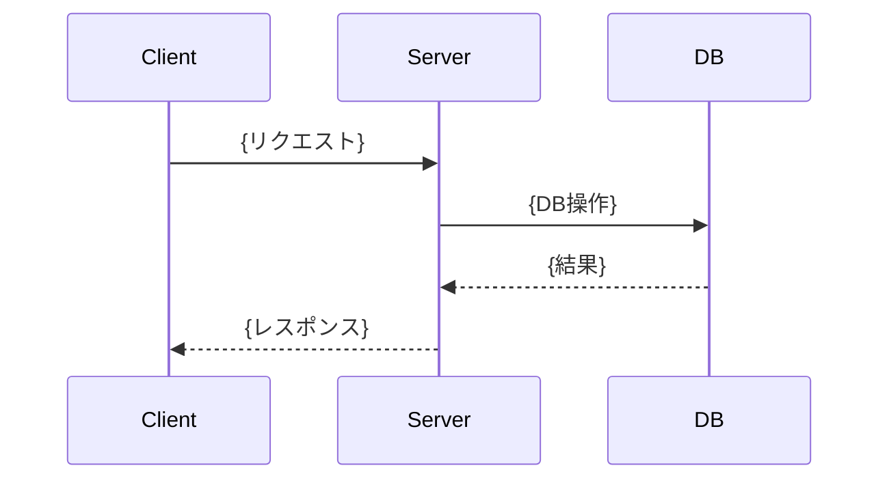

# {機能タイトル}

## 概要

{ユーザーストーリー: 誰が・何を・なぜしたいのか（1-3文）}

## 受入条件

- [ ] AC-1: {条件1}
- [ ] AC-2: {条件2}

## スコープ

### やること

- {項目}

### やらないこと

- {項目}

## 非機能要件

{該当なしの場合は「特になし」と記載}

- {要件（例: データ量の想定、認可ルール、パフォーマンス等）}

## データフロー

### {メインユースケース名}



{サブユースケース・エラーフローがあれば別図で追加}

## バックエンド変更

{API変更なしの場合はこのセクション自体を省略（「該当なし」と書かず削除する）}

### API設計

- {どんな操作を提供するか（CRUD等）}
- {入力として何を受け取るか}
- {出力として何を返すか}
- {主要なエラーケースと条件}

### 対象ファイル

- {新規/変更}: `{ファイルパス}` — {概要}

## DB変更

{DB変更なしの場合はこのセクション自体を省略（「該当なし」と書かず削除する）}

### データモデル

{テーブルごとに以下を記述する}

#### {テーブルの役割（自然言語）}

- 目的: {このテーブルが何を管理するか}
- 関係: {他テーブルとの関係性（例: ユーザーと商品の多対多を表現する中間テーブル）}

| カラム | 説明 | 制約 |
|--------|------|------|
| {カラムの役割（自然言語）} | {何を表すデータか} | {必須/一意/外部キー等} |

- {一意性制約・複合制約などのビジネスルール}
- {既存データへの影響がある場合はその方針}

### 対象ファイル

- {新規/変更}: `{ファイルパス}` — {概要}

## フロントエンド変更

{UI変更なしの場合はこのセクション自体を省略（「該当なし」と書かず削除する）}

### 画面・UI設計

- {どんな画面/UIが必要か}
- {ユーザーが行える操作}
- {表示するデータ}

### ワイヤーフレーム

```
+---------------------------+
|  {ヘッダー}                |
+---------------------------+
|  {メインコンテンツ}         |
|                           |
+---------------------------+
```

### 対象ファイル

- {新規/変更}: `{ファイルパス}` — {概要}

## 設計判断

| 判断事項 | 選択 | 理由 | 検討した代替案 |
|---------|------|------|--------------|
| {判断事項} | {選択した方式} | {選択理由} | {代替案とその不採用理由} |

## システム影響

### 影響範囲

- {影響するモジュール・機能}

### リスク

- {考慮すべきリスク（後方互換性、パフォーマンス、セキュリティ等）}

## 実装タスク

### 依存関係図

```mermaid
graph TD
    T1[#1 {タスク名}] --> T2[#2 {タスク名}]
    T2 --> T3[#3 {タスク名}]
```

### タスク一覧

| # | タスク | 対象ファイル | 見積 | 依存 |
|---|--------|------------|------|------|
| 1 | {タスク名} | `{ファイルパス}` | {S/M/L} | - |
| 2 | {タスク名} | `{ファイルパス}` | {S/M/L} | #1 |

> 見積基準: S(〜1h), M(1-3h), L(3h〜)

## テスト方針

### トレーサビリティ

| 受入条件 | 自動テスト | 手動検証 |
|---------|-----------|---------|
| AC-1 | #{テスト番号} | #{チェック番号} |
| AC-2 | #{テスト番号} | #{チェック番号} |

### 自動テスト

| # | テスト | 種別 | 対象 |
|---|--------|------|------|
| 1 | {テスト名} | {unit/integration/e2e} | {対象} |

### ビルド確認

```bash
{コマンド1}  # {説明}
{コマンド2}  # {説明}
```

### 手動検証チェックリスト

- [ ] MV-1: {チェック項目1}
- [ ] MV-2: {チェック項目2}
