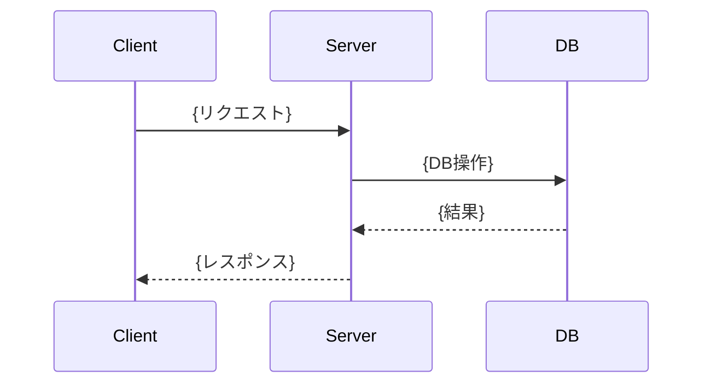

# {機能タイトル}

## 概要

{ユーザーストーリー: 誰が・何を・なぜしたいのか（1-3文）}

## 受入条件

- [ ] {条件1}
- [ ] {条件2}

## スコープ

### やること

- {項目}

### やらないこと

- {項目}

## 非機能要件

{該当なしの場合は「特になし」と記載}

- {要件（例: データ量の想定、認可ルール、パフォーマンス等）}

## データフロー

### {メインユースケース名}



{サブユースケースがあれば同様に追加}

## バックエンド変更

{API変更なしの場合はこのセクション自体を省略}

### エンドポイント一覧

| メソッド | パス | 概要 |
|---------|------|------|
| {GET/POST/...} | {/api/xxx} | {概要} |

### 主要な型定義

```
// Request
{型名} {
  {フィールド}: {型}
}

// Response
{型名} {
  {フィールド}: {型}
}
```

### エラーケース

| ステータス | コード/メッセージ | 条件 |
|-----------|-----------------|------|
| {400/404/...} | {エラー内容} | {発生条件} |

### 対象ファイル

- {新規/変更}: `{ファイルパス}` — {概要}

## DB変更

{DB変更なしの場合はこのセクション自体を省略}

### テーブル一覧

| テーブル名 | 操作 | 概要 |
|-----------|------|------|
| {テーブル名} | {新規/変更} | {概要} |

### {テーブル名}

| カラム | 型 | 制約 | 説明 |
|--------|-----|------|------|
| {カラム名} | {型} | {PK/NOT NULL/UNIQUE/FK等} | {説明} |

### リレーション

- {テーブルA}.{カラム} → {テーブルB}.{カラム} ({1:N/N:M等})

### 対象ファイル

- {新規/変更}: `{ファイルパス}` — {概要}

## フロントエンド変更

{UI変更なしの場合はこのセクション自体を省略}

### コンポーネントツリー

```
{ParentComponent}
├── {ChildA}
│   └── {GrandChild}
└── {ChildB}
```

### 主要コンポーネント

#### {ComponentName}

- Props: `{ {prop}: {型} }`
- 状態: {管理する状態}
- 振る舞い: {主要なイベント・ロジック}

### ワイヤーフレーム

```
+---------------------------+
|  {ヘッダー}                |
+---------------------------+
|  {メインコンテンツ}         |
|                           |
+---------------------------+
```

### 対象ファイル

- {新規/変更}: `{ファイルパス}` — {概要}

## システム影響

### 影響範囲

- {影響するモジュール・機能}

### リスク

- {考慮すべきリスク（後方互換性、パフォーマンス、セキュリティ等）}

## 実装タスク

### 依存関係図

```mermaid
graph TD
    T1[#1 {タスク名}] --> T2[#2 {タスク名}]
    T2 --> T3[#3 {タスク名}]
```

### タスク一覧

| # | タスク | 対象ファイル | 見積 | 依存 |
|---|--------|------------|------|------|
| 1 | {タスク名} | `{ファイルパス}` | {S/M/L} | - |
| 2 | {タスク名} | `{ファイルパス}` | {S/M/L} | #1 |

> 見積基準: S(〜1h), M(1-3h), L(3h〜)

## テスト方針

### 自動テスト

| # | テスト | 種別 | 対象 |
|---|--------|------|------|
| 1 | {テスト名} | {unit/integration/e2e} | {対象} |

### ビルド確認

```bash
{コマンド1}  # {説明}
{コマンド2}  # {説明}
```

### 手動検証チェックリスト

- [ ] {チェック項目1}
- [ ] {チェック項目2}
